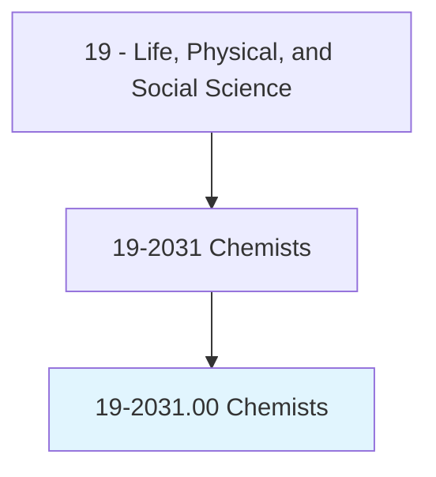
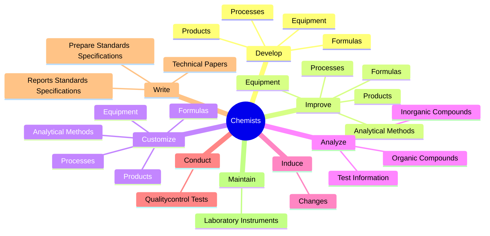
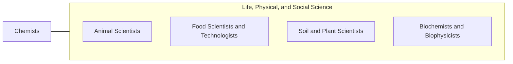

# Chemists

> Conduct qualitative and quantitative chemical analyses or experiments in laboratories for quality or process control or to develop new products or knowledge.

## Overview

Chemists is classified under Life, Physical, and Social Science (SOC 19). Conduct qualitative and quantitative chemical analyses or experiments in laboratories for quality or process control or to develop new products or knowledge.

## Classification Hierarchy

## Key Statistics

| Metric | Value |
|--------|-------|
| SOC Code | 19-2031.00 |
| Category | [Life, Physical, and Social Science](/occupations/Science) |
| Task Count | 73 |
| Source | O*NET |

## Core Tasks

### develop.Products

Chemists develop products as part of their core responsibilities.

**Actions:**
- `develop.Products`
- `develop.Equipment`
- `develop.Formulas`
- `develop.Processes`

### improve.Products

Chemists improve products as part of their core responsibilities.

**Actions:**
- `improve.Products`
- `improve.Equipment`
- `improve.Formulas`
- `improve.Processes`

### customize.Products

Chemists customize products as part of their core responsibilities.

**Actions:**
- `customize.Products`
- `customize.Equipment`
- `customize.Formulas`
- `customize.Processes`

## Skills & Competencies

### Technical Skills
- **Research Methods** - Advanced
- **Data Analysis** - Advanced
- **Laboratory Techniques** - Advanced

### Soft Skills
- **Communication** - Essential
- **Problem Solving** - Essential
- **Critical Thinking** - Important
- **Teamwork** - Important
- **Adaptability** - Important

## Related Occupations

## Industries

This occupation is found across multiple industries. See [Industries](/industries) for sector-specific employment data.

## Career Progression

---

*Source: O*NET 19-2031.00 - ONETOccupation*
