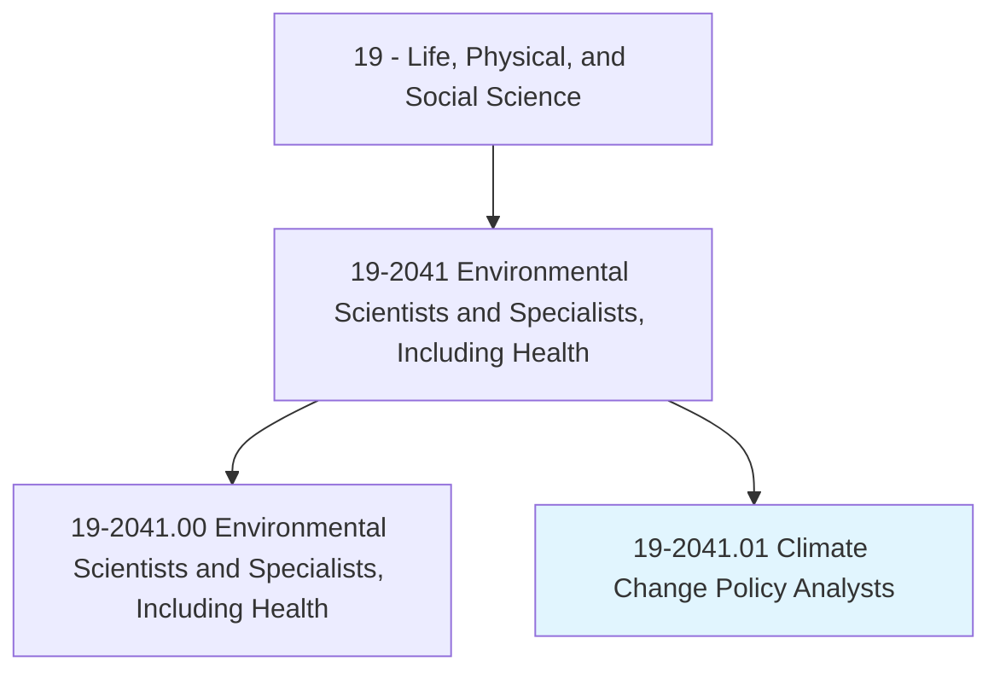
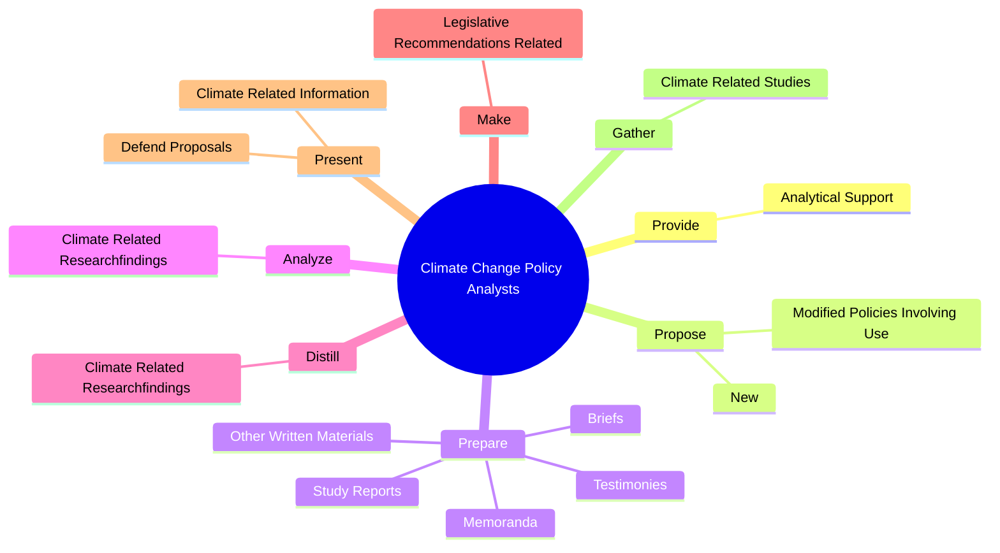
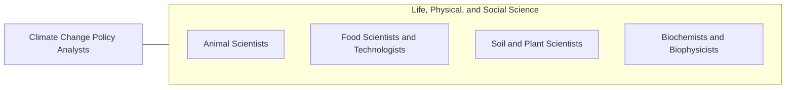

# Climate Change Policy Analysts

> Research and analyze policy developments related to climate change. Make climate-related recommendations for actions such as legislation, awareness campaigns, or fundraising approaches.

## Overview

Climate Change Policy Analysts is a specialized variant within the Life, Physical, and Social Science category. Research and analyze policy developments related to climate change. 

## Classification Hierarchy

## Key Statistics

| Metric | Value |
|--------|-------|
| SOC Code | 19-2041.01 |
| Category | [Life, Physical, and Social Science](/occupations/Science/index) |
| Task Count | 67 |
| Source | O*NET |

## Core Tasks

### provide.AnalyticalSupport

Climate Change Policy Analysts provide analytical support as part of their core responsibilities.

**Actions:**
- `provide.AnalyticalSupport.for.PolicyBriefsRelatedToRenewableEnergy`
- `provide.AnalyticalSupport.for.EnergyEfficiency`
- `provide.AnalyticalSupport.for.ClimateChange`

### propose.New

Climate Change Policy Analysts propose new as part of their core responsibilities.

**Actions:**
- `propose.New.of.TraditionalFuels`
- `propose.New.of.AlternativeFuels`
- `propose.New.of.Transportation.of.Goods`
- `propose.New.of.OtherFactorsRelating.to.climate.Change`

### prepare.StudyReports

Climate Change Policy Analysts prepare study reports as part of their core responsibilities.

**Actions:**
- `prepare.StudyReports.to.inform.GovernmentGroupsOnEnvironmentalIssues`
- `prepare.StudyReports.to.EnvironmentalGroupsOnEnvironmentalIssues`
- `prepare.StudyReports.to.climate.Change`
- `prepare.Memoranda.to.inform.GovernmentGroupsOnEnvironmentalIssues`

## Skills & Competencies

### Technical Skills
- **Research Methods** - Advanced
- **Data Analysis** - Advanced
- **Laboratory Techniques** - Advanced

### Soft Skills
- **Communication** - Essential
- **Problem Solving** - Essential
- **Critical Thinking** - Important
- **Teamwork** - Important
- **Adaptability** - Important

## Related Occupations

## Industries

This occupation is found across multiple industries. See [Industries](/industries) for sector-specific employment data.

## Career Progression

---

*Source: O*NET 19-2041.01 - ONETOccupation*
