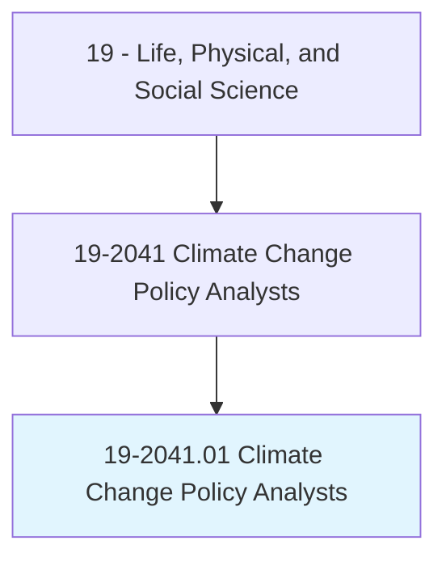
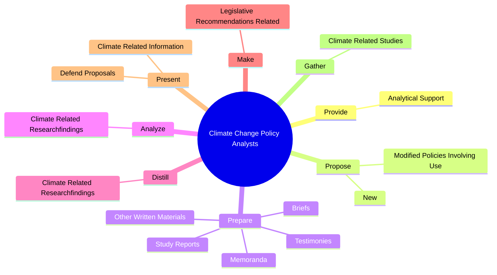
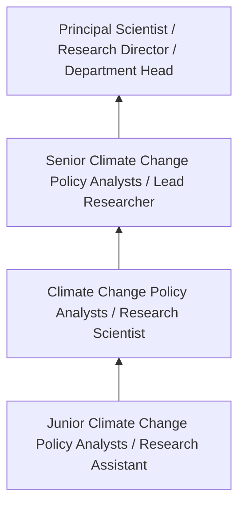
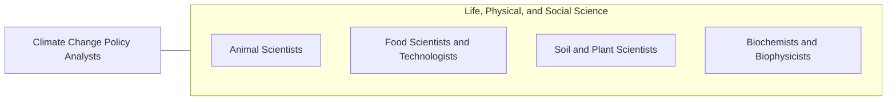

# Climate Change Policy Analysts

> Research and analyze policy developments related to climate change. Make climate-related recommendations for actions such as legislation, awareness campaigns, or fundraising approaches.

## Overview

Climate Change Policy Analysts professionals research and analyze policy developments related to climate change. This occupation falls within the Life, Physical, and Social Science category and requires a combination of specialized knowledge, technical skills, and practical experience.

These professionals work across diverse settings and organizational contexts, applying their expertise to meet the demands of their field. They must stay current with industry standards, emerging practices, and regulatory requirements that affect their work. The role demands both independent judgment and collaborative skills, as practitioners regularly interact with colleagues, stakeholders, and the public.

As the field continues to evolve, Climate Change Policy Analysts professionals increasingly leverage technology and data-driven approaches to enhance their effectiveness. Career opportunities span the public and private sectors, with demand influenced by economic conditions, demographic shifts, and technological advancement.

## Classification Hierarchy



## Key Statistics

| Metric | Value |
|--------|-------|
| SOC Code | 19-2041.01 |
| Job Zone | N/A |
| Category | [Life, Physical, and Social Science](/occupations/Science/index) |
| Core Tasks | 67+ |
| Salary Range | $50,000 - $130,000 |
| Median Salary | $78,000 |
| Growth Outlook | 7% (Faster than average) |
| Source | O*NET |

## Core Tasks



### prepare.StudyReports

Climate Change Policy Analysts prepare study reports as part of their core responsibilities.

**Actions:**
- `prepare.StudyReports.to.inform.GovernmentGroupsOnEnvironmentalIssues` - Prepare study reports, memoranda, briefs, testimonies, or other written mater...
- `prepare.StudyReports.to.EnvironmentalGroupsOnEnvironmentalIssues` - Prepare study reports, memoranda, briefs, testimonies, or other written mater...
- `prepare.StudyReports.to.climate.Change` - Prepare study reports, memoranda, briefs, testimonies, or other written mater...
- `prepare.Memoranda.to.inform.GovernmentGroupsOnEnvironmentalIssues` - Prepare study reports, memoranda, briefs, testimonies, or other written mater...
- `prepare.Memoranda.to.EnvironmentalGroupsOnEnvironmentalIssues` - Prepare study reports, memoranda, briefs, testimonies, or other written mater...

### propose.New

Climate Change Policy Analysts propose new as part of their core responsibilities.

**Actions:**
- `propose.New.of.TraditionalFuels` - Propose new or modified policies involving use of traditional and alternative...
- `propose.New.of.AlternativeFuels` - Propose new or modified policies involving use of traditional and alternative...
- `propose.New.of.Transportation.of.Goods` - Propose new or modified policies involving use of traditional and alternative...
- `propose.New.of.OtherFactorsRelating.to.climate.Change` - Propose new or modified policies involving use of traditional and alternative...
- `propose.New.of.ClimateChange` - Propose new or modified policies involving use of traditional and alternative...

### make.LegislativeRecommendationsRelated

Climate Change Policy Analysts make legislative recommendations related as part of their core responsibilities.

**Actions:**
- `make.LegislativeRecommendationsRelated.to.climate.Change` - Make legislative recommendations related to climate change or environmental m...
- `make.LegislativeRecommendationsRelated.to.EnvironmentalManagement` - Make legislative recommendations related to climate change or environmental m...
- `make.LegislativeRecommendationsRelated.to.BasedOnClimateChangePolicies` - Make legislative recommendations related to climate change or environmental m...
- `make.LegislativeRecommendationsRelated.to.Principles` - Make legislative recommendations related to climate change or environmental m...
- `make.LegislativeRecommendationsRelated.to.programs` - Make legislative recommendations related to climate change or environmental m...

### research.Policies

Climate Change Policy Analysts research policies as part of their core responsibilities.

**Actions:**
- `research.Policies.for.ClimateManagement` - Research policies, practices, or procedures for climate or environmental mana...
- `research.Policies.for.EnvironmentalManagement` - Research policies, practices, or procedures for climate or environmental mana...
- `research.Practices.for.ClimateManagement` - Research policies, practices, or procedures for climate or environmental mana...
- `research.Practices.for.EnvironmentalManagement` - Research policies, practices, or procedures for climate or environmental mana...
- `research.Procedures.for.ClimateManagement` - Research policies, practices, or procedures for climate or environmental mana...


## Skills & Competencies

### Technical Skills
- **Research Methodology** - Expert
- **Data Analysis** - Advanced
- **Laboratory Techniques** - Advanced
- **Scientific Writing** - Advanced
- **Statistical Software** - Advanced
- **Quality Control** - Proficient

### Soft Skills
- **Analytical Thinking** - Critical
- **Attention to Detail** - Critical
- **Problem Solving** - Essential
- **Collaboration** - Essential
- **Written Communication** - Essential

## Education & Certifications

| Requirement | Details |
|-------------|---------|
| Typical Education | Bachelor's or Master's degree in relevant scientific field |
| Work Experience | 1-3 years research or laboratory experience |
| On-the-Job Training | Moderate - specialized laboratory techniques |
| Certifications | Field-specific certifications may be required |

## Career Progression



## Industry Variations

### Academic Research
Focus on fundamental research and publication. Climate Change Policy Analysts professionals in academia often combine research with teaching responsibilities and mentoring graduate students.

### Industry Research and Development
Applied research for product development and commercial applications. Emphasis on innovation timelines and market-driven objectives.

### Government and Regulatory
Mission-oriented research supporting public policy and regulatory decisions. Focus on public health, environmental protection, or national security.

### Consulting and Contract Research
Project-based work for diverse clients. Requires strong communication skills and ability to translate findings for non-technical audiences.

## Technology & Tools

- **Laboratory Information Management Systems (LIMS)**
- **Statistical software (R, SAS, SPSS)**
- **Spectroscopy and chromatography equipment**
- **Microscopy and imaging systems**
- **Data analysis and visualization tools**

## Related Occupations



## Industries

- Research and Development - High Employment
- Pharmaceutical Manufacturing - High Employment
- [Government Agencies](/industries/PublicAdministration) - Moderate Employment
- [Higher Education](/industries/Education) - Moderate Employment

## Departments

This occupation typically works in:
- [Research and Development](/departments/Research/index)
- Quality Assurance
- Laboratory Operations

## GraphDL Semantic Structure

```graphdl
Climate Change Policy Analysts perform:
- provide.AnalyticalSupport.for.PolicyBriefsRelatedToRenewableEnergy
- provide.AnalyticalSupport.for.EnergyEfficiency
- provide.AnalyticalSupport.for.ClimateChange
- propose.New.of.TraditionalFuels
- propose.New.of.AlternativeFuels
- propose.New.of.Transportation.of.Goods
```

---

*Source: O*NET 19-2041.01 - ONETOccupation*
