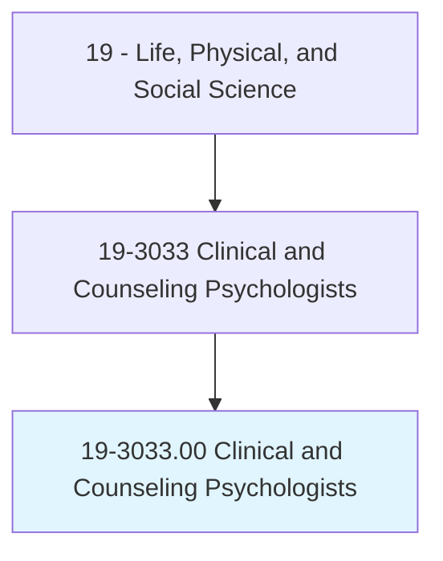
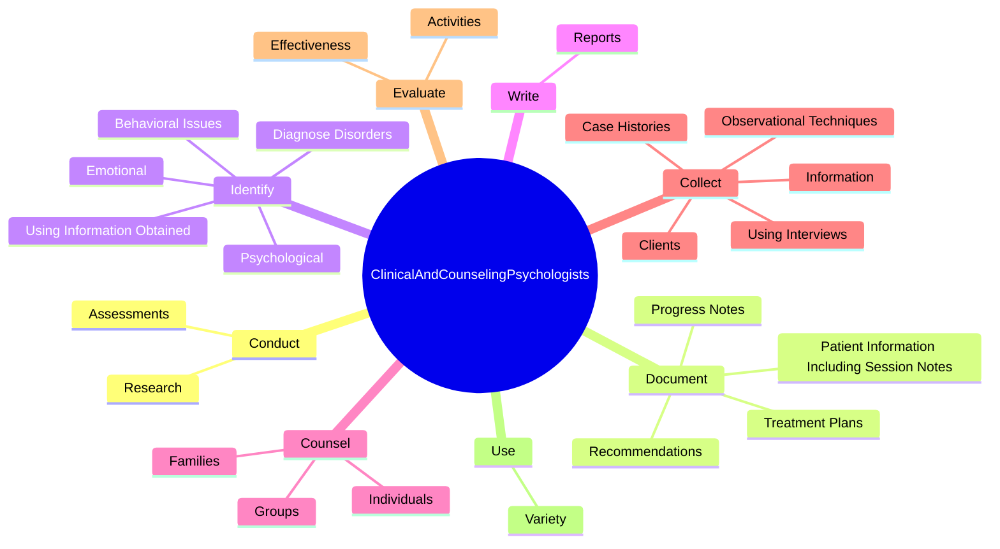

# Clinical and Counseling Psychologists

> Assess, diagnose, and treat mental and emotional disorders of individuals through observation, interview, and psychological tests. Help individuals with distress or maladjustment understand their problems through their knowledge of case history, interviews with patients, and theory. Provide individual or group counseling services to assist individuals in achieving more effective personal, social, educational, and vocational development and adjustment. May design behavior modification programs and consult with medical personnel regarding the best treatment for patients.

## Overview

Clinical and Counseling Psychologists is an occupation within the Life, Physical, and Social Science category. Assess, diagnose, and treat mental and emotional disorders of individuals through observation, interview, and psychological tests. Help individuals with distress or maladjustment understand their problems through their knowledge of case history, interviews with patients, and theory.

## Classification Hierarchy

## Key Statistics

| Metric | Value |
|--------|-------|
| SOC Code | 19-3033.00 |
| Category | [Life, Physical, and Social Science](/occupations/Science/index) |
| Task Count | 223 |
| Source | O*NET |

## Core Tasks

### conduct.Assessments

Clinical and Counseling Psychologists conduct assessments as part of their core responsibilities.

**Actions:**
- `conduct.Assessments.of.PatientsRisk.for.HarmToSelf`
- `conduct.Assessments.of.Others`
- `conduct.Research.to.develop.DiagnosticTherapeuticCounselingTechniques`
- `conduct.Research.to.improve.DiagnosticTherapeuticCounselingTechniques`

### document.PatientInformationIncludingSessionNotes

Clinical and Counseling Psychologists document patient information including session notes as part of their core responsibilities.

**Actions:**
- `document.PatientInformationIncludingSessionNotes`
- `document.ProgressNotes`
- `document.Recommendations`
- `document.TreatmentPlans`

### identify.Psychological

Clinical and Counseling Psychologists identify psychological as part of their core responsibilities.

**Actions:**
- `identify.Psychological.from.Interviews`
- `identify.Psychological.from.Tests`
- `identify.Psychological.from.Records`
- `identify.Psychological.from.ReferenceMaterials`

## Skills & Competencies

### Technical Skills
- **Research Methods** - Advanced
- **Data Analysis** - Advanced
- **Laboratory Techniques** - Advanced

### Soft Skills
- **Communication** - Essential
- **Problem Solving** - Essential
- **Critical Thinking** - Important
- **Teamwork** - Important
- **Adaptability** - Important

## Related Occupations

## Industries

This occupation is found across multiple industries. See [Industries](/industries) for sector-specific employment data.

## Career Progression

---

*Source: O*NET 19-3033.00 - ONETOccupation*
