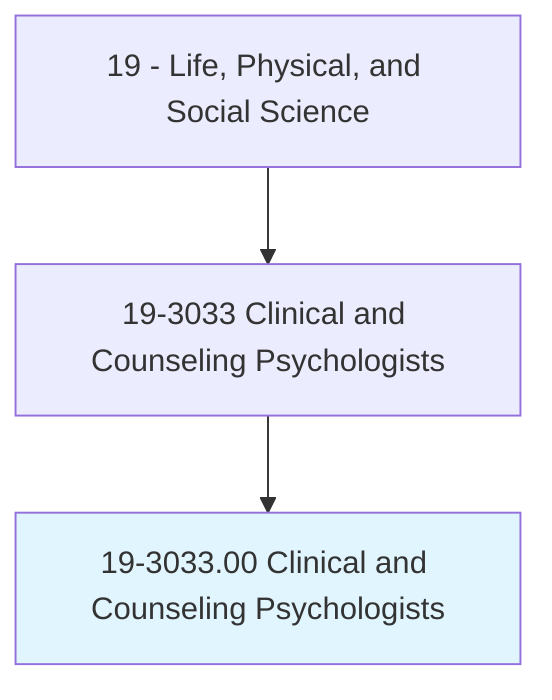
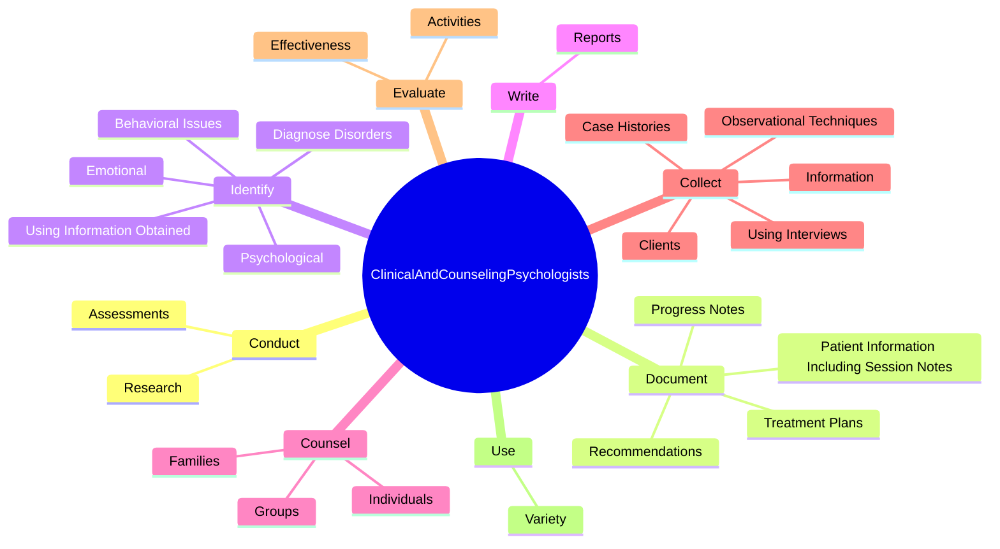
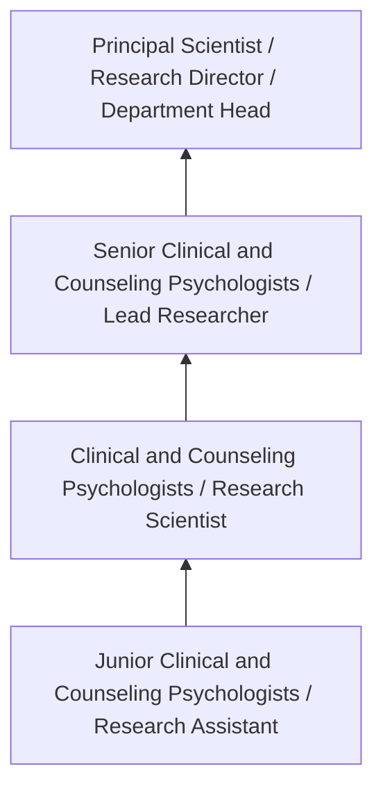

# Clinical and Counseling Psychologists

> Assess, diagnose, and treat mental and emotional disorders of individuals through observation, interview, and psychological tests. Help individuals with distress or maladjustment understand their problems through their knowledge of case history, interviews with patients, and theory. Provide individual or group counseling services to assist individuals in achieving more effective personal, social, educational, and vocational development and adjustment. May design behavior modification programs and consult with medical personnel regarding the best treatment for patients.

## Overview

Clinical and Counseling Psychologists professionals assess, diagnose, and treat mental and emotional disorders of individuals through observation, interview, and psychological tests. This occupation falls within the Life, Physical, and Social Science category and requires a combination of specialized knowledge, technical skills, and practical experience.

These professionals work across diverse settings and organizational contexts, applying their expertise to meet the demands of their field. They must stay current with industry standards, emerging practices, and regulatory requirements that affect their work. The role demands both independent judgment and collaborative skills, as practitioners regularly interact with colleagues, stakeholders, and the public.

As the field continues to evolve, Clinical and Counseling Psychologists professionals increasingly leverage technology and data-driven approaches to enhance their effectiveness. Career opportunities span the public and private sectors, with demand influenced by economic conditions, demographic shifts, and technological advancement.

## Classification Hierarchy



## Key Statistics

| Metric | Value |
|--------|-------|
| SOC Code | 19-3033.00 |
| Job Zone | N/A |
| Category | [Life, Physical, and Social Science](/occupations/Science/index) |
| Core Tasks | N/A+ |
| Salary Range | $50,000 - $130,000 |
| Median Salary | $78,000 |
| Growth Outlook | 7% (Faster than average) |
| Source | O*NET |

## Core Tasks



### conduct.Assessments

Clinical and Counseling Psychologists conduct assessments as part of their core responsibilities.

**Actions:**
- `conduct.Assessments.of.PatientsRisk.for.HarmToSelf`
- `conduct.Assessments.of.Others`
- `conduct.Research.to.develop.DiagnosticTherapeuticCounselingTechniques`
- `conduct.Research.to.improve.DiagnosticTherapeuticCounselingTechniques`

### document.PatientInformationIncludingSessionNotes

Clinical and Counseling Psychologists document patient information including session notes as part of their core responsibilities.

**Actions:**
- `document.PatientInformationIncludingSessionNotes`
- `document.ProgressNotes`
- `document.Recommendations`
- `document.TreatmentPlans`

### identify.Psychological

Clinical and Counseling Psychologists identify psychological as part of their core responsibilities.

**Actions:**
- `identify.Psychological.from.Interviews`
- `identify.Psychological.from.Tests`
- `identify.Psychological.from.Records`
- `identify.Psychological.from.ReferenceMaterials`

### Technical Skills
- **Research Methods** - Advanced
- **Data Analysis** - Advanced
- **Laboratory Techniques** - Advanced

### Soft Skills
- **Communication** - Essential
- **Problem Solving** - Essential
- **Critical Thinking** - Important
- **Teamwork** - Important
- **Adaptability** - Important


## Skills & Competencies

### Technical Skills
- **Research Methodology** - Expert
- **Data Analysis** - Advanced
- **Laboratory Techniques** - Advanced
- **Scientific Writing** - Advanced
- **Statistical Software** - Advanced
- **Quality Control** - Proficient

### Soft Skills
- **Analytical Thinking** - Critical
- **Attention to Detail** - Critical
- **Problem Solving** - Essential
- **Collaboration** - Essential
- **Written Communication** - Essential

## Education & Certifications

| Requirement | Details |
|-------------|---------|
| Typical Education | Bachelor's or Master's degree in relevant scientific field |
| Work Experience | 1-3 years research or laboratory experience |
| On-the-Job Training | Moderate - specialized laboratory techniques |
| Certifications | Field-specific certifications may be required |

## Career Progression



## Industry Variations

### Academic Research
Focus on fundamental research and publication. Clinical and Counseling Psychologists professionals in academia often combine research with teaching responsibilities and mentoring graduate students.

### Industry Research and Development
Applied research for product development and commercial applications. Emphasis on innovation timelines and market-driven objectives.

### Government and Regulatory
Mission-oriented research supporting public policy and regulatory decisions. Focus on public health, environmental protection, or national security.

### Consulting and Contract Research
Project-based work for diverse clients. Requires strong communication skills and ability to translate findings for non-technical audiences.

## Technology & Tools

- **Laboratory Information Management Systems (LIMS)**
- **Statistical software (R, SAS, SPSS)**
- **Spectroscopy and chromatography equipment**
- **Microscopy and imaging systems**
- **Data analysis and visualization tools**

## Related Occupations


## Industries

- Research and Development - High Employment
- Pharmaceutical Manufacturing - High Employment
- [Government Agencies](/industries/PublicAdministration) - Moderate Employment
- [Higher Education](/industries/Education) - Moderate Employment

## Departments

This occupation typically works in:
- [Research and Development](/departments/Research/index)
- Quality Assurance
- Laboratory Operations

## GraphDL Semantic Structure

```graphdl
Clinical and Counseling Psychologists perform:
- conduct.Research.in.ClinicalandCounselingPsychologistsField
- analyze.Data.using.ScientificMethods
- prepare.Reports.on.ResearchFindings
- develop.Procedures.for.ClinicalandCounselingPsychologistsAnalysis
- collaborate.WithTeam.on.ResearchProjects
```

---

*Source: O*NET 19-3033.00 - ONETOccupation*
