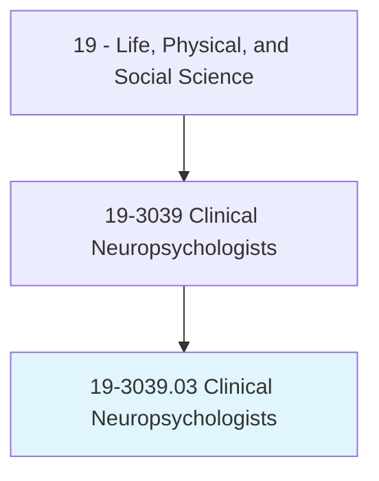
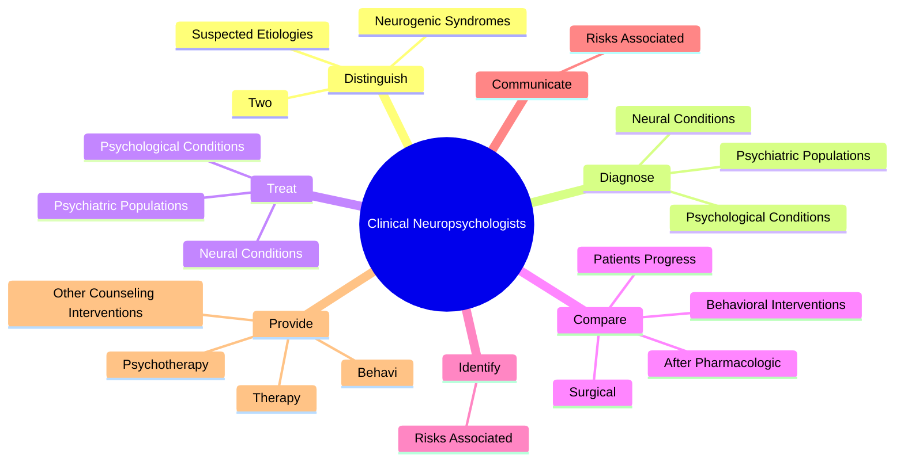
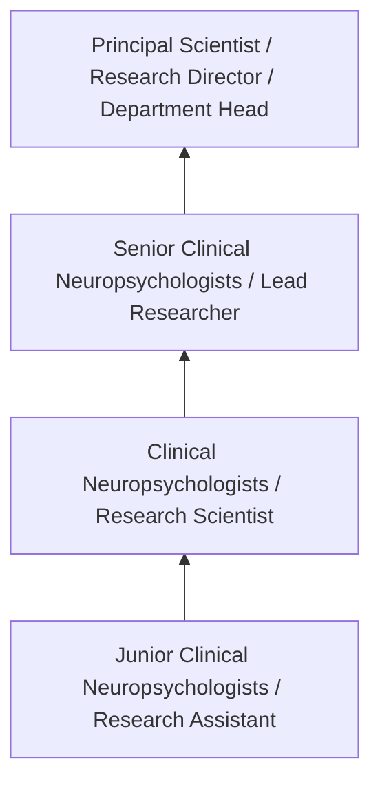

# Clinical Neuropsychologists

> Assess and diagnose patients with neurobehavioral problems related to acquired or developmental disorders of the nervous system, such as neurodegenerative disorders, traumatic brain injury, seizure disorders, and learning disabilities. Recommend treatment after diagnosis, such as therapy, medication, or surgery. Assist with evaluation before and after neurosurgical procedures, such as deep brain stimulation.

## Overview

Clinical Neuropsychologists professionals assess and diagnose patients with neurobehavioral problems related to acquired or developmental disorders of the nervous system, such as neurodegenerative disorders, traumatic brain injury, seizure disorders, and learning disabilities. This occupation falls within the Life, Physical, and Social Science category and requires a combination of specialized knowledge, technical skills, and practical experience.

These professionals work across diverse settings and organizational contexts, applying their expertise to meet the demands of their field. They must stay current with industry standards, emerging practices, and regulatory requirements that affect their work. The role demands both independent judgment and collaborative skills, as practitioners regularly interact with colleagues, stakeholders, and the public.

As the field continues to evolve, Clinical Neuropsychologists professionals increasingly leverage technology and data-driven approaches to enhance their effectiveness. Career opportunities span the public and private sectors, with demand influenced by economic conditions, demographic shifts, and technological advancement.

## Classification Hierarchy



## Key Statistics

| Metric | Value |
|--------|-------|
| SOC Code | 19-3039.03 |
| Job Zone | N/A |
| Category | [Life, Physical, and Social Science](/occupations/Science/index) |
| Core Tasks | 42+ |
| Salary Range | $50,000 - $130,000 |
| Median Salary | $78,000 |
| Growth Outlook | 7% (Faster than average) |
| Source | O*NET |

## Core Tasks



### diagnose.NeuralConditions

Clinical Neuropsychologists diagnose neural conditions as part of their core responsibilities.

**Actions:**
- `diagnose.NeuralConditions.in.MedicalPopulations` - Diagnose and treat neural and psychological conditions in medical and surgica...
- `diagnose.NeuralConditions.in.SurgicalPopulations` - Diagnose and treat neural and psychological conditions in medical and surgica...
- `diagnose.NeuralConditions.in.Patients.with.EarlyDementingIllness` - Diagnose and treat neural and psychological conditions in medical and surgica...
- `diagnose.NeuralConditions.in.ChronicPain.with.NeurologicalBasis` - Diagnose and treat neural and psychological conditions in medical and surgica...
- `diagnose.PsychologicalConditions.in.MedicalPopulations` - Diagnose and treat neural and psychological conditions in medical and surgica...

### treat.NeuralConditions

Clinical Neuropsychologists treat neural conditions as part of their core responsibilities.

**Actions:**
- `treat.NeuralConditions.in.MedicalPopulations` - Diagnose and treat neural and psychological conditions in medical and surgica...
- `treat.NeuralConditions.in.SurgicalPopulations` - Diagnose and treat neural and psychological conditions in medical and surgica...
- `treat.NeuralConditions.in.Patients.with.EarlyDementingIllness` - Diagnose and treat neural and psychological conditions in medical and surgica...
- `treat.NeuralConditions.in.ChronicPain.with.NeurologicalBasis` - Diagnose and treat neural and psychological conditions in medical and surgica...
- `treat.PsychologicalConditions.in.MedicalPopulations` - Diagnose and treat neural and psychological conditions in medical and surgica...

### distinguish.NeurogenicSyndromes

Clinical Neuropsychologists distinguish neurogenic syndromes as part of their core responsibilities.

**Actions:**
- `distinguish.NeurogenicSyndromes.of.CerebralDysfunction` - Distinguish between psychogenic and neurogenic syndromes, two or more suspect...
- `distinguish.NeurogenicSyndromes.of.BetweenDisordersInvolvingComplexSeizures` - Distinguish between psychogenic and neurogenic syndromes, two or more suspect...
- `distinguish.Two.of.CerebralDysfunction` - Distinguish between psychogenic and neurogenic syndromes, two or more suspect...
- `distinguish.Two.of.BetweenDisordersInvolvingComplexSeizures` - Distinguish between psychogenic and neurogenic syndromes, two or more suspect...
- `distinguish.SuspectedEtiologies.of.CerebralDysfunction` - Distinguish between psychogenic and neurogenic syndromes, two or more suspect...

### compare.PatientsProgress

Clinical Neuropsychologists compare patients progress as part of their core responsibilities.

**Actions:**
- `compare.PatientsProgress.before` - Compare patients' progress before and after pharmacologic, surgical, or behav...
- `compare.AfterPharmacologic` - Compare patients' progress before and after pharmacologic, surgical, or behav...
- `compare.Surgical` - Compare patients' progress before and after pharmacologic, surgical, or behav...
- `compare.BehavioralInterventions` - Compare patients' progress before and after pharmacologic, surgical, or behav...


## Skills & Competencies

### Technical Skills
- **Research Methodology** - Expert
- **Data Analysis** - Advanced
- **Laboratory Techniques** - Advanced
- **Scientific Writing** - Advanced
- **Statistical Software** - Advanced
- **Quality Control** - Proficient

### Soft Skills
- **Analytical Thinking** - Critical
- **Attention to Detail** - Critical
- **Problem Solving** - Essential
- **Collaboration** - Essential
- **Written Communication** - Essential

## Education & Certifications

| Requirement | Details |
|-------------|---------|
| Typical Education | Bachelor's or Master's degree in relevant scientific field |
| Work Experience | 1-3 years research or laboratory experience |
| On-the-Job Training | Moderate - specialized laboratory techniques |
| Certifications | Field-specific certifications may be required |

## Career Progression



## Industry Variations

### Academic Research
Focus on fundamental research and publication. Clinical Neuropsychologists professionals in academia often combine research with teaching responsibilities and mentoring graduate students.

### Industry Research and Development
Applied research for product development and commercial applications. Emphasis on innovation timelines and market-driven objectives.

### Government and Regulatory
Mission-oriented research supporting public policy and regulatory decisions. Focus on public health, environmental protection, or national security.

### Consulting and Contract Research
Project-based work for diverse clients. Requires strong communication skills and ability to translate findings for non-technical audiences.

## Technology & Tools

- **Laboratory Information Management Systems (LIMS)**
- **Statistical software (R, SAS, SPSS)**
- **Spectroscopy and chromatography equipment**
- **Microscopy and imaging systems**
- **Data analysis and visualization tools**

## Related Occupations


## Industries

- Research and Development - High Employment
- Pharmaceutical Manufacturing - High Employment
- [Government Agencies](/industries/PublicAdministration) - Moderate Employment
- [Higher Education](/industries/Education) - Moderate Employment

## Departments

This occupation typically works in:
- [Research and Development](/departments/Research/index)
- Quality Assurance
- Laboratory Operations

## GraphDL Semantic Structure

```graphdl
Clinical Neuropsychologists perform:
- distinguish.NeurogenicSyndromes.of.CerebralDysfunction
- distinguish.NeurogenicSyndromes.of.BetweenDisordersInvolvingComplexSeizures
- distinguish.Two.of.CerebralDysfunction
- distinguish.Two.of.BetweenDisordersInvolvingComplexSeizures
- distinguish.SuspectedEtiologies.of.CerebralDysfunction
- distinguish.SuspectedEtiologies.of.BetweenDisordersInvolvingComplexSeizures
```

---

*Source: O*NET 19-3039.03 - ONETOccupation*
