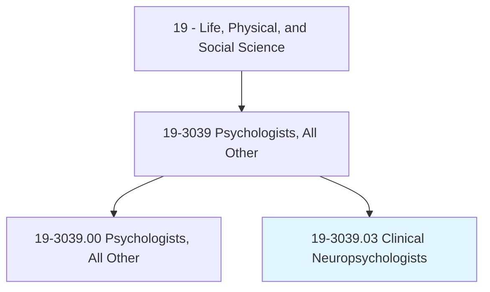
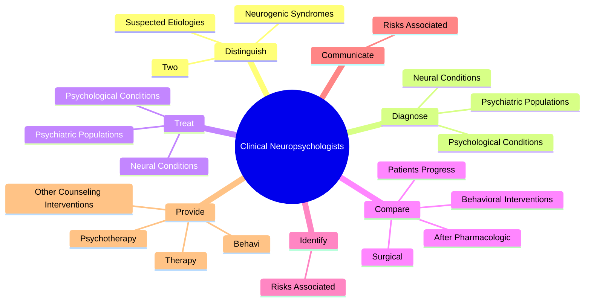

# Clinical Neuropsychologists

> Assess and diagnose patients with neurobehavioral problems related to acquired or developmental disorders of the nervous system, such as neurodegenerative disorders, traumatic brain injury, seizure disorders, and learning disabilities. Recommend treatment after diagnosis, such as therapy, medication, or surgery. Assist with evaluation before and after neurosurgical procedures, such as deep brain stimulation.

## Overview

Clinical Neuropsychologists is a specialized variant within the Life, Physical, and Social Science category. Assess and diagnose patients with neurobehavioral problems related to acquired or developmental disorders of the nervous system, such as neurodegenerative disorders, traumatic brain injury, seizure disorders, and learning disabilities. Recommend treatment after diagnosis, such as therapy, medication, or surgery.

## Classification Hierarchy

## Key Statistics

| Metric | Value |
|--------|-------|
| SOC Code | 19-3039.03 |
| Category | [Life, Physical, and Social Science](/occupations/Science/index) |
| Task Count | 42 |
| Source | O*NET |

## Core Tasks

### distinguish.NeurogenicSyndromes

Clinical Neuropsychologists distinguish neurogenic syndromes as part of their core responsibilities.

**Actions:**
- `distinguish.NeurogenicSyndromes.of.CerebralDysfunction`
- `distinguish.NeurogenicSyndromes.of.BetweenDisordersInvolvingComplexSeizures`
- `distinguish.Two.of.CerebralDysfunction`
- `distinguish.Two.of.BetweenDisordersInvolvingComplexSeizures`

### diagnose.NeuralConditions

Clinical Neuropsychologists diagnose neural conditions as part of their core responsibilities.

**Actions:**
- `diagnose.NeuralConditions.in.MedicalPopulations`
- `diagnose.NeuralConditions.in.SurgicalPopulations`
- `diagnose.NeuralConditions.in.Patients.with.EarlyDementingIllness`
- `diagnose.NeuralConditions.in.ChronicPain.with.NeurologicalBasis`

### treat.NeuralConditions

Clinical Neuropsychologists treat neural conditions as part of their core responsibilities.

**Actions:**
- `treat.NeuralConditions.in.MedicalPopulations`
- `treat.NeuralConditions.in.SurgicalPopulations`
- `treat.NeuralConditions.in.Patients.with.EarlyDementingIllness`
- `treat.NeuralConditions.in.ChronicPain.with.NeurologicalBasis`

## Skills & Competencies

### Technical Skills
- **Research Methods** - Advanced
- **Data Analysis** - Advanced
- **Laboratory Techniques** - Advanced

### Soft Skills
- **Communication** - Essential
- **Problem Solving** - Essential
- **Critical Thinking** - Important
- **Teamwork** - Important
- **Adaptability** - Important

## Related Occupations

## Industries

This occupation is found across multiple industries. See [Industries](/industries) for sector-specific employment data.

## Career Progression

---

*Source: O*NET 19-3039.03 - ONETOccupation*
