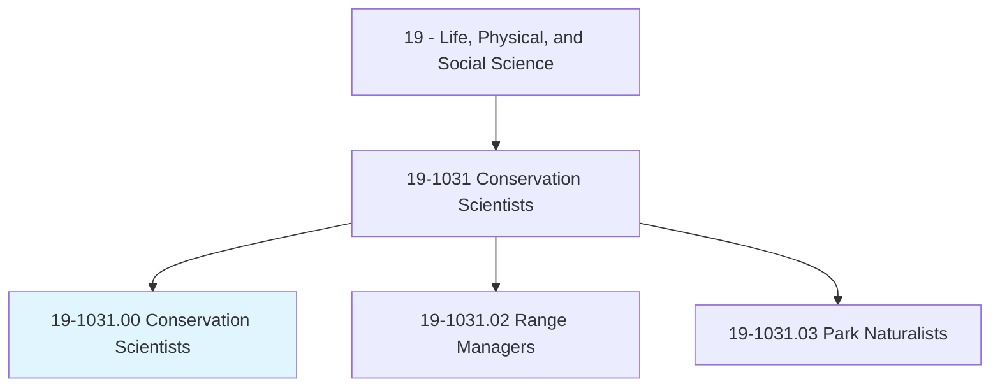
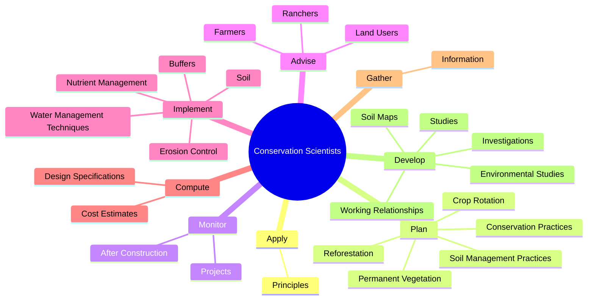
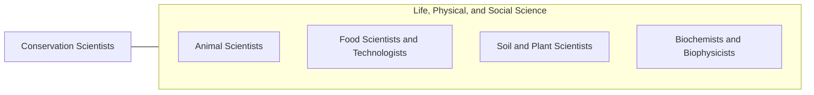

# Conservation Scientists

> Manage, improve, and protect natural resources to maximize their use without damaging the environment. May conduct soil surveys and develop plans to eliminate soil erosion or to protect rangelands. May instruct farmers, agricultural production managers, or ranchers in best ways to use crop rotation, contour plowing, or terracing to conserve soil and water; in the number and kind of livestock and forage plants best suited to particular ranges; and in range and farm improvements, such as fencing and reservoirs for stock watering.

## Overview

Conservation Scientists is an occupation within the Life, Physical, and Social Science category. Manage, improve, and protect natural resources to maximize their use without damaging the environment. May conduct soil surveys and develop plans to eliminate soil erosion or to protect rangelands.

## Classification Hierarchy

## Key Statistics

| Metric | Value |
|--------|-------|
| SOC Code | 19-1031.00 |
| Category | [Life, Physical, and Social Science](/occupations/Science/index) |
| Task Count | 158 |
| Source | O*NET |

## Core Tasks

### apply.Principles

Conservation Scientists apply principles as part of their core responsibilities.

**Actions:**
- `apply.Principles.of.SpecializedFields.of.Science`
- `apply.Principles.of.Agronomy`
- `apply.Principles.of.SoilScience`
- `apply.Principles.of.Forestry`

### plan.SoilManagementPractices

Conservation Scientists plan soil management practices as part of their core responsibilities.

**Actions:**
- `plan.SoilManagementPractices.to.maintain.Soil`
- `plan.SoilManagementPractices.to.conserve.Water`
- `plan.ConservationPractices.to.maintain.Soil`
- `plan.ConservationPractices.to.conserve.Water`

### monitor.Projects

Conservation Scientists monitor projects as part of their core responsibilities.

**Actions:**
- `monitor.Projects.during.ensure.ProjectsConformToDesignSpecifications`
- `monitor.AfterConstruction.to.ensure.ProjectsConformToDesignSpecifications`

## Skills & Competencies

### Technical Skills
- **Research Methods** - Advanced
- **Data Analysis** - Advanced
- **Laboratory Techniques** - Advanced

### Soft Skills
- **Communication** - Essential
- **Problem Solving** - Essential
- **Critical Thinking** - Important
- **Teamwork** - Important
- **Adaptability** - Important

## Related Occupations

## Industries

This occupation is found across multiple industries. See [Industries](/industries) for sector-specific employment data.

## Career Progression

---

*Source: O*NET 19-1031.00 - ONETOccupation*
