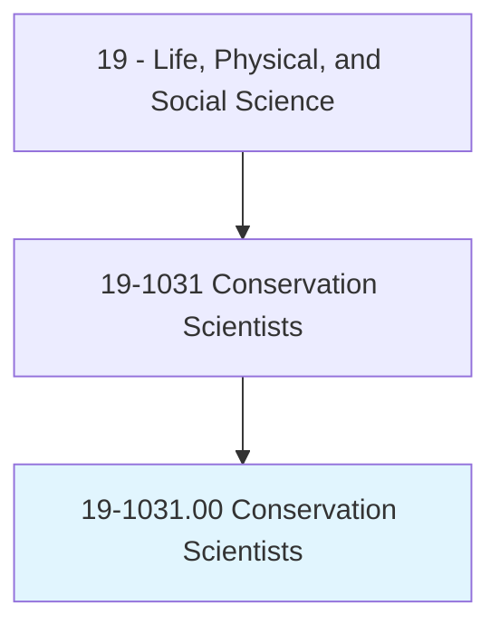
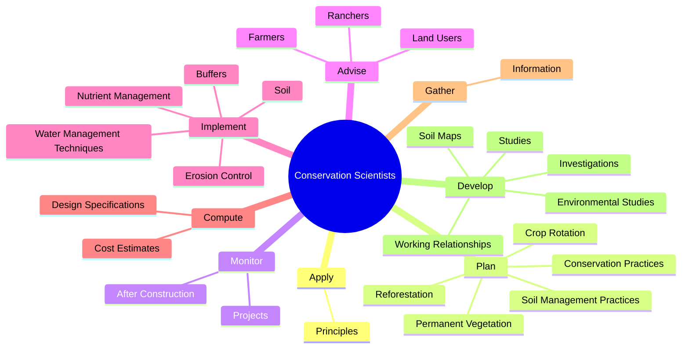
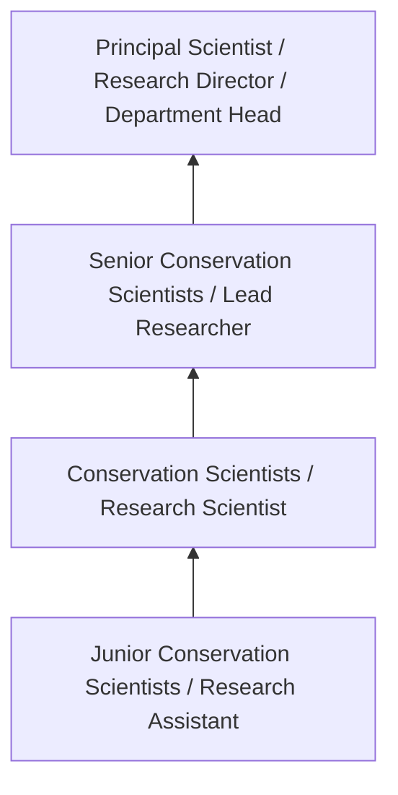
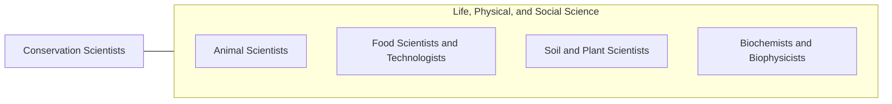

# Conservation Scientists

> Manage, improve, and protect natural resources to maximize their use without damaging the environment. May conduct soil surveys and develop plans to eliminate soil erosion or to protect rangelands. May instruct farmers, agricultural production managers, or ranchers in best ways to use crop rotation, contour plowing, or terracing to conserve soil and water; in the number and kind of livestock and forage plants best suited to particular ranges; and in range and farm improvements, such as fencing and reservoirs for stock watering.

## Overview

Conservation Scientists professionals manage, improve, and protect natural resources to maximize their use without damaging the environment. This occupation falls within the Life, Physical, and Social Science category and requires a combination of specialized knowledge, technical skills, and practical experience.

These professionals work across diverse settings and organizational contexts, applying their expertise to meet the demands of their field. They must stay current with industry standards, emerging practices, and regulatory requirements that affect their work. The role demands both independent judgment and collaborative skills, as practitioners regularly interact with colleagues, stakeholders, and the public.

As the field continues to evolve, Conservation Scientists professionals increasingly leverage technology and data-driven approaches to enhance their effectiveness. Career opportunities span the public and private sectors, with demand influenced by economic conditions, demographic shifts, and technological advancement.

## Classification Hierarchy



## Key Statistics

| Metric | Value |
|--------|-------|
| SOC Code | 19-1031.00 |
| Job Zone | N/A |
| Category | [Life, Physical, and Social Science](/occupations/Science/index) |
| Core Tasks | 158+ |
| Salary Range | $50,000 - $130,000 |
| Median Salary | $78,000 |
| Growth Outlook | 7% (Faster than average) |
| Source | O*NET |

## Core Tasks



### plan.SoilManagementPractices

Conservation Scientists plan soil management practices as part of their core responsibilities.

**Actions:**
- `plan.SoilManagementPractices.to.maintain.Soil` - Plan soil management or conservation practices, such as crop rotation, refore...
- `plan.SoilManagementPractices.to.conserve.Water` - Plan soil management or conservation practices, such as crop rotation, refore...
- `plan.ConservationPractices.to.maintain.Soil` - Plan soil management or conservation practices, such as crop rotation, refore...
- `plan.ConservationPractices.to.conserve.Water` - Plan soil management or conservation practices, such as crop rotation, refore...
- `plan.CropRotation.to.maintain.Soil` - Plan soil management or conservation practices, such as crop rotation, refore...

### develop.WorkingRelationships

Conservation Scientists develop working relationships as part of their core responsibilities.

**Actions:**
- `develop.WorkingRelationships.with.LocalGovernmentStaffMembers` - Develop or maintain working relationships with local government staff or boar...
- `develop.WorkingRelationships.with.BoardMembers` - Develop or maintain working relationships with local government staff or boar...
- `develop.Studies.of.VariousLandUses.to.inform.CorrectiveActionPlans` - Develop, conduct, or participate in surveys, studies, or investigations of va...
- `develop.Investigations.of.VariousLandUses.to.inform.CorrectiveActionPlans` - Develop, conduct, or participate in surveys, studies, or investigations of va...
- `develop.SoilMaps` - Develop soil maps.

### implement.Soil

Conservation Scientists implement soil as part of their core responsibilities.

**Actions:**
- `implement.Soil.in.Accordance.with.ConservationPlans` - Implement soil or water management techniques, such as nutrient management, e...
- `implement.WaterManagementTechniques.in.Accordance.with.ConservationPlans` - Implement soil or water management techniques, such as nutrient management, e...
- `implement.NutrientManagement.in.Accordance.with.ConservationPlans` - Implement soil or water management techniques, such as nutrient management, e...
- `implement.ErosionControl.in.Accordance.with.ConservationPlans` - Implement soil or water management techniques, such as nutrient management, e...
- `implement.Buffers.in.Accordance.with.ConservationPlans` - Implement soil or water management techniques, such as nutrient management, e...

### conduct.Studies

Conservation Scientists conduct studies as part of their core responsibilities.

**Actions:**
- `conduct.Studies.of.VariousLandUses.to.inform.CorrectiveActionPlans` - Develop, conduct, or participate in surveys, studies, or investigations of va...
- `conduct.Investigations.of.VariousLandUses.to.inform.CorrectiveActionPlans` - Develop, conduct, or participate in surveys, studies, or investigations of va...
- `conduct.AnnualAuditsChecks.of.ProgramImplementation.by.LocalGovernment` - Initiate, schedule, or conduct annual audits or compliance checks of program ...
- `conduct.ComplianceChecks.of.ProgramImplementation.by.LocalGovernment` - Initiate, schedule, or conduct annual audits or compliance checks of program ...
- `conduct.EnvironmentalStudies` - Develop or conduct environmental studies, such as plant material field trials...


## Skills & Competencies

### Technical Skills
- **Research Methodology** - Expert
- **Data Analysis** - Advanced
- **Laboratory Techniques** - Advanced
- **Scientific Writing** - Advanced
- **Statistical Software** - Advanced
- **Quality Control** - Proficient

### Soft Skills
- **Analytical Thinking** - Critical
- **Attention to Detail** - Critical
- **Problem Solving** - Essential
- **Collaboration** - Essential
- **Written Communication** - Essential

## Education & Certifications

| Requirement | Details |
|-------------|---------|
| Typical Education | Bachelor's or Master's degree in relevant scientific field |
| Work Experience | 1-3 years research or laboratory experience |
| On-the-Job Training | Moderate - specialized laboratory techniques |
| Certifications | Field-specific certifications may be required |

## Career Progression



## Industry Variations

### Academic Research
Focus on fundamental research and publication. Conservation Scientists professionals in academia often combine research with teaching responsibilities and mentoring graduate students.

### Industry Research and Development
Applied research for product development and commercial applications. Emphasis on innovation timelines and market-driven objectives.

### Government and Regulatory
Mission-oriented research supporting public policy and regulatory decisions. Focus on public health, environmental protection, or national security.

### Consulting and Contract Research
Project-based work for diverse clients. Requires strong communication skills and ability to translate findings for non-technical audiences.

## Technology & Tools

- **Laboratory Information Management Systems (LIMS)**
- **Statistical software (R, SAS, SPSS)**
- **Spectroscopy and chromatography equipment**
- **Microscopy and imaging systems**
- **Data analysis and visualization tools**

## Related Occupations



## Industries

- [Research and Development](/industries/ResearchDevelopment) - High Employment
- [Pharmaceutical Manufacturing](/industries/Pharma) - High Employment
- [Government Agencies](/industries/Government) - Moderate Employment
- [Higher Education](/industries/Education) - Moderate Employment

## Departments

This occupation typically works in:
- [Research and Development](/departments/Research/index)
- [Quality Assurance](/departments/QualityAssurance)
- [Laboratory Operations](/departments/Laboratory)

## GraphDL Semantic Structure

```
Conservation Scientists perform:
- apply.Principles.of.SpecializedFields.of.Science
- apply.Principles.of.Agronomy
- apply.Principles.of.SoilScience
- apply.Principles.of.Forestry
- apply.Principles.of.Agriculture
- apply.Principles.of.achieve.ConservationObjectives
```

---

*Source: O*NET 19-1031.00 - ONETOccupation*
