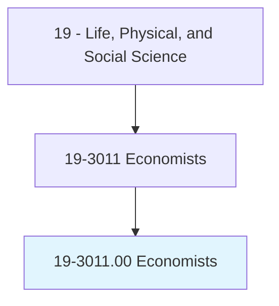
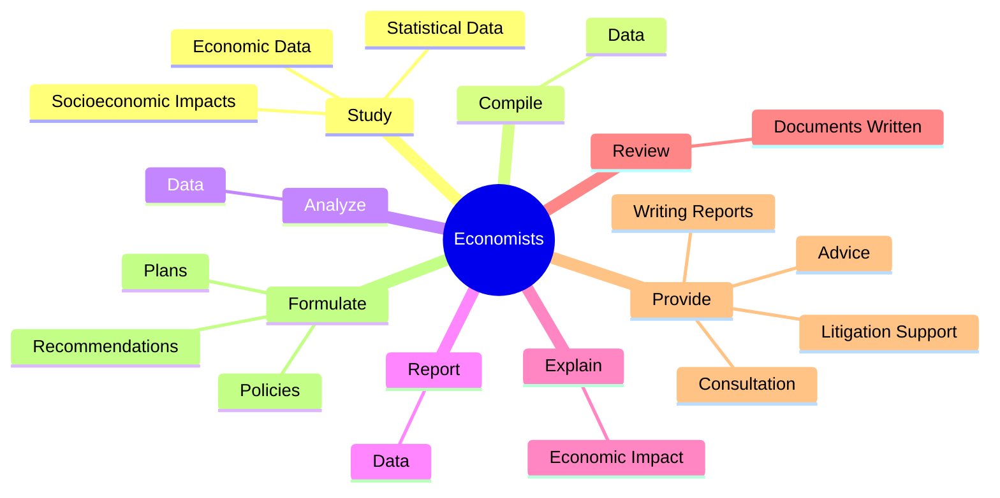
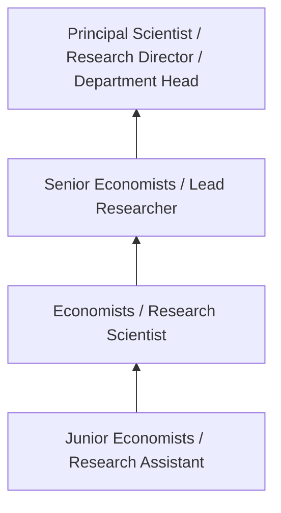
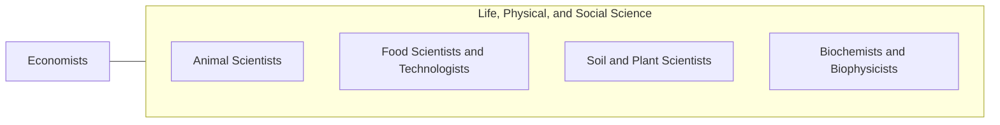

# Economists

> Conduct research, prepare reports, or formulate plans to address economic problems related to the production and distribution of goods and services or monetary and fiscal policy. May collect and process economic and statistical data using sampling techniques and econometric methods.

## Overview

Economists professionals conduct research, prepare reports, or formulate plans to address economic problems related to the production and distribution of goods and services or monetary and fiscal policy. This occupation falls within the Life, Physical, and Social Science category and requires a combination of specialized knowledge, technical skills, and practical experience.

These professionals work across diverse settings and organizational contexts, applying their expertise to meet the demands of their field. They must stay current with industry standards, emerging practices, and regulatory requirements that affect their work. The role demands both independent judgment and collaborative skills, as practitioners regularly interact with colleagues, stakeholders, and the public.

As the field continues to evolve, Economists professionals increasingly leverage technology and data-driven approaches to enhance their effectiveness. Career opportunities span the public and private sectors, with demand influenced by economic conditions, demographic shifts, and technological advancement.

## Classification Hierarchy



## Key Statistics

| Metric | Value |
|--------|-------|
| SOC Code | 19-3011.00 |
| Job Zone | N/A |
| Category | [Life, Physical, and Social Science](/occupations/Science/index) |
| Core Tasks | 70+ |
| Salary Range | $50,000 - $130,000 |
| Median Salary | $78,000 |
| Growth Outlook | 7% (Faster than average) |
| Source | O*NET |

## Core Tasks



### study.EconomicData

Economists study economic data as part of their core responsibilities.

**Actions:**
- `study.EconomicData.in.Area.of.Specialization` - Study economic and statistical data in area of specialization, such as financ...
- `study.EconomicData.in.Finance` - Study economic and statistical data in area of specialization, such as financ...
- `study.EconomicData.in.Labor` - Study economic and statistical data in area of specialization, such as financ...
- `study.EconomicData.in.Agriculture` - Study economic and statistical data in area of specialization, such as financ...
- `study.StatisticalData.in.Area.of.Specialization` - Study economic and statistical data in area of specialization, such as financ...

### provide.Advice

Economists provide advice as part of their core responsibilities.

**Actions:**
- `provide.Advice.on.EconomicRelationships.to.Businesses` - Provide advice and consultation on economic relationships to businesses, publ...
- `provide.Advice.on.Public` - Provide advice and consultation on economic relationships to businesses, publ...
- `provide.Advice.on.PrivateAgencies` - Provide advice and consultation on economic relationships to businesses, publ...
- `provide.Advice.on.OtherEmployers` - Provide advice and consultation on economic relationships to businesses, publ...
- `provide.Consultation.on.EconomicRelationships.to.Businesses` - Provide advice and consultation on economic relationships to businesses, publ...

### forecast.Production

Economists forecast production as part of their core responsibilities.

**Actions:**
- `forecast.Production.of.RenewableResources` - Forecast production and consumption of renewable resources and supply, consum...
- `forecast.Production.of.Supply` - Forecast production and consumption of renewable resources and supply, consum...
- `forecast.Production.of.Consumption` - Forecast production and consumption of renewable resources and supply, consum...
- `forecast.Production.of.Depletion.of.NonRenewableResources` - Forecast production and consumption of renewable resources and supply, consum...
- `forecast.Consumption.of.RenewableResources` - Forecast production and consumption of renewable resources and supply, consum...

### formulate.Recommendations

Economists formulate recommendations as part of their core responsibilities.

**Actions:**
- `formulate.Recommendations.to.solve.EconomicProblemsInterpretMarkets` - Formulate recommendations, policies, or plans to solve economic problems or t...
- `formulate.Recommendations.to.ToInterpretMarkets` - Formulate recommendations, policies, or plans to solve economic problems or t...
- `formulate.Policies.to.solve.EconomicProblemsInterpretMarkets` - Formulate recommendations, policies, or plans to solve economic problems or t...
- `formulate.Policies.to.ToInterpretMarkets` - Formulate recommendations, policies, or plans to solve economic problems or t...
- `formulate.Plans.to.solve.EconomicProblemsInterpretMarkets` - Formulate recommendations, policies, or plans to solve economic problems or t...


## Skills & Competencies

### Technical Skills
- **Research Methodology** - Expert
- **Data Analysis** - Advanced
- **Laboratory Techniques** - Advanced
- **Scientific Writing** - Advanced
- **Statistical Software** - Advanced
- **Quality Control** - Proficient

### Soft Skills
- **Analytical Thinking** - Critical
- **Attention to Detail** - Critical
- **Problem Solving** - Essential
- **Collaboration** - Essential
- **Written Communication** - Essential

## Education & Certifications

| Requirement | Details |
|-------------|---------|
| Typical Education | Bachelor's or Master's degree in relevant scientific field |
| Work Experience | 1-3 years research or laboratory experience |
| On-the-Job Training | Moderate - specialized laboratory techniques |
| Certifications | Field-specific certifications may be required |

## Career Progression



## Industry Variations

### Academic Research
Focus on fundamental research and publication. Economists professionals in academia often combine research with teaching responsibilities and mentoring graduate students.

### Industry Research and Development
Applied research for product development and commercial applications. Emphasis on innovation timelines and market-driven objectives.

### Government and Regulatory
Mission-oriented research supporting public policy and regulatory decisions. Focus on public health, environmental protection, or national security.

### Consulting and Contract Research
Project-based work for diverse clients. Requires strong communication skills and ability to translate findings for non-technical audiences.

## Technology & Tools

- **Laboratory Information Management Systems (LIMS)**
- **Statistical software (R, SAS, SPSS)**
- **Spectroscopy and chromatography equipment**
- **Microscopy and imaging systems**
- **Data analysis and visualization tools**

## Related Occupations



## Industries

- Research and Development - High Employment
- Pharmaceutical Manufacturing - High Employment
- [Government Agencies](/industries/PublicAdministration) - Moderate Employment
- [Higher Education](/industries/Education) - Moderate Employment

## Departments

This occupation typically works in:
- [Research and Development](/departments/Research/index)
- Quality Assurance
- Laboratory Operations

## GraphDL Semantic Structure

```graphdl
Economists perform:
- study.EconomicData.in.Area.of.Specialization
- study.EconomicData.in.Finance
- study.EconomicData.in.Labor
- study.EconomicData.in.Agriculture
- study.StatisticalData.in.Area.of.Specialization
- study.StatisticalData.in.Finance
```

---

*Source: O*NET 19-3011.00 - ONETOccupation*
