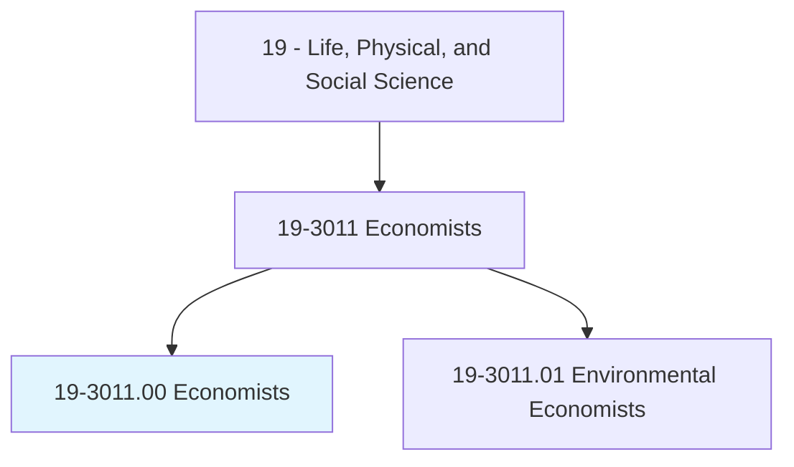
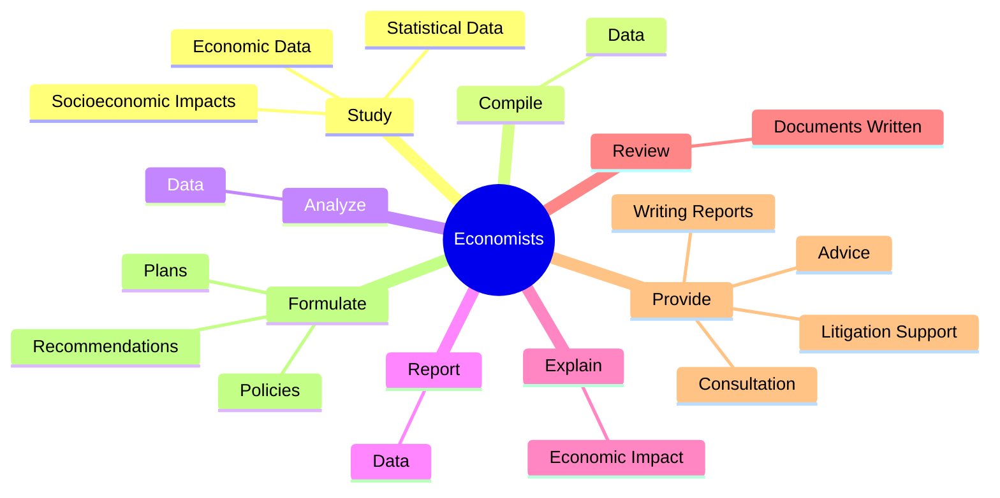
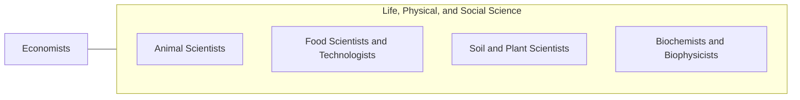

# Economists

> Conduct research, prepare reports, or formulate plans to address economic problems related to the production and distribution of goods and services or monetary and fiscal policy. May collect and process economic and statistical data using sampling techniques and econometric methods.

## Overview

Economists is an occupation within the Life, Physical, and Social Science category. Conduct research, prepare reports, or formulate plans to address economic problems related to the production and distribution of goods and services or monetary and fiscal policy. 

## Classification Hierarchy

## Key Statistics

| Metric | Value |
|--------|-------|
| SOC Code | 19-3011.00 |
| Category | [Life, Physical, and Social Science](/occupations/Science/index) |
| Task Count | 70 |
| Source | O*NET |

## Core Tasks

### study.EconomicData

Economists study economic data as part of their core responsibilities.

**Actions:**
- `study.EconomicData.in.Area.of.Specialization`
- `study.EconomicData.in.Finance`
- `study.EconomicData.in.Labor`
- `study.EconomicData.in.Agriculture`

### compile.Data

Economists compile data as part of their core responsibilities.

**Actions:**
- `compile.Data.to.explain.EconomicPhenomena`
- `compile.Data.to.forecast.MarketTrends`
- `compile.Data.to.ApplyingMathematicalModels`
- `compile.Data.to.StatisticalTechniques`

### analyze.Data

Economists analyze data as part of their core responsibilities.

**Actions:**
- `analyze.Data.to.explain.EconomicPhenomena`
- `analyze.Data.to.forecast.MarketTrends`
- `analyze.Data.to.ApplyingMathematicalModels`
- `analyze.Data.to.StatisticalTechniques`

## Skills & Competencies

### Technical Skills
- **Research Methods** - Advanced
- **Data Analysis** - Advanced
- **Laboratory Techniques** - Advanced

### Soft Skills
- **Communication** - Essential
- **Problem Solving** - Essential
- **Critical Thinking** - Important
- **Teamwork** - Important
- **Adaptability** - Important

## Related Occupations

## Industries

This occupation is found across multiple industries. See [Industries](/industries) for sector-specific employment data.

## Career Progression

---

*Source: O*NET 19-3011.00 - ONETOccupation*
