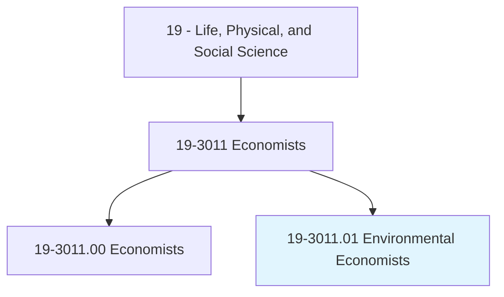
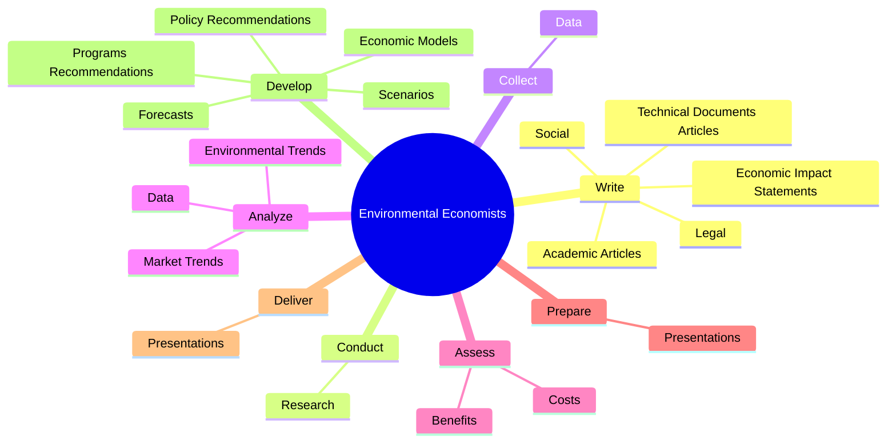
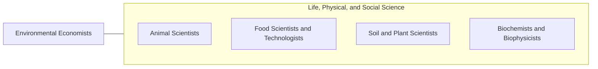

# Environmental Economists

> Conduct economic analysis related to environmental protection and use of the natural environment, such as water, air, land, and renewable energy resources. Evaluate and quantify benefits, costs, incentives, and impacts of alternative options using economic principles and statistical techniques.

## Overview

Environmental Economists is a specialized variant within the Life, Physical, and Social Science category. Conduct economic analysis related to environmental protection and use of the natural environment, such as water, air, land, and renewable energy resources. 

## Classification Hierarchy

## Key Statistics

| Metric | Value |
|--------|-------|
| SOC Code | 19-3011.01 |
| Category | [Life, Physical, and Social Science](/occupations/Science) |
| Task Count | 95 |
| Source | O*NET |

## Core Tasks

### write.TechnicalDocumentsArticles

Environmental Economists write technical documents articles as part of their core responsibilities.

**Actions:**
- `write.TechnicalDocumentsArticles.to.communicate.StudyResultsForecasts`
- `write.TechnicalDocumentsArticles.to.EconomicForecasts`
- `write.AcademicArticles.to.communicate.StudyResultsForecasts`
- `write.AcademicArticles.to.EconomicForecasts`

### conduct.Research

Environmental Economists conduct research as part of their core responsibilities.

**Actions:**
- `conduct.Research.on.EconomicTopics`
- `conduct.Research.on.EnvironmentalTopics`
- `conduct.Research.on.AlternativeFuelUse`
- `conduct.Research.on.Public`

### collect.Data

Environmental Economists collect data as part of their core responsibilities.

**Actions:**
- `collect.Data.to.compare.EnvironmentalImplicationsOfEconomicPolicy`
- `collect.Data.to.practice.Alternatives`

## Skills & Competencies

### Technical Skills
- **Research Methods** - Advanced
- **Data Analysis** - Advanced
- **Laboratory Techniques** - Advanced

### Soft Skills
- **Communication** - Essential
- **Problem Solving** - Essential
- **Critical Thinking** - Important
- **Teamwork** - Important
- **Adaptability** - Important

## Related Occupations

## Industries

This occupation is found across multiple industries. See [Industries](/industries) for sector-specific employment data.

## Career Progression

---

*Source: O*NET 19-3011.01 - ONETOccupation*
