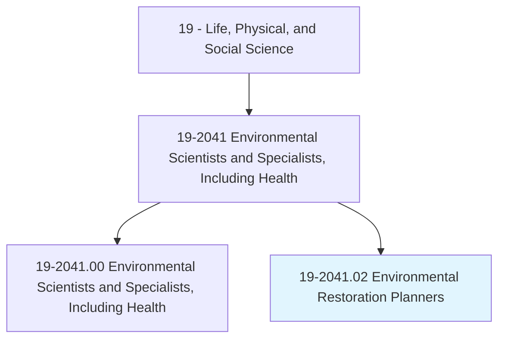
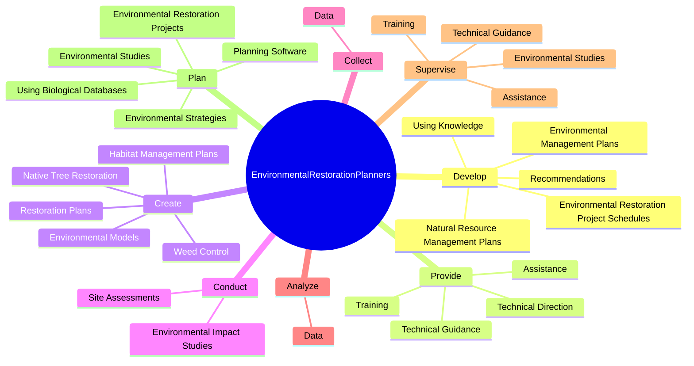
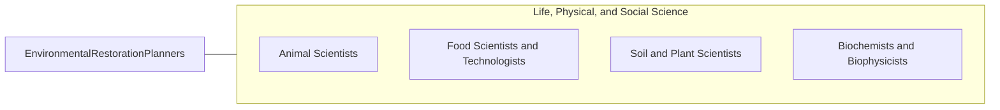

# Environmental Restoration Planners

> Collaborate with field and biology staff to oversee the implementation of restoration projects and to develop new products. Process and synthesize complex scientific data into practical strategies for restoration, monitoring or management.

## Overview

Environmental Restoration Planners is a specialized variant within the Life, Physical, and Social Science category. Collaborate with field and biology staff to oversee the implementation of restoration projects and to develop new products. 

## Classification Hierarchy

## Key Statistics

| Metric | Value |
|--------|-------|
| SOC Code | 19-2041.02 |
| Category | [Life, Physical, and Social Science](/occupations/Science/index) |
| Task Count | 93 |
| Source | O*NET |

## Core Tasks

### develop.EnvironmentalRestorationProjectSchedules

Environmental Restoration Planners develop environmental restoration project schedules as part of their core responsibilities.

**Actions:**
- `develop.EnvironmentalRestorationProjectSchedules`
- `develop.NaturalResourceManagementPlans.of.EnvironmentalPlanningFederalEnvironmentalRegulatoryRequirements`
- `develop.NaturalResourceManagementPlans.of.StateFederalEnvironmentalRegulatoryRequirements`
- `develop.UsingKnowledge.of.EnvironmentalPlanningFederalEnvironmentalRegulatoryRequirements`

### provide.TechnicalDirection

Environmental Restoration Planners provide technical direction as part of their core responsibilities.

**Actions:**
- `provide.TechnicalDirection.on.EnvironmentalPlanningToEnergyEngineers`
- `provide.TechnicalDirection.on.Biologists`
- `provide.TechnicalDirection.on.Geologists`
- `provide.TechnicalDirection.on.OtherProfessionalsWorking.to.develop.RestorationPlans`

### create.HabitatManagementPlans

Environmental Restoration Planners create habitat management plans as part of their core responsibilities.

**Actions:**
- `create.HabitatManagementPlans`
- `create.RestorationPlans`
- `create.NativeTreeRestoration`
- `create.WeedControl`

## Skills & Competencies

### Technical Skills
- **Research Methods** - Advanced
- **Data Analysis** - Advanced
- **Laboratory Techniques** - Advanced

### Soft Skills
- **Communication** - Essential
- **Problem Solving** - Essential
- **Critical Thinking** - Important
- **Teamwork** - Important
- **Adaptability** - Important

## Related Occupations

## Industries

This occupation is found across multiple industries. See [Industries](/industries) for sector-specific employment data.

## Career Progression

---

*Source: O*NET 19-2041.02 - ONETOccupation*
