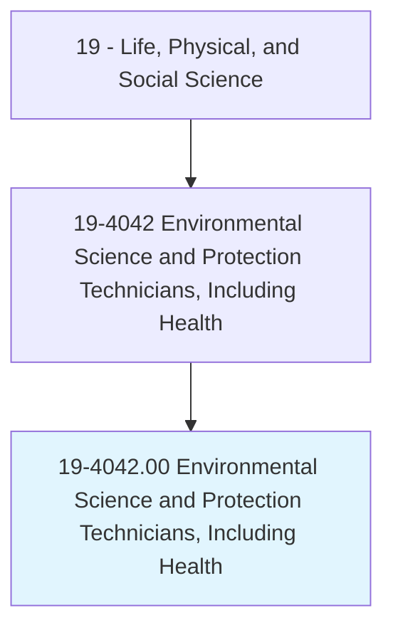
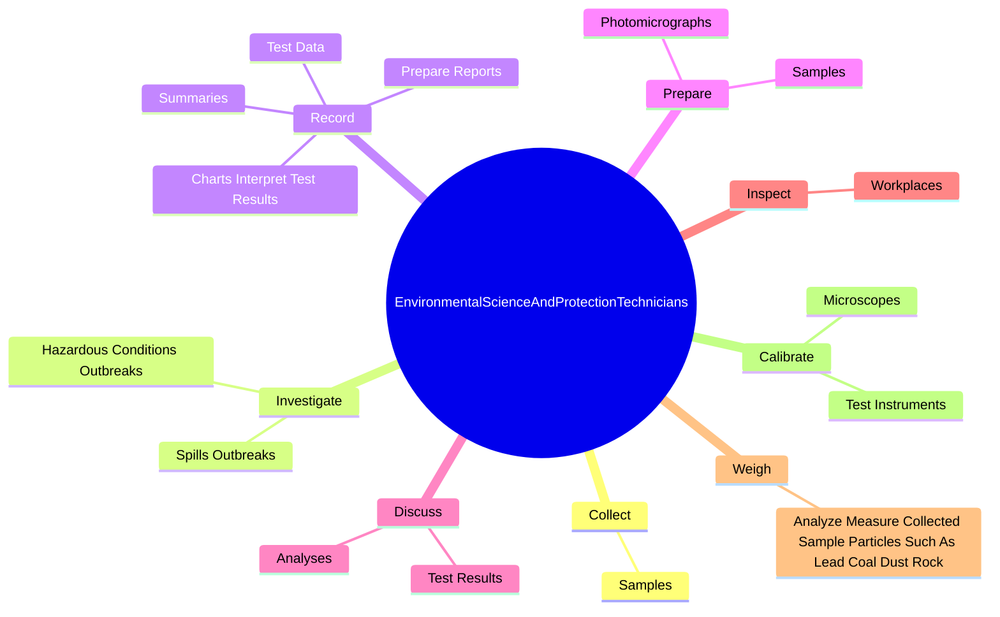
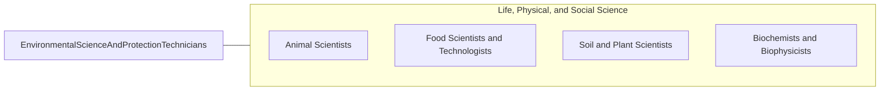

# Environmental Science and Protection Technicians, Including Health

> Perform laboratory and field tests to monitor the environment and investigate sources of pollution, including those that affect health, under the direction of an environmental scientist, engineer, or other specialist. May collect samples of gases, soil, water, and other materials for testing.

## Overview

Environmental Science and Protection Technicians, Including Health is an occupation within the Life, Physical, and Social Science category. Perform laboratory and field tests to monitor the environment and investigate sources of pollution, including those that affect health, under the direction of an environmental scientist, engineer, or other specialist. 

## Classification Hierarchy

## Key Statistics

| Metric | Value |
|--------|-------|
| SOC Code | 19-4042.00 |
| Category | [Life, Physical, and Social Science](/occupations/Science) |
| Task Count | 92 |
| Source | O*NET |

## Core Tasks

### collect.Samples

Environmental Science and Protection Technicians, Including Health collect samples as part of their core responsibilities.

**Actions:**
- `collect.Samples.of.Gases`
- `collect.Samples.of.Soils`
- `collect.Samples.of.Water`
- `collect.Samples.of.IndustrialWastewater`

### investigate.HazardousConditionsOutbreaks

Environmental Science and Protection Technicians, Including Health investigate hazardous conditions outbreaks as part of their core responsibilities.

**Actions:**
- `investigate.HazardousConditionsOutbreaks.of.Disease`
- `investigate.HazardousConditionsOutbreaks.of.FoodPoisoning`
- `investigate.HazardousConditionsOutbreaks.of.CollectingSamplesF`
- `investigate.HazardousConditionsOutbreaks.of.Analysis`

### record.TestData

Environmental Science and Protection Technicians, Including Health record test data as part of their core responsibilities.

**Actions:**
- `record.TestData`
- `record.PrepareReports`
- `record.Summaries`
- `record.ChartsInterpretTestResults`

## Skills & Competencies

### Technical Skills
- **Research Methods** - Advanced
- **Data Analysis** - Advanced
- **Laboratory Techniques** - Advanced

### Soft Skills
- **Communication** - Essential
- **Problem Solving** - Essential
- **Critical Thinking** - Important
- **Teamwork** - Important
- **Adaptability** - Important

## Related Occupations

## Industries

This occupation is found across multiple industries. See [Industries](/industries) for sector-specific employment data.

## Career Progression

---

*Source: O*NET 19-4042.00 - ONETOccupation*
