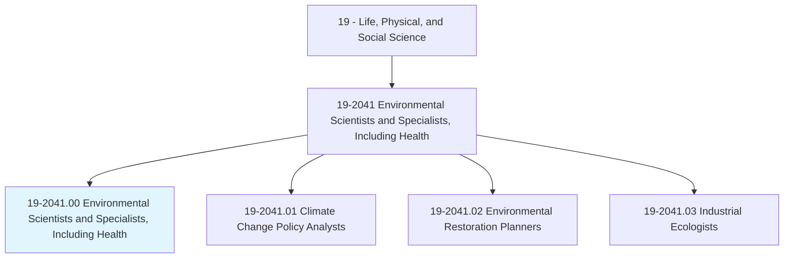
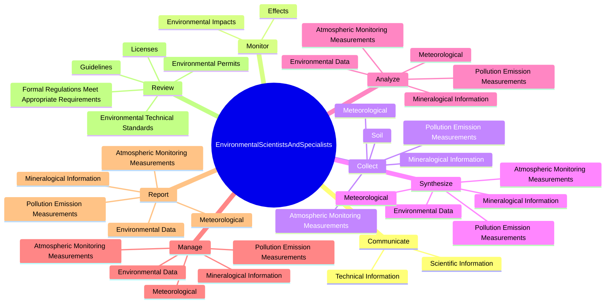
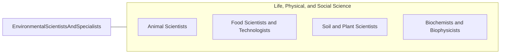

# Environmental Scientists and Specialists, Including Health

> Conduct research or perform investigation for the purpose of identifying, abating, or eliminating sources of pollutants or hazards that affect either the environment or public health. Using knowledge of various scientific disciplines, may collect, synthesize, study, report, and recommend action based on data derived from measurements or observations of air, food, soil, water, and other sources.

## Overview

Environmental Scientists and Specialists, Including Health is an occupation within the Life, Physical, and Social Science category. Conduct research or perform investigation for the purpose of identifying, abating, or eliminating sources of pollutants or hazards that affect either the environment or public health. 

## Classification Hierarchy

## Key Statistics

| Metric | Value |
|--------|-------|
| SOC Code | 19-2041.00 |
| Category | [Life, Physical, and Social Science](/occupations/Science) |
| Task Count | 139 |
| Source | O*NET |

## Core Tasks

### communicate.ScientificInformation

Environmental Scientists and Specialists, Including Health communicate scientific information as part of their core responsibilities.

**Actions:**
- `communicate.ScientificInformation.to.Public`
- `communicate.ScientificInformation.to.Organizations`
- `communicate.ScientificInformation.to.InternalAudiencesThroughOralBriefings`
- `communicate.ScientificInformation.to.WrittenDocuments`

### monitor.Effects

Environmental Scientists and Specialists, Including Health monitor effects as part of their core responsibilities.

**Actions:**
- `monitor.Effects.of.PollutionDegradationRecommendMeans.of.PreventionControl`
- `monitor.Effects.of.LandDegradationRecommendMeans.of.PreventionControl`
- `monitor.EnvironmentalImpacts.of.DevelopmentActivities`

### collect.PollutionEmissionMeasurements

Environmental Scientists and Specialists, Including Health collect pollution emission measurements as part of their core responsibilities.

**Actions:**
- `collect.PollutionEmissionMeasurements`
- `collect.AtmosphericMonitoringMeasurements`
- `collect.Meteorological`
- `collect.MineralogicalInformation`

## Skills & Competencies

### Technical Skills
- **Research Methods** - Advanced
- **Data Analysis** - Advanced
- **Laboratory Techniques** - Advanced

### Soft Skills
- **Communication** - Essential
- **Problem Solving** - Essential
- **Critical Thinking** - Important
- **Teamwork** - Important
- **Adaptability** - Important

## Related Occupations

## Industries

This occupation is found across multiple industries. See [Industries](/industries) for sector-specific employment data.

## Career Progression

---

*Source: O*NET 19-2041.00 - ONETOccupation*
