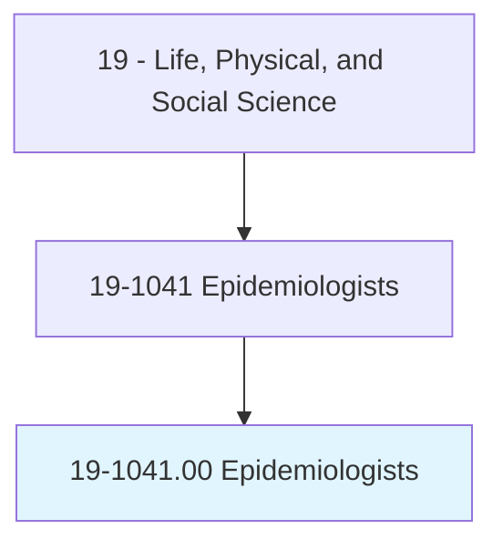
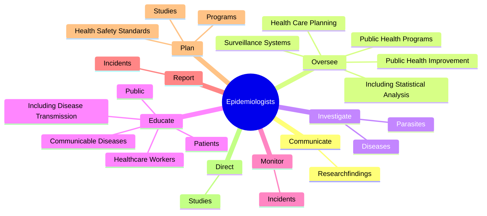
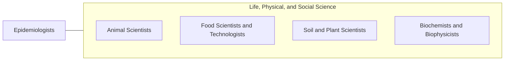

# Epidemiologists

> Investigate and describe the determinants and distribution of disease, disability, or health outcomes. May develop the means for prevention and control.

## Overview

Epidemiologists is an occupation within the Life, Physical, and Social Science category. Investigate and describe the determinants and distribution of disease, disability, or health outcomes. 

## Classification Hierarchy

## Key Statistics

| Metric | Value |
|--------|-------|
| SOC Code | 19-1041.00 |
| Category | [Life, Physical, and Social Science](/occupations/Science) |
| Task Count | 125 |
| Source | O*NET |

## Core Tasks

### communicate.Researchfindings

Epidemiologists communicate researchfindings as part of their core responsibilities.

**Actions:**
- `communicate.Researchfindings.on.VariousTypesOfDiseasesToHealthPractitioners`
- `communicate.Researchfindings.on.PolicyMakers`
- `communicate.Researchfindings.on.Public`

### oversee.PublicHealthPrograms

Epidemiologists oversee public health programs as part of their core responsibilities.

**Actions:**
- `oversee.PublicHealthPrograms`
- `oversee.IncludingStatisticalAnalysis`
- `oversee.HealthCarePlanning`
- `oversee.SurveillanceSystems`

### investigate.Diseases

Epidemiologists investigate diseases as part of their core responsibilities.

**Actions:**
- `investigate.Diseases.to.determine.CauseFactors`
- `investigate.Diseases.to.RiskFactors`
- `investigate.Diseases.to.Progress`
- `investigate.Diseases.to.LifeCycle`

## Skills & Competencies

### Technical Skills
- **Research Methods** - Advanced
- **Data Analysis** - Advanced
- **Laboratory Techniques** - Advanced

### Soft Skills
- **Communication** - Essential
- **Problem Solving** - Essential
- **Critical Thinking** - Important
- **Teamwork** - Important
- **Adaptability** - Important

## Related Occupations

## Industries

This occupation is found across multiple industries. See [Industries](/industries) for sector-specific employment data.

## Career Progression

---

*Source: O*NET 19-1041.00 - ONETOccupation*
