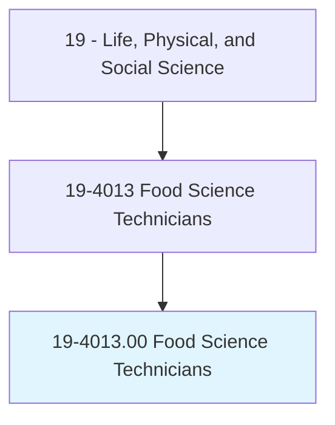
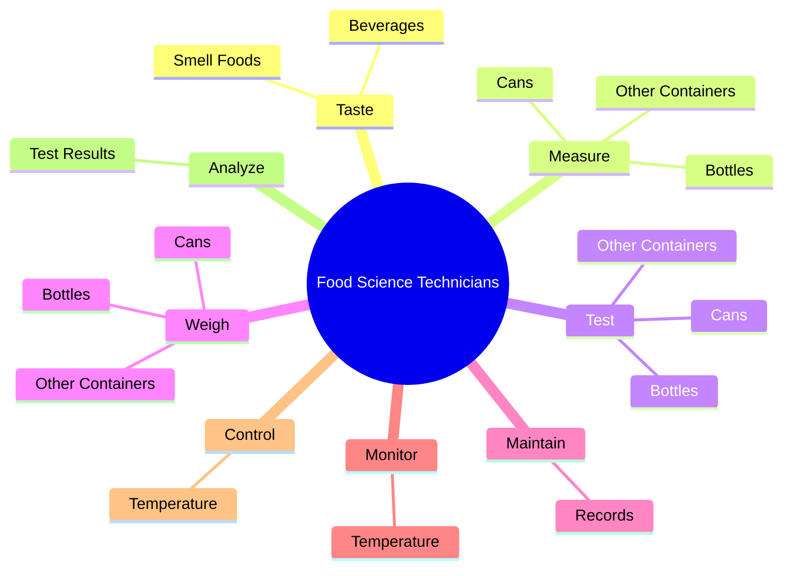
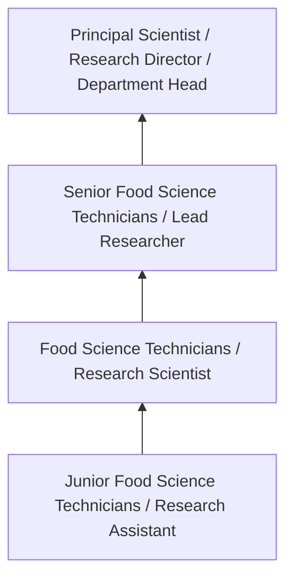

# Food Science Technicians

> Work with food scientists or technologists to perform standardized qualitative and quantitative tests to determine physical or chemical properties of food or beverage products. Includes technicians who assist in research and development of production technology, quality control, packaging, processing, and use of foods.

## Overview

Food Science Technicians professionals work with food scientists or technologists to perform standardized qualitative and quantitative tests to determine physical or chemical properties of food or beverage products. This occupation falls within the Life, Physical, and Social Science category and requires a combination of specialized knowledge, technical skills, and practical experience.

These professionals work across diverse settings and organizational contexts, applying their expertise to meet the demands of their field. They must stay current with industry standards, emerging practices, and regulatory requirements that affect their work. The role demands both independent judgment and collaborative skills, as practitioners regularly interact with colleagues, stakeholders, and the public.

As the field continues to evolve, Food Science Technicians professionals increasingly leverage technology and data-driven approaches to enhance their effectiveness. Career opportunities span the public and private sectors, with demand influenced by economic conditions, demographic shifts, and technological advancement.

## Classification Hierarchy



## Key Statistics

| Metric | Value |
|--------|-------|
| SOC Code | 19-4013.00 |
| Job Zone | N/A |
| Category | [Life, Physical, and Social Science](/occupations/Science/index) |
| Core Tasks | 86+ |
| Salary Range | $50,000 - $130,000 |
| Median Salary | $78,000 |
| Growth Outlook | 7% (Faster than average) |
| Source | O*NET |

## Core Tasks



### compute.MoistureContentPercentages

Food Science Technicians compute moisture content percentages as part of their core responsibilities.

**Actions:**
- `compute.MoistureContentPercentages.of.Ingredients` - Compute moisture or salt content, percentages of ingredients, formulas, or ot...
- `compute.MoistureContentPercentages.of.Formulas` - Compute moisture or salt content, percentages of ingredients, formulas, or ot...
- `compute.MoistureContentPercentages.of.OtherProductFactors` - Compute moisture or salt content, percentages of ingredients, formulas, or ot...
- `compute.MoistureContentPercentages.of.UsingMathematical` - Compute moisture or salt content, percentages of ingredients, formulas, or ot...
- `compute.MoistureContentPercentages.of.ChemicalProcedures` - Compute moisture or salt content, percentages of ingredients, formulas, or ot...

### measure.Bottles

Food Science Technicians measure bottles as part of their core responsibilities.

**Actions:**
- `measure.Bottles.to.ensure.Hardness` - Measure, test, or weigh bottles, cans, or other containers to ensure that har...
- `measure.Bottles.to.Strength` - Measure, test, or weigh bottles, cans, or other containers to ensure that har...
- `measure.Bottles.to.DimensionsMeetSpecifications` - Measure, test, or weigh bottles, cans, or other containers to ensure that har...
- `measure.Cans.to.ensure.Hardness` - Measure, test, or weigh bottles, cans, or other containers to ensure that har...
- `measure.Cans.to.Strength` - Measure, test, or weigh bottles, cans, or other containers to ensure that har...

### test.Bottles

Food Science Technicians test bottles as part of their core responsibilities.

**Actions:**
- `test.Bottles.to.ensure.Hardness` - Measure, test, or weigh bottles, cans, or other containers to ensure that har...
- `test.Bottles.to.Strength` - Measure, test, or weigh bottles, cans, or other containers to ensure that har...
- `test.Bottles.to.DimensionsMeetSpecifications` - Measure, test, or weigh bottles, cans, or other containers to ensure that har...
- `test.Cans.to.ensure.Hardness` - Measure, test, or weigh bottles, cans, or other containers to ensure that har...
- `test.Cans.to.Strength` - Measure, test, or weigh bottles, cans, or other containers to ensure that har...

### weigh.Bottles

Food Science Technicians weigh bottles as part of their core responsibilities.

**Actions:**
- `weigh.Bottles.to.ensure.Hardness` - Measure, test, or weigh bottles, cans, or other containers to ensure that har...
- `weigh.Bottles.to.Strength` - Measure, test, or weigh bottles, cans, or other containers to ensure that har...
- `weigh.Bottles.to.DimensionsMeetSpecifications` - Measure, test, or weigh bottles, cans, or other containers to ensure that har...
- `weigh.Cans.to.ensure.Hardness` - Measure, test, or weigh bottles, cans, or other containers to ensure that har...
- `weigh.Cans.to.Strength` - Measure, test, or weigh bottles, cans, or other containers to ensure that har...


## Skills & Competencies

### Technical Skills
- **Research Methodology** - Expert
- **Data Analysis** - Advanced
- **Laboratory Techniques** - Advanced
- **Scientific Writing** - Advanced
- **Statistical Software** - Advanced
- **Quality Control** - Proficient

### Soft Skills
- **Analytical Thinking** - Critical
- **Attention to Detail** - Critical
- **Problem Solving** - Essential
- **Collaboration** - Essential
- **Written Communication** - Essential

## Education & Certifications

| Requirement | Details |
|-------------|---------|
| Typical Education | Bachelor's or Master's degree in relevant scientific field |
| Work Experience | 1-3 years research or laboratory experience |
| On-the-Job Training | Moderate - specialized laboratory techniques |
| Certifications | Field-specific certifications may be required |

## Career Progression



## Industry Variations

### Academic Research
Focus on fundamental research and publication. Food Science Technicians professionals in academia often combine research with teaching responsibilities and mentoring graduate students.

### Industry Research and Development
Applied research for product development and commercial applications. Emphasis on innovation timelines and market-driven objectives.

### Government and Regulatory
Mission-oriented research supporting public policy and regulatory decisions. Focus on public health, environmental protection, or national security.

### Consulting and Contract Research
Project-based work for diverse clients. Requires strong communication skills and ability to translate findings for non-technical audiences.

## Technology & Tools

- **Laboratory Information Management Systems (LIMS)**
- **Statistical software (R, SAS, SPSS)**
- **Spectroscopy and chromatography equipment**
- **Microscopy and imaging systems**
- **Data analysis and visualization tools**

## Related Occupations


## Industries

- Research and Development - High Employment
- Pharmaceutical Manufacturing - High Employment
- [Government Agencies](/industries/PublicAdministration) - Moderate Employment
- [Higher Education](/industries/Education) - Moderate Employment

## Departments

This occupation typically works in:
- [Research and Development](/departments/Research/index)
- Quality Assurance
- Laboratory Operations

## GraphDL Semantic Structure

```graphdl
Food Science Technicians perform:
- taste.SmellFoods.to.ensure.FlavorsMeetSpecificationsSelectSamplesWithSpecificCharacteristics
- taste.SmellFoods.to.ToSelectSamplesWithSpecificCharacteristics
- taste.Beverages.to.ensure.FlavorsMeetSpecificationsSelectSamplesWithSpecificCharacteristics
- taste.Beverages.to.ToSelectSamplesWithSpecificCharacteristics
- measure.Bottles.to.ensure.Hardness
- measure.Bottles.to.Strength
```

---

*Source: O*NET 19-4013.00 - ONETOccupation*
