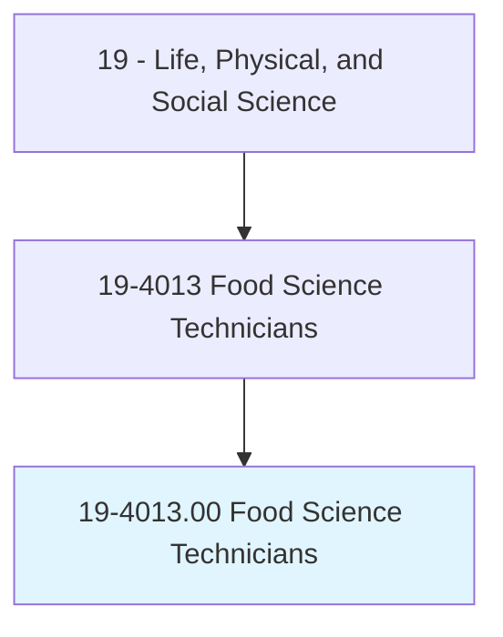
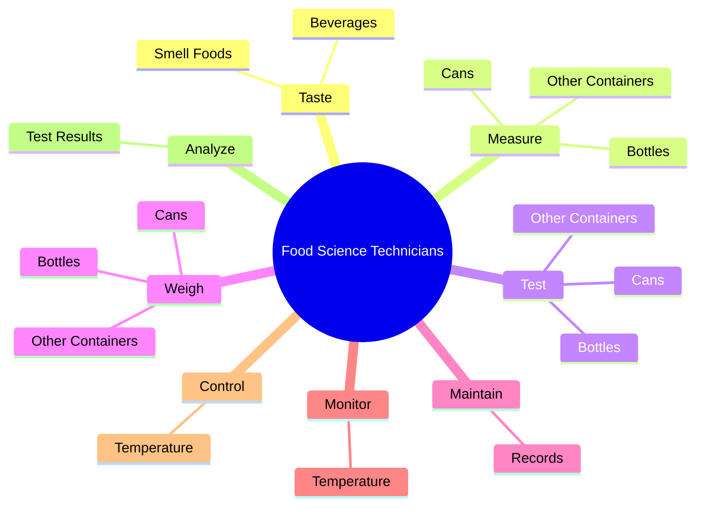

# Food Science Technicians

> Work with food scientists or technologists to perform standardized qualitative and quantitative tests to determine physical or chemical properties of food or beverage products. Includes technicians who assist in research and development of production technology, quality control, packaging, processing, and use of foods.

## Overview

Food Science Technicians is an occupation within the Life, Physical, and Social Science category. Work with food scientists or technologists to perform standardized qualitative and quantitative tests to determine physical or chemical properties of food or beverage products. 

## Classification Hierarchy

## Key Statistics

| Metric | Value |
|--------|-------|
| SOC Code | 19-4013.00 |
| Category | [Life, Physical, and Social Science](/occupations/Science) |
| Task Count | 86 |
| Source | O*NET |

## Core Tasks

### taste.SmellFoods

Food Science Technicians taste smell foods as part of their core responsibilities.

**Actions:**
- `taste.SmellFoods.to.ensure.FlavorsMeetSpecificationsSelectSamplesWithSpecificCharacteristics`
- `taste.SmellFoods.to.ToSelectSamplesWithSpecificCharacteristics`
- `taste.Beverages.to.ensure.FlavorsMeetSpecificationsSelectSamplesWithSpecificCharacteristics`
- `taste.Beverages.to.ToSelectSamplesWithSpecificCharacteristics`

### measure.Bottles

Food Science Technicians measure bottles as part of their core responsibilities.

**Actions:**
- `measure.Bottles.to.ensure.Hardness`
- `measure.Bottles.to.Strength`
- `measure.Bottles.to.DimensionsMeetSpecifications`
- `measure.Cans.to.ensure.Hardness`

### test.Bottles

Food Science Technicians test bottles as part of their core responsibilities.

**Actions:**
- `test.Bottles.to.ensure.Hardness`
- `test.Bottles.to.Strength`
- `test.Bottles.to.DimensionsMeetSpecifications`
- `test.Cans.to.ensure.Hardness`

## Skills & Competencies

### Technical Skills
- **Research Methods** - Advanced
- **Data Analysis** - Advanced
- **Laboratory Techniques** - Advanced

### Soft Skills
- **Communication** - Essential
- **Problem Solving** - Essential
- **Critical Thinking** - Important
- **Teamwork** - Important
- **Adaptability** - Important

## Related Occupations

## Industries

This occupation is found across multiple industries. See [Industries](/industries) for sector-specific employment data.

## Career Progression

---

*Source: O*NET 19-4013.00 - ONETOccupation*
