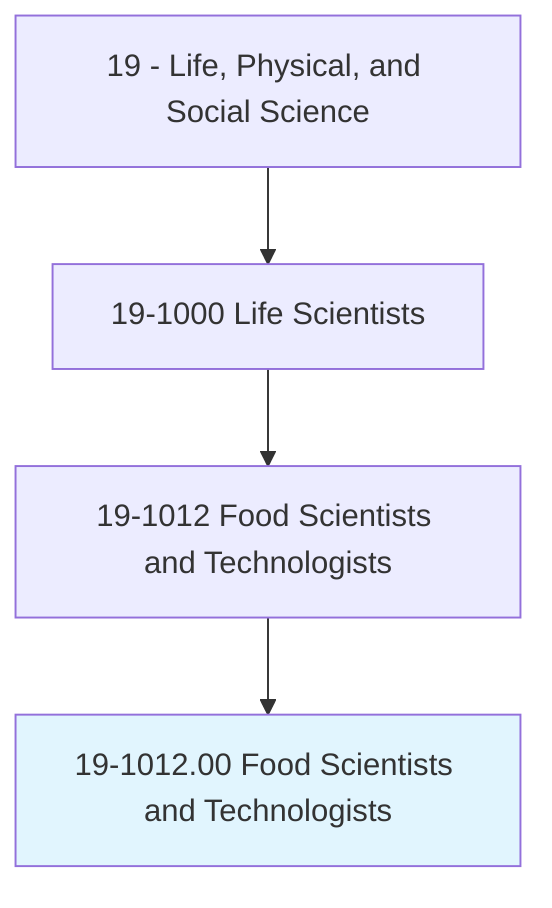
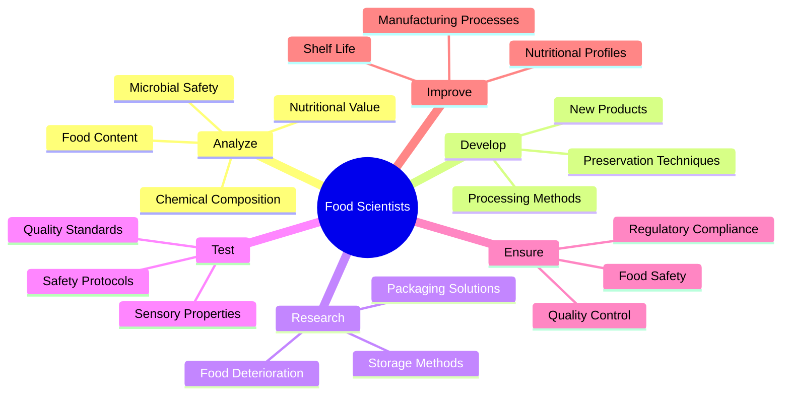
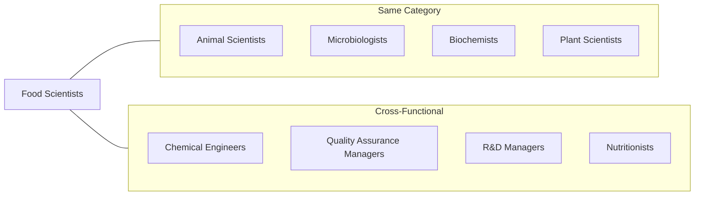
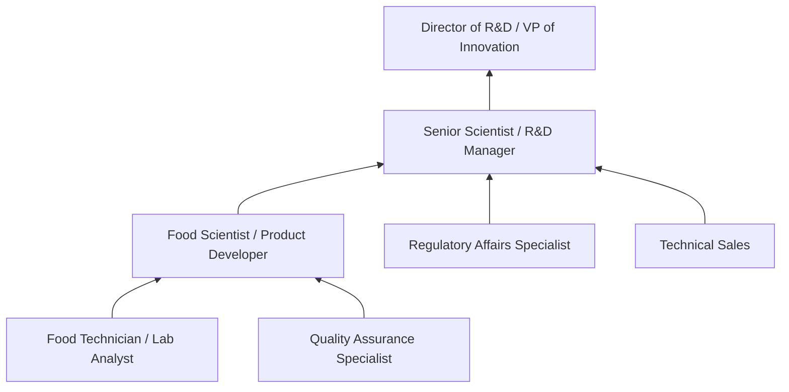

# Food Scientists and Technologists

> Use chemistry, microbiology, engineering, and other sciences to study the principles underlying the processing and deterioration of foods; analyze food content to determine levels of vitamins, fat, sugar, and protein; discover new food sources; research ways to make processed foods safe, palatable, and healthful; and apply food science knowledge to determine best ways to process, package, preserve, store, and distribute food.

## Overview

Food Scientists and Technologists apply multidisciplinary scientific knowledge to ensure our food supply is safe, nutritious, and appealing. They work at the intersection of chemistry, microbiology, engineering, and nutrition to develop new food products, improve processing methods, and ensure regulatory compliance. From formulating new recipes to extending shelf life, these professionals address critical challenges in food safety, quality, and innovation. They work in food manufacturing, research institutions, government agencies, and consulting firms.

## Classification Hierarchy



## Key Statistics

| Metric | Value |
|--------|-------|
| SOC Code | 19-1012.00 |
| Job Zone | 4 (Considerable Preparation) |
| Category | [Life, Physical, and Social Science](/occupations/Science) |
| Core Tasks | 15+ |
| Source | O*NET |

## Core Tasks



### analyze.FoodContent

Food Scientists conduct comprehensive analysis of food composition and nutritional value.

**Actions:**
- `analyze.FoodContent.to.determine.Levels.of.Vitamins` - Quantify vitamin content in food products
- `analyze.FoodContent.to.determine.Levels.of.Fat` - Measure lipid composition and profiles
- `analyze.FoodContent.to.determine.Levels.of.Sugar` - Assess carbohydrate and sugar content
- `analyze.FoodContent.to.determine.Levels.of.Protein` - Evaluate protein quality and quantity
- `test.Samples.to.verify.NutritionalLabeling` - Ensure accurate nutritional information

### develop.NewFoodProducts

Food Scientists create innovative food products that meet consumer demands and market needs.

**Actions:**
- `develop.NewFoodProducts.to.meet.ConsumerDemands` - Formulate products addressing market trends
- `develop.Formulations.to.improve.NutritionalValue` - Enhance healthfulness of food products
- `create.Prototypes.for.ProductTesting` - Design samples for evaluation
- `optimize.Recipes.to.balance.TasteSafetyNutrition` - Refine formulations for multiple objectives
- `develop.AlternativeIngredients.to.reduce.Costs` - Find cost-effective substitutions

### research.FoodDeterioration

Food Scientists investigate factors affecting food quality and shelf life.

**Actions:**
- `research.FoodDeterioration.to.understand.SpoilageMechanisms` - Study decay processes
- `study.MicrobialGrowth.to.prevent.Contamination` - Investigate pathogen behavior
- `analyze.ChemicalReactions.to.predict.ShelfLife` - Model degradation kinetics
- `investigate.EnvironmentalFactors.affecting.FoodQuality` - Examine storage conditions impact
- `evaluate.PackagingMaterials.to.extend.ShelfLife` - Test protective barriers

### ensure.FoodSafety

Food Scientists implement and monitor food safety protocols.

**Actions:**
- `ensure.FoodSafety.through.HACCPImplementation` - Apply hazard analysis critical control points
- `develop.SafetyProtocols.to.prevent.Contamination` - Create preventive control measures
- `test.Products.for.PathogenPresence` - Screen for harmful microorganisms
- `monitor.ProcessingConditions.to.maintain.SafetyStandards` - Track critical parameters
- `validate.Sanitation.Procedures.to.ensure.Compliance` - Verify cleaning effectiveness

### improve.ProcessingMethods

Food Scientists optimize manufacturing techniques for efficiency and quality.

**Actions:**
- `improve.ProcessingMethods.to.increase.Efficiency` - Enhance production throughput
- `develop.PreservationTechniques.to.maintain.Quality` - Create methods to extend product life
- `optimize.ThermalProcessing.to.ensure.Safety` - Refine heating and cooling protocols
- `implement.NewTechnologies.to.improve.Manufacturing` - Introduce innovative equipment
- `design.ProcessingParameters.to.preserve.NutritionalValue` - Minimize nutrient loss

### test.SensoryProperties

Food Scientists evaluate consumer acceptance and product quality attributes.

**Actions:**
- `test.SensoryProperties.to.evaluate.Palatability` - Assess taste and acceptability
- `conduct.ConsumerPanels.to.gauge.Preferences` - Gather market feedback
- `analyze.TextureProperties.to.optimize.Mouthfeel` - Evaluate physical characteristics
- `measure.ColorStability.to.maintain.Appeal` - Monitor visual quality
- `evaluate.AromaProfiles.to.enhance.Products` - Assess olfactory characteristics

## Skills & Competencies

### Technical Skills
- **Food Chemistry** - Expert
- **Microbiology** - Advanced
- **Food Processing Technology** - Expert
- **Quality Assurance** - Advanced
- **Sensory Evaluation** - Advanced
- **Regulatory Knowledge (FDA, USDA)** - Advanced
- **Statistical Analysis** - Advanced
- **Laboratory Techniques** - Expert

### Soft Skills
- **Problem Solving** - Critical
- **Attention to Detail** - Critical
- **Analytical Thinking** - Essential
- **Communication** - Essential
- **Project Management** - Essential

## Related Occupations



## Industries

- [Food Manufacturing](/industries/FoodManufacturing) - High Employment
- [Beverage Production](/industries/BeverageProduction) - High Employment
- [Research and Development](/industries/ResearchDevelopment) - Moderate Employment
- [Government (FDA, USDA)](/industries/Government) - Moderate Employment
- [Food Service and Restaurant Chains](/industries/FoodService) - Growing Employment
- [Agricultural and Food Consulting](/industries/Consulting) - Moderate Employment

## Career Progression



## Industry Variations

### Food Manufacturing
Focus on production optimization, quality control, and scale-up of new products. Emphasis on efficiency and cost management.

### Research and Development
Innovation-focused role developing new products, ingredients, and technologies. Emphasis on creativity and scientific advancement.

### Government and Regulatory
Oversight of food safety, inspection, and policy development. Focus on public health protection and regulatory compliance.

### Academic Research
Fundamental research on food science principles. Teaching and mentorship combined with publication-focused research.

### Consulting
Advisory services to food companies on formulation, safety, and regulatory compliance. Varied projects across multiple clients.

## Education & Training

| Requirement | Details |
|-------------|---------|
| Typical Education | Bachelor's or Master's degree in Food Science, Food Technology, or related field |
| Work Experience | 2-5 years in food industry or laboratory setting |
| On-the-Job Training | Moderate - company-specific processes and regulations |
| Common Certifications | SQF Practitioner, PCQI (Preventive Controls Qualified Individual), CFS (Certified Food Scientist) |

## Departments

This occupation typically works in:
- [Research and Development](/departments/ResearchDevelopment)
- [Quality Assurance](/departments/QualityAssurance)
- [Product Development](/departments/ProductDevelopment)
- [Food Safety](/departments/FoodSafety)
- [Regulatory Affairs](/departments/RegulatoryAffairs)

## GraphDL Semantic Structure

```
Food Scientists perform:
- analyze.FoodContent.to.determine.NutritionalValue
- develop.NewProducts.to.meet.MarketNeeds
- research.FoodDeterioration.to.extend.ShelfLife
- ensure.FoodSafety.through.QualityControl
- test.SensoryProperties.to.evaluate.Acceptability
- improve.ProcessingMethods.to.increase.Efficiency
```

---

*Source: O*NET 19-1012.00 - ONETOccupation*
