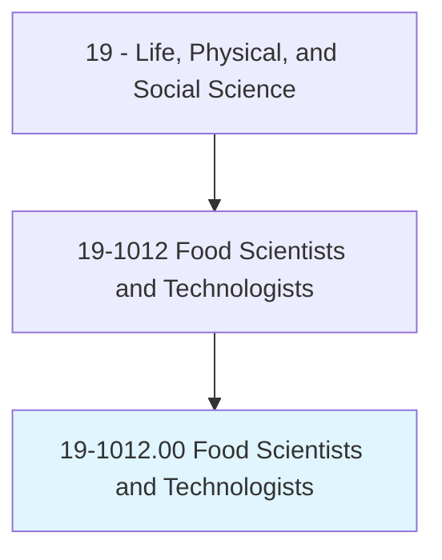
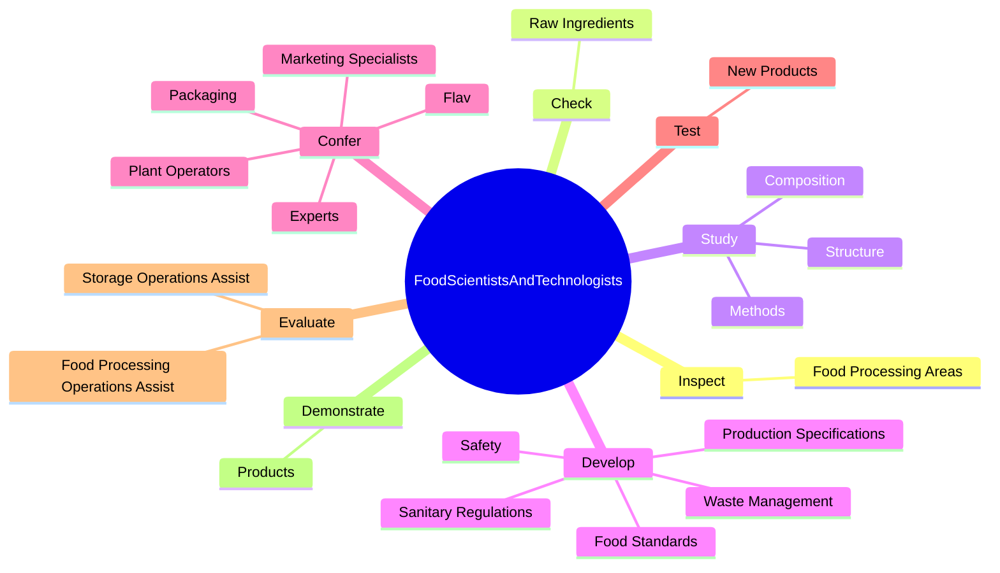

# Food Scientists and Technologists

> Use chemistry, microbiology, engineering, and other sciences to study the principles underlying the processing and deterioration of foods; analyze food content to determine levels of vitamins, fat, sugar, and protein; discover new food sources; research ways to make processed foods safe, palatable, and healthful; and apply food science knowledge to determine best ways to process, package, preserve, store, and distribute food.

## Overview

Food Scientists and Technologists is classified under Life, Physical, and Social Science (SOC 19). Use chemistry, microbiology, engineering, and other sciences to study the principles underlying the processing and deterioration of foods; analyze food content to determine levels of vitamins, fat, sugar, and protein; discover new food sources; research ways to make processed foods safe, palatable, and healthful; and apply food science knowledge to determine best ways to process, package, preserve, store, and distribute food.

## Classification Hierarchy

## Key Statistics

| Metric | Value |
|--------|-------|
| SOC Code | 19-1012.00 |
| Category | [Life, Physical, and Social Science](/occupations/Science) |
| Task Count | 65 |
| Source | O*NET |

## Core Tasks

### inspect.FoodProcessingAreas

Food Scientists and Technologists inspect food processing areas as part of their core responsibilities.

**Actions:**
- `inspect.FoodProcessingAreas.to.ensure.ComplianceWithGovernmentRegulationsForSanitation`
- `inspect.FoodProcessingAreas.to.StandardsForSanitation`
- `inspect.FoodProcessingAreas.to.Safety`
- `inspect.FoodProcessingAreas.to.Quality`

### check.RawIngredients

Food Scientists and Technologists check raw ingredients as part of their core responsibilities.

**Actions:**
- `check.RawIngredients.for.Maturity`
- `check.RawIngredients.for.Stability.for.Processing`
- `check.RawIngredients.for.FinishedProductsF`
- `check.RawIngredients.for.Safety`

### study.Methods

Food Scientists and Technologists study methods as part of their core responsibilities.

**Actions:**
- `study.Methods.to.improve.AspectsOfFoods`
- `study.Methods.to.ChemicalComposition`
- `study.Methods.to.Flavor`
- `study.Methods.to.Color`

## Skills & Competencies

### Technical Skills
- **Research Methods** - Advanced
- **Data Analysis** - Advanced
- **Laboratory Techniques** - Advanced

### Soft Skills
- **Communication** - Essential
- **Problem Solving** - Essential
- **Critical Thinking** - Important
- **Teamwork** - Important
- **Adaptability** - Important

## Related Occupations

## Industries

This occupation is found across multiple industries. See [Industries](/industries) for sector-specific employment data.

## Career Progression

---

*Source: O*NET 19-1012.00 - ONETOccupation*
