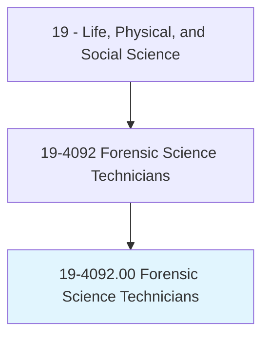
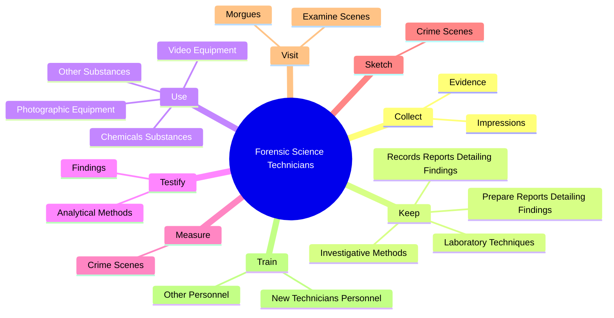

# Forensic Science Technicians

> Collect, identify, classify, and analyze physical evidence related to criminal investigations. Perform tests on weapons or substances, such as fiber, hair, and tissue to determine significance to investigation. May testify as expert witnesses on evidence or crime laboratory techniques. May serve as specialists in area of expertise, such as ballistics, fingerprinting, handwriting, or biochemistry.

## Overview

Forensic Science Technicians is an occupation within the Life, Physical, and Social Science category. Collect, identify, classify, and analyze physical evidence related to criminal investigations. Perform tests on weapons or substances, such as fiber, hair, and tissue to determine significance to investigation.

## Classification Hierarchy

## Key Statistics

| Metric | Value |
|--------|-------|
| SOC Code | 19-4092.00 |
| Category | [Life, Physical, and Social Science](/occupations/Science) |
| Task Count | 97 |
| Source | O*NET |

## Core Tasks

### collect.Evidence

Forensic Science Technicians collect evidence as part of their core responsibilities.

**Actions:**
- `collect.Evidence.from.CrimeScenes`
- `collect.Evidence.from.StoringIt.in.ConditionsPreserveIntegrity`
- `collect.Impressions.of.Dust.from.SurfacesToObtain`
- `collect.Impressions.of.IdentifyFingerprints`

### keep.RecordsReportsDetailingFindings

Forensic Science Technicians keep records reports detailing findings as part of their core responsibilities.

**Actions:**
- `keep.RecordsReportsDetailingFindings`
- `keep.PrepareReportsDetailingFindings`
- `keep.InvestigativeMethods`
- `keep.LaboratoryTechniques`

### use.PhotographicEquipment

Forensic Science Technicians use photographic equipment as part of their core responsibilities.

**Actions:**
- `use.PhotographicEquipment.to.document.EvidenceScenes`
- `use.PhotographicEquipment.to.CrimeScenes`
- `use.VideoEquipment.to.document.EvidenceScenes`
- `use.VideoEquipment.to.CrimeScenes`

## Skills & Competencies

### Technical Skills
- **Research Methods** - Advanced
- **Data Analysis** - Advanced
- **Laboratory Techniques** - Advanced

### Soft Skills
- **Communication** - Essential
- **Problem Solving** - Essential
- **Critical Thinking** - Important
- **Teamwork** - Important
- **Adaptability** - Important

## Related Occupations

## Industries

This occupation is found across multiple industries. See [Industries](/industries) for sector-specific employment data.

## Career Progression

---

*Source: O*NET 19-4092.00 - ONETOccupation*
