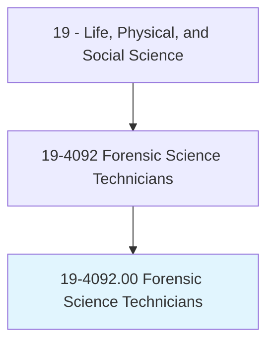
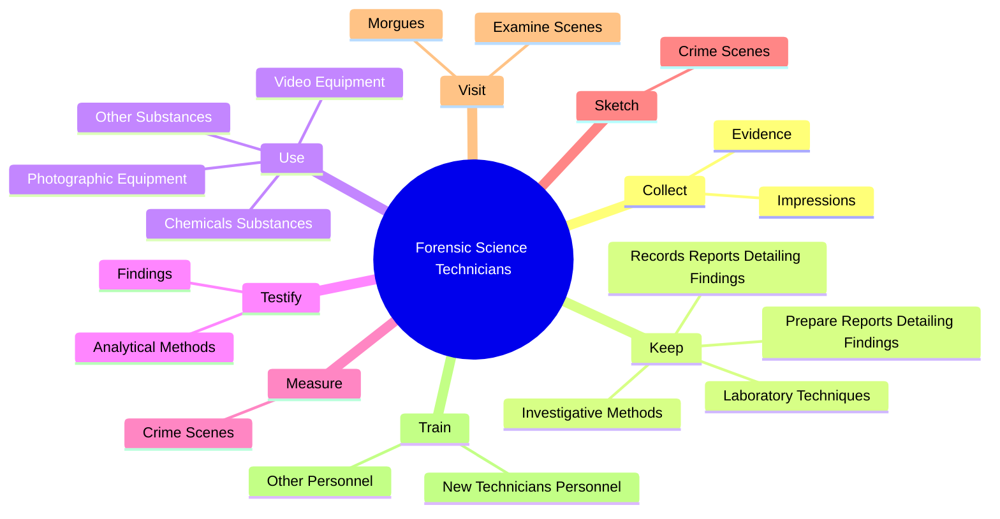
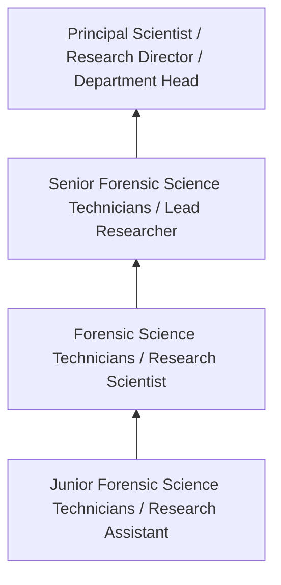

# Forensic Science Technicians

> Collect, identify, classify, and analyze physical evidence related to criminal investigations. Perform tests on weapons or substances, such as fiber, hair, and tissue to determine significance to investigation. May testify as expert witnesses on evidence or crime laboratory techniques. May serve as specialists in area of expertise, such as ballistics, fingerprinting, handwriting, or biochemistry.

## Overview

Forensic Science Technicians professionals collect, identify, classify, and analyze physical evidence related to criminal investigations. This occupation falls within the Life, Physical, and Social Science category and requires a combination of specialized knowledge, technical skills, and practical experience.

These professionals work across diverse settings and organizational contexts, applying their expertise to meet the demands of their field. They must stay current with industry standards, emerging practices, and regulatory requirements that affect their work. The role demands both independent judgment and collaborative skills, as practitioners regularly interact with colleagues, stakeholders, and the public.

As the field continues to evolve, Forensic Science Technicians professionals increasingly leverage technology and data-driven approaches to enhance their effectiveness. Career opportunities span the public and private sectors, with demand influenced by economic conditions, demographic shifts, and technological advancement.

## Classification Hierarchy



## Key Statistics

| Metric | Value |
|--------|-------|
| SOC Code | 19-4092.00 |
| Job Zone | N/A |
| Category | [Life, Physical, and Social Science](/occupations/Science/index) |
| Core Tasks | 97+ |
| Salary Range | $50,000 - $130,000 |
| Median Salary | $78,000 |
| Growth Outlook | 7% (Faster than average) |
| Source | O*NET |

## Core Tasks



### examine.BloodStainPatterns

Forensic Science Technicians examine blood stain patterns as part of their core responsibilities.

**Actions:**
- `examine.BloodStainPatterns.at.CrimeScenes` - Examine and analyze blood stain patterns at crime scenes.
- `examine.Footwear.of.Impressions` - Examine footwear, tire tracks, or other types of impressions.
- `examine.TireTracks.of.Impressions` - Examine footwear, tire tracks, or other types of impressions.
- `examine.OtherTypes.of.Impressions` - Examine footwear, tire tracks, or other types of impressions.
- `examine.PhysicalEvidence.to.obtain.InformationAboutSource` - Examine physical evidence, such as hair, biological fluids, fiber, wood, or s...

### use.PhotographicEquipment

Forensic Science Technicians use photographic equipment as part of their core responsibilities.

**Actions:**
- `use.PhotographicEquipment.to.document.EvidenceScenes` - Use photographic or video equipment to document evidence or crime scenes.
- `use.PhotographicEquipment.to.CrimeScenes` - Use photographic or video equipment to document evidence or crime scenes.
- `use.VideoEquipment.to.document.EvidenceScenes` - Use photographic or video equipment to document evidence or crime scenes.
- `use.VideoEquipment.to.CrimeScenes` - Use photographic or video equipment to document evidence or crime scenes.
- `use.ChemicalsSubstances.to.examine.LatentFingerprintEvidence` - Use chemicals or other substances to examine latent fingerprint evidence and ...

### confer.Fingerprinting

Forensic Science Technicians confer fingerprinting as part of their core responsibilities.

**Actions:**
- `confer.Fingerprinting` - Confer with ballistics, fingerprinting, handwriting, documents, electronics, ...
- `confer.Handwriting` - Confer with ballistics, fingerprinting, handwriting, documents, electronics, ...
- `confer.Documents` - Confer with ballistics, fingerprinting, handwriting, documents, electronics, ...
- `confer.Electronics` - Confer with ballistics, fingerprinting, handwriting, documents, electronics, ...
- `confer.Medical` - Confer with ballistics, fingerprinting, handwriting, documents, electronics, ...

### interpret.LaboratoryFindings

Forensic Science Technicians interpret laboratory findings as part of their core responsibilities.

**Actions:**
- `interpret.LaboratoryFindings.to.identify.Substances` - Interpret laboratory findings or test results to identify and classify substa...
- `interpret.LaboratoryFindings.to.classify.Substances` - Interpret laboratory findings or test results to identify and classify substa...
- `interpret.LaboratoryFindings.to.Materials` - Interpret laboratory findings or test results to identify and classify substa...
- `interpret.LaboratoryFindings.to.OtherEvidenceCollectedAtCrimeScenes` - Interpret laboratory findings or test results to identify and classify substa...
- `interpret.TestResults.to.identify.Substances` - Interpret laboratory findings or test results to identify and classify substa...


## Skills & Competencies

### Technical Skills
- **Research Methodology** - Expert
- **Data Analysis** - Advanced
- **Laboratory Techniques** - Advanced
- **Scientific Writing** - Advanced
- **Statistical Software** - Advanced
- **Quality Control** - Proficient

### Soft Skills
- **Analytical Thinking** - Critical
- **Attention to Detail** - Critical
- **Problem Solving** - Essential
- **Collaboration** - Essential
- **Written Communication** - Essential

## Education & Certifications

| Requirement | Details |
|-------------|---------|
| Typical Education | Bachelor's or Master's degree in relevant scientific field |
| Work Experience | 1-3 years research or laboratory experience |
| On-the-Job Training | Moderate - specialized laboratory techniques |
| Certifications | Field-specific certifications may be required |

## Career Progression



## Industry Variations

### Academic Research
Focus on fundamental research and publication. Forensic Science Technicians professionals in academia often combine research with teaching responsibilities and mentoring graduate students.

### Industry Research and Development
Applied research for product development and commercial applications. Emphasis on innovation timelines and market-driven objectives.

### Government and Regulatory
Mission-oriented research supporting public policy and regulatory decisions. Focus on public health, environmental protection, or national security.

### Consulting and Contract Research
Project-based work for diverse clients. Requires strong communication skills and ability to translate findings for non-technical audiences.

## Technology & Tools

- **Laboratory Information Management Systems (LIMS)**
- **Statistical software (R, SAS, SPSS)**
- **Spectroscopy and chromatography equipment**
- **Microscopy and imaging systems**
- **Data analysis and visualization tools**

## Related Occupations


## Industries

- Research and Development - High Employment
- Pharmaceutical Manufacturing - High Employment
- [Government Agencies](/industries/PublicAdministration) - Moderate Employment
- [Higher Education](/industries/Education) - Moderate Employment

## Departments

This occupation typically works in:
- [Research and Development](/departments/Research/index)
- Quality Assurance
- Laboratory Operations

## GraphDL Semantic Structure

```graphdl
Forensic Science Technicians perform:
- collect.Evidence.from.CrimeScenes
- collect.Evidence.from.StoringIt.in.ConditionsPreserveIntegrity
- keep.RecordsReportsDetailingFindings
- keep.PrepareReportsDetailingFindings
- keep.InvestigativeMethods
- keep.LaboratoryTechniques
```

---

*Source: O*NET 19-4092.00 - ONETOccupation*
