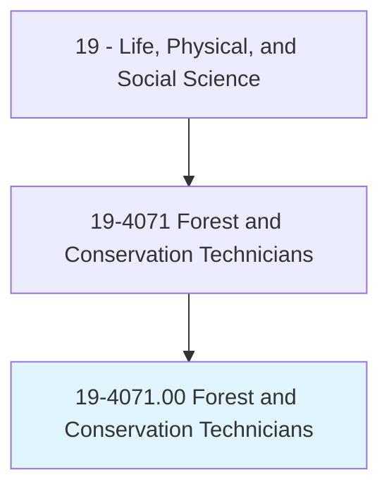
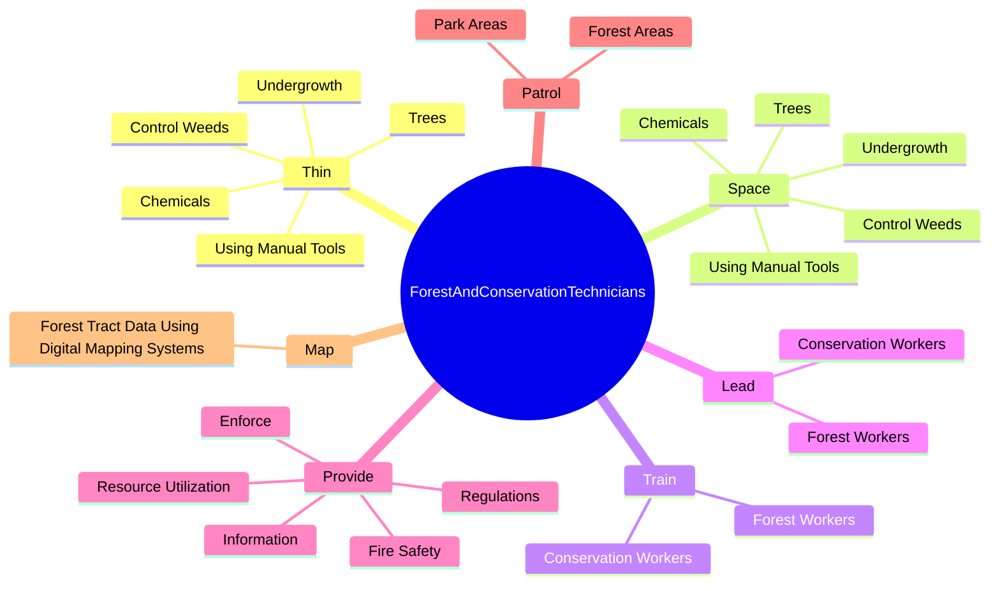
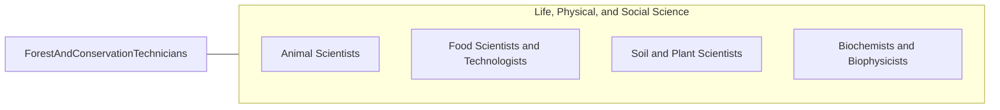

# Forest and Conservation Technicians

> Provide technical assistance regarding the conservation of soil, water, forests, or related natural resources. May compile data pertaining to size, content, condition, and other characteristics of forest tracts under the direction of foresters, or train and lead forest workers in forest propagation and fire prevention and suppression. May assist conservation scientists in managing, improving, and protecting rangelands and wildlife habitats.

## Overview

Forest and Conservation Technicians is an occupation within the Life, Physical, and Social Science category. Provide technical assistance regarding the conservation of soil, water, forests, or related natural resources. May compile data pertaining to size, content, condition, and other characteristics of forest tracts under the direction of foresters, or train and lead forest workers in forest propagation and fire prevention and suppression.

## Classification Hierarchy

## Key Statistics

| Metric | Value |
|--------|-------|
| SOC Code | 19-4071.00 |
| Category | [Life, Physical, and Social Science](/occupations/Science) |
| Task Count | 125 |
| Source | O*NET |

## Core Tasks

### thin.Trees

Forest and Conservation Technicians thin trees as part of their core responsibilities.

**Actions:**
- `thin.Trees`
- `thin.ControlWeeds`
- `thin.Undergrowth`
- `thin.UsingManualTools`

### space.Trees

Forest and Conservation Technicians space trees as part of their core responsibilities.

**Actions:**
- `space.Trees`
- `space.ControlWeeds`
- `space.Undergrowth`
- `space.UsingManualTools`

### train.ForestWorkers

Forest and Conservation Technicians train forest workers as part of their core responsibilities.

**Actions:**
- `train.ForestWorkers.in.SeasonalActivities`
- `train.ForestWorkers.in.PlantingTreeSeedlings`
- `train.ForestWorkers.in.PuttingOutForestFires`
- `train.ForestWorkers.in.MaintainingRecreationalFacilities`

## Skills & Competencies

### Technical Skills
- **Research Methods** - Advanced
- **Data Analysis** - Advanced
- **Laboratory Techniques** - Advanced

### Soft Skills
- **Communication** - Essential
- **Problem Solving** - Essential
- **Critical Thinking** - Important
- **Teamwork** - Important
- **Adaptability** - Important

## Related Occupations

## Industries

This occupation is found across multiple industries. See [Industries](/industries) for sector-specific employment data.

## Career Progression

---

*Source: O*NET 19-4071.00 - ONETOccupation*
