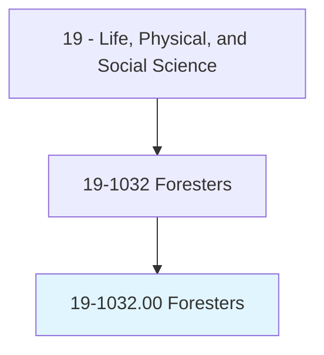
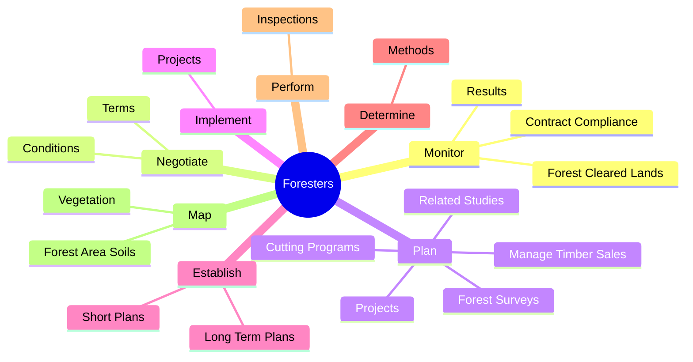
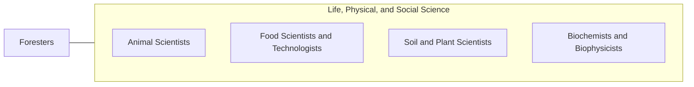

# Foresters

> Manage public and private forested lands for economic, recreational, and conservation purposes. May inventory the type, amount, and location of standing timber, appraise the timber's worth, negotiate the purchase, and draw up contracts for procurement. May determine how to conserve wildlife habitats, creek beds, water quality, and soil stability, and how best to comply with environmental regulations. May devise plans for planting and growing new trees, monitor trees for healthy growth, and determine optimal harvesting schedules.

## Overview

Foresters is an occupation within the Life, Physical, and Social Science category. Manage public and private forested lands for economic, recreational, and conservation purposes. May inventory the type, amount, and location of standing timber, appraise the timber's worth, negotiate the purchase, and draw up contracts for procurement.

## Classification Hierarchy

## Key Statistics

| Metric | Value |
|--------|-------|
| SOC Code | 19-1032.00 |
| Category | [Life, Physical, and Social Science](/occupations/Science/index) |
| Task Count | 158 |
| Source | O*NET |

## Core Tasks

### monitor.ContractCompliance

Foresters monitor contract compliance as part of their core responsibilities.

**Actions:**
- `monitor.ContractCompliance.of.ForestryActivities.to.assure.AdherenceToGovernmentRegulations`
- `monitor.Results.of.ForestryActivities.to.assure.AdherenceToGovernmentRegulations`
- `monitor.ForestClearedLands.to.ensure.TheyAreReclaimedToSuitableEndUse`

### negotiate.Terms

Foresters negotiate terms as part of their core responsibilities.

**Actions:**
- `negotiate.Terms.of.Agreements`
- `negotiate.Terms.of.Contracts.for.ForestHarvesting`
- `negotiate.Terms.of.ForestManagement`
- `negotiate.Terms.of.Leasing.of.ForestLands`

### plan.Projects

Foresters plan projects as part of their core responsibilities.

**Actions:**
- `plan.Projects.for.Conservation.of.WildlifeHabitatsWaterQuality`
- `plan.Projects.for.SoilWaterQuality`
- `plan.CuttingPrograms.from.HarvestedAreas`
- `plan.CuttingPrograms.from.AssistingCompanies.to.achieve.ProductionGoals`

## Skills & Competencies

### Technical Skills
- **Research Methods** - Advanced
- **Data Analysis** - Advanced
- **Laboratory Techniques** - Advanced

### Soft Skills
- **Communication** - Essential
- **Problem Solving** - Essential
- **Critical Thinking** - Important
- **Teamwork** - Important
- **Adaptability** - Important

## Related Occupations

## Industries

This occupation is found across multiple industries. See [Industries](/industries) for sector-specific employment data.

## Career Progression

---

*Source: O*NET 19-1032.00 - ONETOccupation*
