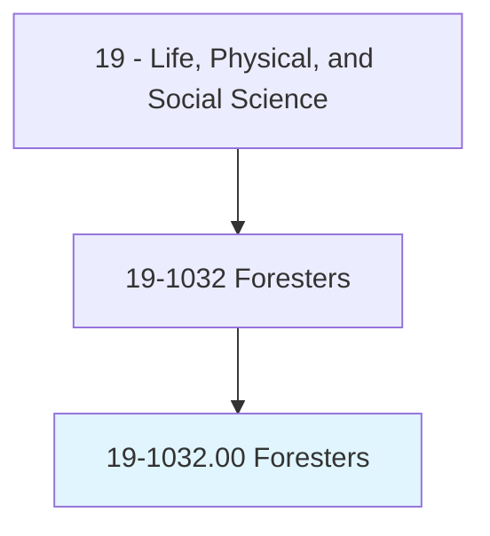
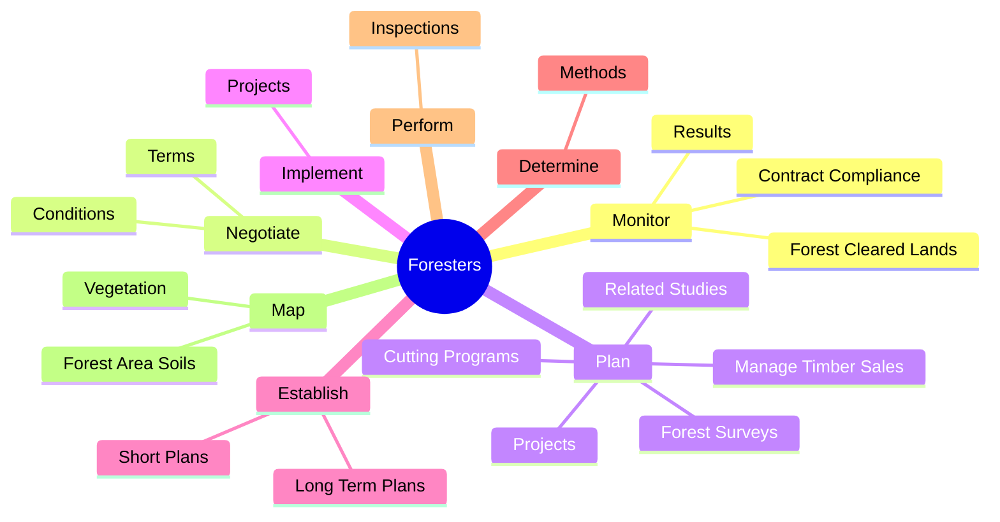
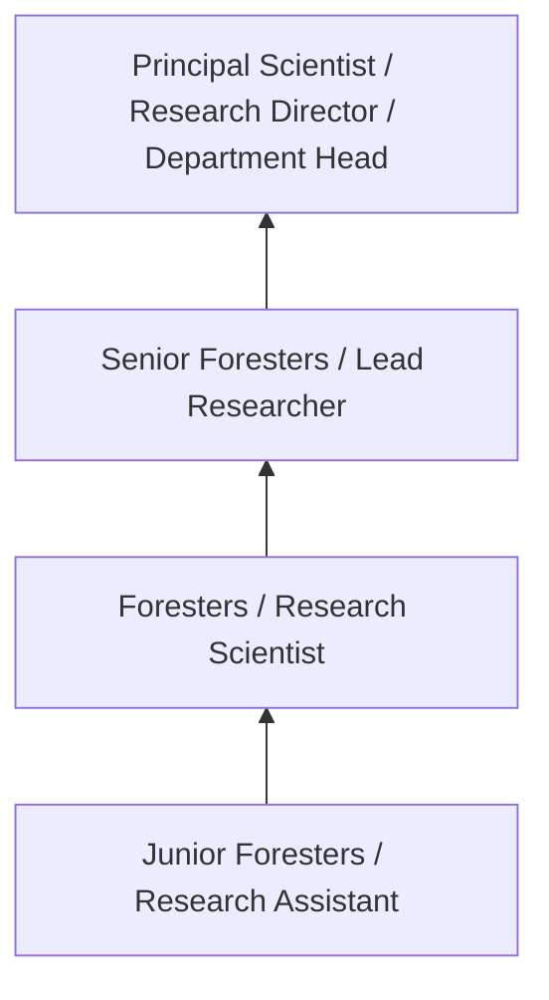
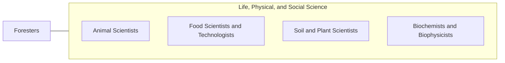

# Foresters

> Manage public and private forested lands for economic, recreational, and conservation purposes. May inventory the type, amount, and location of standing timber, appraise the timber's worth, negotiate the purchase, and draw up contracts for procurement. May determine how to conserve wildlife habitats, creek beds, water quality, and soil stability, and how best to comply with environmental regulations. May devise plans for planting and growing new trees, monitor trees for healthy growth, and determine optimal harvesting schedules.

## Overview

Foresters professionals manage public and private forested lands for economic, recreational, and conservation purposes. This occupation falls within the Life, Physical, and Social Science category and requires a combination of specialized knowledge, technical skills, and practical experience.

These professionals work across diverse settings and organizational contexts, applying their expertise to meet the demands of their field. They must stay current with industry standards, emerging practices, and regulatory requirements that affect their work. The role demands both independent judgment and collaborative skills, as practitioners regularly interact with colleagues, stakeholders, and the public.

As the field continues to evolve, Foresters professionals increasingly leverage technology and data-driven approaches to enhance their effectiveness. Career opportunities span the public and private sectors, with demand influenced by economic conditions, demographic shifts, and technological advancement.

## Classification Hierarchy



## Key Statistics

| Metric | Value |
|--------|-------|
| SOC Code | 19-1032.00 |
| Job Zone | N/A |
| Category | [Life, Physical, and Social Science](/occupations/Science/index) |
| Core Tasks | 158+ |
| Salary Range | $50,000 - $130,000 |
| Median Salary | $78,000 |
| Growth Outlook | 7% (Faster than average) |
| Source | O*NET |

## Core Tasks



### plan.Projects

Foresters plan projects as part of their core responsibilities.

**Actions:**
- `plan.Projects.for.Conservation.of.WildlifeHabitatsWaterQuality` - Plan and implement projects for conservation of wildlife habitats and soil an...
- `plan.Projects.for.SoilWaterQuality` - Plan and implement projects for conservation of wildlife habitats and soil an...
- `plan.CuttingPrograms.from.HarvestedAreas` - Plan cutting programs and manage timber sales from harvested areas, assisting...
- `plan.CuttingPrograms.from.AssistingCompanies.to.achieve.ProductionGoals` - Plan cutting programs and manage timber sales from harvested areas, assisting...
- `plan.ManageTimberSales.from.HarvestedAreas` - Plan cutting programs and manage timber sales from harvested areas, assisting...

### direct.ForestSurveys

Foresters direct forest surveys as part of their core responsibilities.

**Actions:**
- `direct.ForestSurveys` - Plan and direct forest surveys and related studies and prepare reports and re...
- `direct.RelatedStudies` - Plan and direct forest surveys and related studies and prepare reports and re...
- `direct.PrepareReports` - Plan and direct forest surveys and related studies and prepare reports and re...
- `direct.Recommendations` - Plan and direct forest surveys and related studies and prepare reports and re...
- `direct.Participate.in.ForestFireSuppression` - Direct, and participate in, forest fire suppression.

### supervise.Activities

Foresters supervise activities as part of their core responsibilities.

**Actions:**
- `supervise.Activities.of.OtherForestryWorkers` - Supervise activities of other forestry workers.
- `supervise.ForestryProjects.of.TreesToBePlanted` - Plan and supervise forestry projects, such as determining the type, number an...
- `supervise.ForestryProjects.of.ManagingTreeNurseries` - Plan and supervise forestry projects, such as determining the type, number an...
- `supervise.ForestryProjects.of.ThinningForest` - Plan and supervise forestry projects, such as determining the type, number an...
- `supervise.ForestryProjects.of.MonitoringGrowth.of.NewSeedlings` - Plan and supervise forestry projects, such as determining the type, number an...

### provide.AdviceAsConsultant

Foresters provide advice as consultant as part of their core responsibilities.

**Actions:**
- `provide.AdviceAsConsultant.on.ForestryIssues` - Provide advice and recommendations, as a consultant on forestry issues, to pr...
- `provide.AdviceAsConsultant.on.private.WoodlotOwners` - Provide advice and recommendations, as a consultant on forestry issues, to pr...
- `provide.AdviceAsConsultant.on.Firefighters` - Provide advice and recommendations, as a consultant on forestry issues, to pr...
- `provide.AdviceAsConsultant.on.GovernmentAgencies` - Provide advice and recommendations, as a consultant on forestry issues, to pr...
- `provide.AdviceAsConsultant.on.ToCompanies` - Provide advice and recommendations, as a consultant on forestry issues, to pr...


## Skills & Competencies

### Technical Skills
- **Research Methodology** - Expert
- **Data Analysis** - Advanced
- **Laboratory Techniques** - Advanced
- **Scientific Writing** - Advanced
- **Statistical Software** - Advanced
- **Quality Control** - Proficient

### Soft Skills
- **Analytical Thinking** - Critical
- **Attention to Detail** - Critical
- **Problem Solving** - Essential
- **Collaboration** - Essential
- **Written Communication** - Essential

## Education & Certifications

| Requirement | Details |
|-------------|---------|
| Typical Education | Bachelor's or Master's degree in relevant scientific field |
| Work Experience | 1-3 years research or laboratory experience |
| On-the-Job Training | Moderate - specialized laboratory techniques |
| Certifications | Field-specific certifications may be required |

## Career Progression



## Industry Variations

### Academic Research
Focus on fundamental research and publication. Foresters professionals in academia often combine research with teaching responsibilities and mentoring graduate students.

### Industry Research and Development
Applied research for product development and commercial applications. Emphasis on innovation timelines and market-driven objectives.

### Government and Regulatory
Mission-oriented research supporting public policy and regulatory decisions. Focus on public health, environmental protection, or national security.

### Consulting and Contract Research
Project-based work for diverse clients. Requires strong communication skills and ability to translate findings for non-technical audiences.

## Technology & Tools

- **Laboratory Information Management Systems (LIMS)**
- **Statistical software (R, SAS, SPSS)**
- **Spectroscopy and chromatography equipment**
- **Microscopy and imaging systems**
- **Data analysis and visualization tools**

## Related Occupations



## Industries

- Research and Development - High Employment
- Pharmaceutical Manufacturing - High Employment
- [Government Agencies](/industries/PublicAdministration) - Moderate Employment
- [Higher Education](/industries/Education) - Moderate Employment

## Departments

This occupation typically works in:
- [Research and Development](/departments/Research/index)
- Quality Assurance
- Laboratory Operations

## GraphDL Semantic Structure

```graphdl
Foresters perform:
- monitor.ContractCompliance.of.ForestryActivities.to.assure.AdherenceToGovernmentRegulations
- monitor.Results.of.ForestryActivities.to.assure.AdherenceToGovernmentRegulations
- negotiate.Terms.of.Agreements
- negotiate.Terms.of.Contracts.for.ForestHarvesting
- negotiate.Terms.of.ForestManagement
- negotiate.Terms.of.Leasing.of.ForestLands
```

---

*Source: O*NET 19-1032.00 - ONETOccupation*
