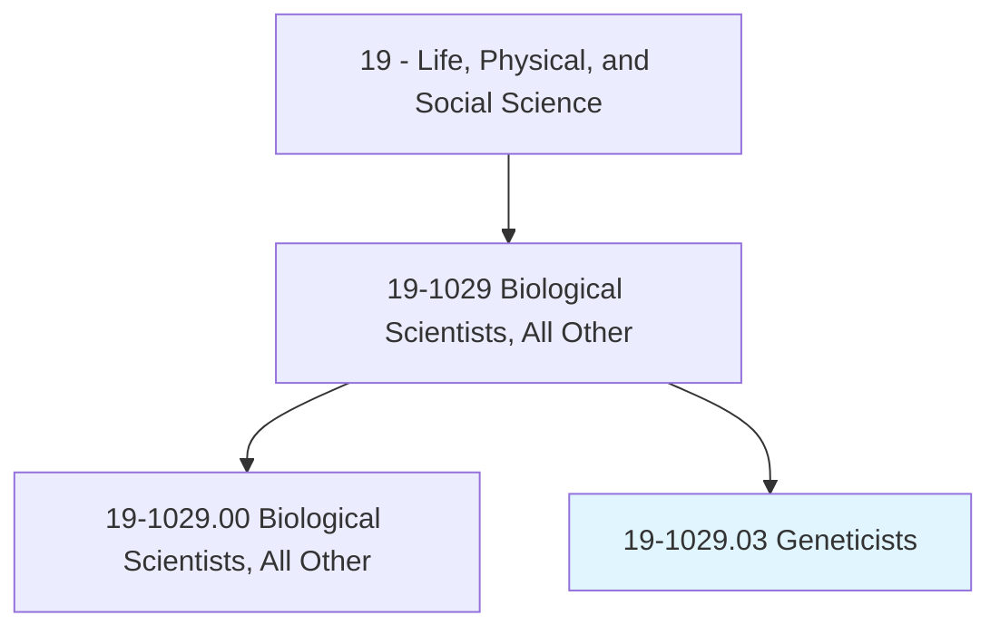
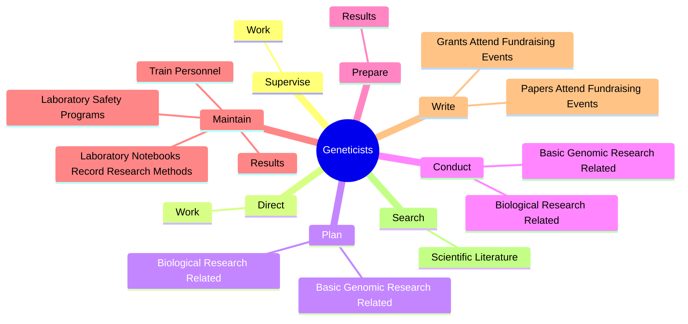
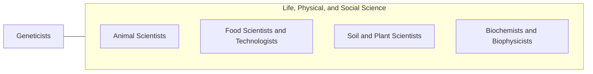

# Geneticists

> Research and study the inheritance of traits at the molecular, organism or population level. May evaluate or treat patients with genetic disorders.

## Overview

Geneticists is a specialized variant within the Life, Physical, and Social Science category. Research and study the inheritance of traits at the molecular, organism or population level. 

## Classification Hierarchy

## Key Statistics

| Metric | Value |
|--------|-------|
| SOC Code | 19-1029.03 |
| Category | [Life, Physical, and Social Science](/occupations/Science) |
| Task Count | 96 |
| Source | O*NET |

## Core Tasks

### supervise.Work

Geneticists supervise work as part of their core responsibilities.

**Actions:**
- `supervise.Work.of.OtherGeneticists`
- `supervise.Work.of.Biologists`
- `supervise.Work.of.BiometriciansWorking.on.GeneticsResearchProjects`

### direct.Work

Geneticists direct work as part of their core responsibilities.

**Actions:**
- `direct.Work.of.OtherGeneticists`
- `direct.Work.of.Biologists`
- `direct.Work.of.Technicians`
- `direct.Work.of.BiometriciansWorking.on.GeneticsResearchProjects`

### plan.BasicGenomicResearchRelated

Geneticists plan basic genomic research related as part of their core responsibilities.

**Actions:**
- `plan.BasicGenomicResearchRelated.to.Areas`
- `plan.BasicGenomicResearchRelated.to.RegulationOfGeneExpression`
- `plan.BasicGenomicResearchRelated.to.ProteinInteractions`
- `plan.BasicGenomicResearchRelated.to.MetabolicNetworks`

## Skills & Competencies

### Technical Skills
- **Research Methods** - Advanced
- **Data Analysis** - Advanced
- **Laboratory Techniques** - Advanced

### Soft Skills
- **Communication** - Essential
- **Problem Solving** - Essential
- **Critical Thinking** - Important
- **Teamwork** - Important
- **Adaptability** - Important

## Related Occupations

## Industries

This occupation is found across multiple industries. See [Industries](/industries) for sector-specific employment data.

## Career Progression

---

*Source: O*NET 19-1029.03 - ONETOccupation*
