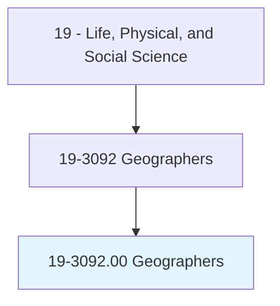
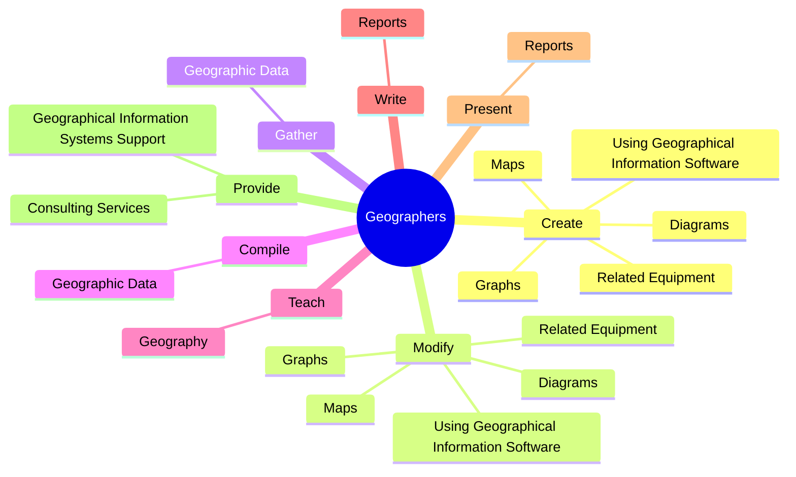
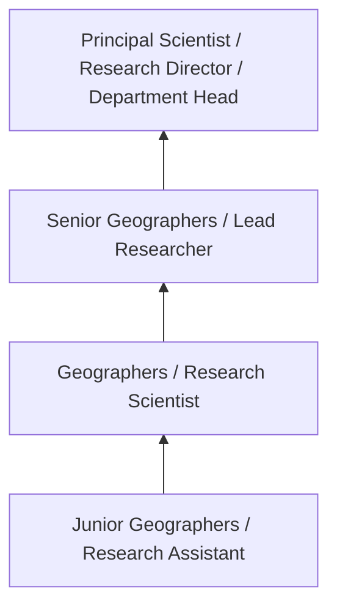
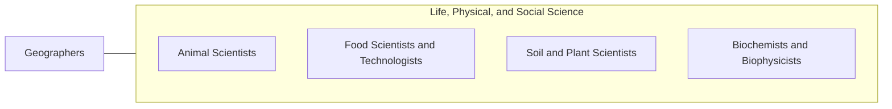

# Geographers

> Study the nature and use of areas of the Earth's surface, relating and interpreting interactions of physical and cultural phenomena. Conduct research on physical aspects of a region, including land forms, climates, soils, plants, and animals, and conduct research on the spatial implications of human activities within a given area, including social characteristics, economic activities, and political organization, as well as researching interdependence between regions at scales ranging from local to global.

## Overview

Geographers professionals study the nature and use of areas of the Earth's surface, relating and interpreting interactions of physical and cultural phenomena. This occupation falls within the Life, Physical, and Social Science category and requires a combination of specialized knowledge, technical skills, and practical experience.

These professionals work across diverse settings and organizational contexts, applying their expertise to meet the demands of their field. They must stay current with industry standards, emerging practices, and regulatory requirements that affect their work. The role demands both independent judgment and collaborative skills, as practitioners regularly interact with colleagues, stakeholders, and the public.

As the field continues to evolve, Geographers professionals increasingly leverage technology and data-driven approaches to enhance their effectiveness. Career opportunities span the public and private sectors, with demand influenced by economic conditions, demographic shifts, and technological advancement.

## Classification Hierarchy



## Key Statistics

| Metric | Value |
|--------|-------|
| SOC Code | 19-3092.00 |
| Job Zone | N/A |
| Category | [Life, Physical, and Social Science](/occupations/Science/index) |
| Core Tasks | 146+ |
| Salary Range | $50,000 - $130,000 |
| Median Salary | $78,000 |
| Growth Outlook | 7% (Faster than average) |
| Source | O*NET |

## Core Tasks



### create.Maps

Geographers create maps as part of their core responsibilities.

**Actions:**
- `create.Maps.of.Cartography` - Create and modify maps, graphs, or diagrams, using geographical information s...
- `create.Maps.of.CoordinateSystems` - Create and modify maps, graphs, or diagrams, using geographical information s...
- `create.Maps.of.Longitude` - Create and modify maps, graphs, or diagrams, using geographical information s...
- `create.Maps.of.Latitude` - Create and modify maps, graphs, or diagrams, using geographical information s...
- `create.Maps.of.Elevation` - Create and modify maps, graphs, or diagrams, using geographical information s...

### modify.Maps

Geographers modify maps as part of their core responsibilities.

**Actions:**
- `modify.Maps.of.Cartography` - Create and modify maps, graphs, or diagrams, using geographical information s...
- `modify.Maps.of.CoordinateSystems` - Create and modify maps, graphs, or diagrams, using geographical information s...
- `modify.Maps.of.Longitude` - Create and modify maps, graphs, or diagrams, using geographical information s...
- `modify.Maps.of.Latitude` - Create and modify maps, graphs, or diagrams, using geographical information s...
- `modify.Maps.of.Elevation` - Create and modify maps, graphs, or diagrams, using geographical information s...

### provide.GeographicalInformationSystemsSupport

Geographers provide geographical information systems support as part of their core responsibilities.

**Actions:**
- `provide.GeographicalInformationSystemsSupport.to.private.Sectors` - Provide geographical information systems support to the private and public se...
- `provide.GeographicalInformationSystemsSupport.to.PublicSectors` - Provide geographical information systems support to the private and public se...
- `provide.ConsultingServices.in.Fields` - Provide consulting services in fields such as resource development and manage...
- `provide.ConsultingServices.in.ResourceDevelopment` - Provide consulting services in fields such as resource development and manage...
- `provide.ConsultingServices.in.Management` - Provide consulting services in fields such as resource development and manage...

### develop.GeographicalInformationComputerSystems

Geographers develop geographical information computer systems as part of their core responsibilities.

**Actions:**
- `develop.GeographicalInformationComputerSystems` - Develop, operate, and maintain geographical information computer systems, inc...
- `develop.IncludingHardware` - Develop, operate, and maintain geographical information computer systems, inc...
- `develop.Software` - Develop, operate, and maintain geographical information computer systems, inc...
- `develop.Plotters` - Develop, operate, and maintain geographical information computer systems, inc...
- `develop.Digitizers` - Develop, operate, and maintain geographical information computer systems, inc...


## Skills & Competencies

### Technical Skills
- **Research Methodology** - Expert
- **Data Analysis** - Advanced
- **Laboratory Techniques** - Advanced
- **Scientific Writing** - Advanced
- **Statistical Software** - Advanced
- **Quality Control** - Proficient

### Soft Skills
- **Analytical Thinking** - Critical
- **Attention to Detail** - Critical
- **Problem Solving** - Essential
- **Collaboration** - Essential
- **Written Communication** - Essential

## Education & Certifications

| Requirement | Details |
|-------------|---------|
| Typical Education | Bachelor's or Master's degree in relevant scientific field |
| Work Experience | 1-3 years research or laboratory experience |
| On-the-Job Training | Moderate - specialized laboratory techniques |
| Certifications | Field-specific certifications may be required |

## Career Progression



## Industry Variations

### Academic Research
Focus on fundamental research and publication. Geographers professionals in academia often combine research with teaching responsibilities and mentoring graduate students.

### Industry Research and Development
Applied research for product development and commercial applications. Emphasis on innovation timelines and market-driven objectives.

### Government and Regulatory
Mission-oriented research supporting public policy and regulatory decisions. Focus on public health, environmental protection, or national security.

### Consulting and Contract Research
Project-based work for diverse clients. Requires strong communication skills and ability to translate findings for non-technical audiences.

## Technology & Tools

- **Laboratory Information Management Systems (LIMS)**
- **Statistical software (R, SAS, SPSS)**
- **Spectroscopy and chromatography equipment**
- **Microscopy and imaging systems**
- **Data analysis and visualization tools**

## Related Occupations



## Industries

- Research and Development - High Employment
- Pharmaceutical Manufacturing - High Employment
- [Government Agencies](/industries/PublicAdministration) - Moderate Employment
- [Higher Education](/industries/Education) - Moderate Employment

## Departments

This occupation typically works in:
- [Research and Development](/departments/Research/index)
- Quality Assurance
- Laboratory Operations

## GraphDL Semantic Structure

```graphdl
Geographers perform:
- create.Maps.of.Cartography
- create.Maps.of.CoordinateSystems
- create.Maps.of.Longitude
- create.Maps.of.Latitude
- create.Maps.of.Elevation
- create.Maps.of.Topography
```

---

*Source: O*NET 19-3092.00 - ONETOccupation*
