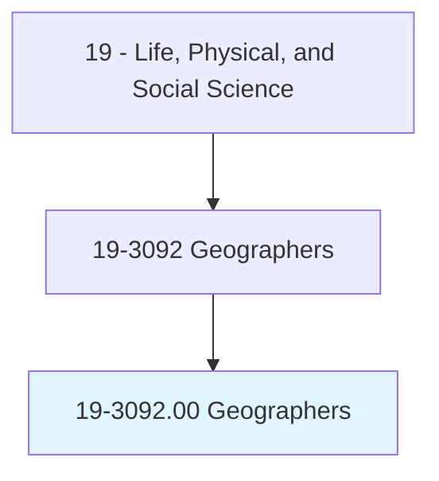
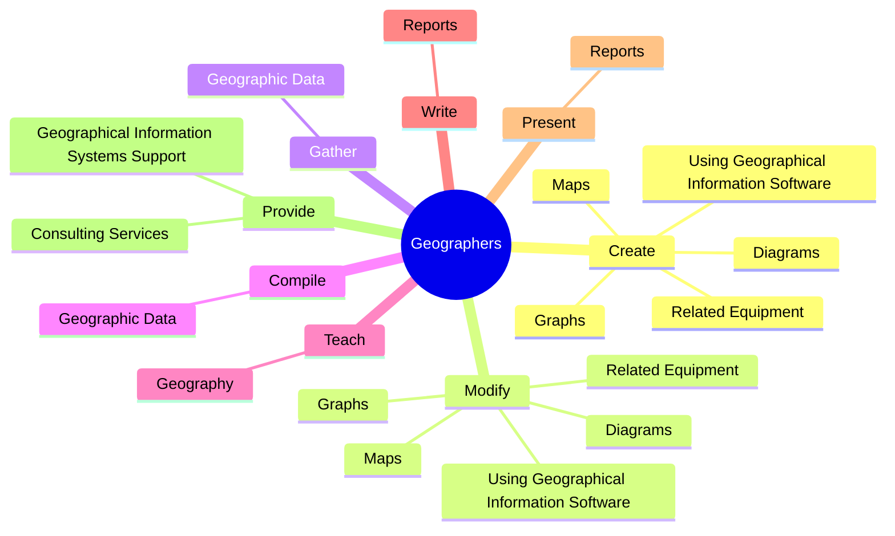
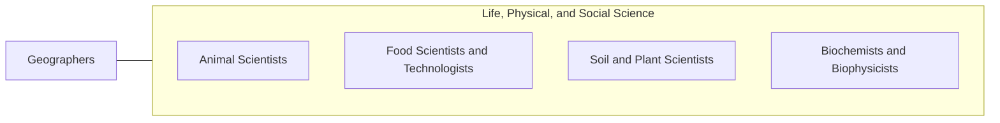

# Geographers

> Study the nature and use of areas of the Earth's surface, relating and interpreting interactions of physical and cultural phenomena. Conduct research on physical aspects of a region, including land forms, climates, soils, plants, and animals, and conduct research on the spatial implications of human activities within a given area, including social characteristics, economic activities, and political organization, as well as researching interdependence between regions at scales ranging from local to global.

## Overview

Geographers is an occupation within the Life, Physical, and Social Science category. Study the nature and use of areas of the Earth's surface, relating and interpreting interactions of physical and cultural phenomena. 

## Classification Hierarchy

## Key Statistics

| Metric | Value |
|--------|-------|
| SOC Code | 19-3092.00 |
| Category | [Life, Physical, and Social Science](/occupations/Science/index) |
| Task Count | 146 |
| Source | O*NET |

## Core Tasks

### create.Maps

Geographers create maps as part of their core responsibilities.

**Actions:**
- `create.Maps.of.Cartography`
- `create.Maps.of.CoordinateSystems`
- `create.Maps.of.Longitude`
- `create.Maps.of.Latitude`

### modify.Maps

Geographers modify maps as part of their core responsibilities.

**Actions:**
- `modify.Maps.of.Cartography`
- `modify.Maps.of.CoordinateSystems`
- `modify.Maps.of.Longitude`
- `modify.Maps.of.Latitude`

### gather.GeographicData

Geographers gather geographic data as part of their core responsibilities.

**Actions:**
- `gather.GeographicData.from.Sources`
- `gather.GeographicData.from.Censuses`
- `gather.GeographicData.from.FieldObservations`
- `gather.GeographicData.from.SatelliteImagery`

## Skills & Competencies

### Technical Skills
- **Research Methods** - Advanced
- **Data Analysis** - Advanced
- **Laboratory Techniques** - Advanced

### Soft Skills
- **Communication** - Essential
- **Problem Solving** - Essential
- **Critical Thinking** - Important
- **Teamwork** - Important
- **Adaptability** - Important

## Related Occupations

## Industries

This occupation is found across multiple industries. See [Industries](/industries) for sector-specific employment data.

## Career Progression

---

*Source: O*NET 19-3092.00 - ONETOccupation*
