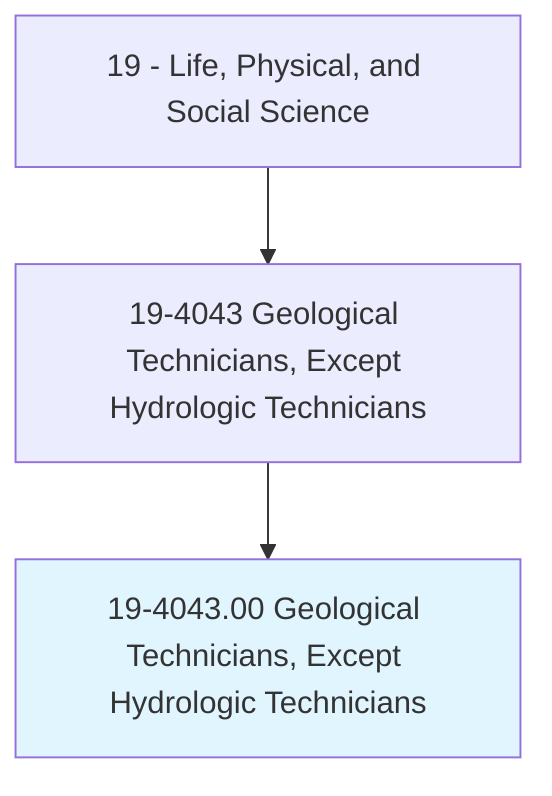
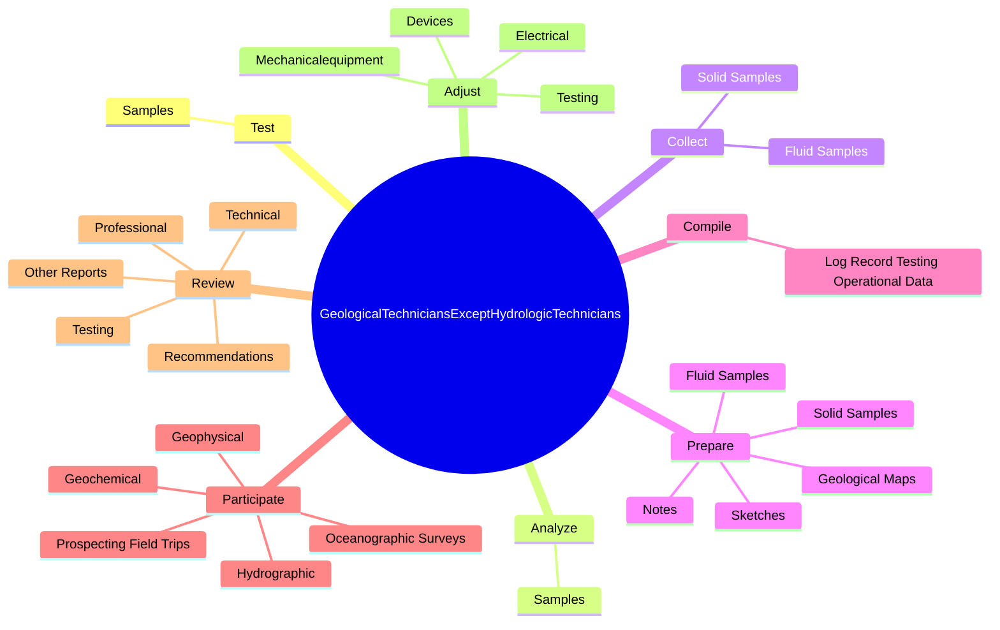
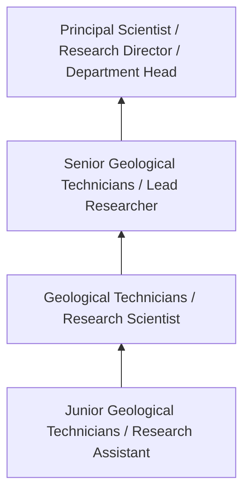
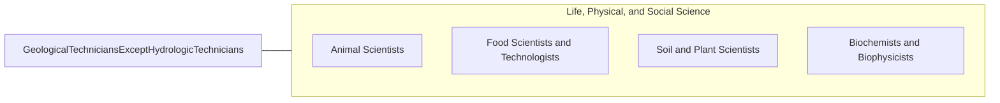

# Geological Technicians, Except Hydrologic Technicians

> Assist scientists or engineers in the use of electronic, sonic, or nuclear measuring instruments in laboratory, exploration, and production activities to obtain data indicating resources such as metallic ore, minerals, gas, coal, or petroleum. Analyze mud and drill cuttings. Chart pressure, temperature, and other characteristics of wells or bore holes.

## Overview

Geological Technicians, Except Hydrologic Technicians professionals assist scientists or engineers in the use of electronic, sonic, or nuclear measuring instruments in laboratory, exploration, and production activities to obtain data indicating resources such as metallic ore, minerals, gas, coal, or petroleum. This occupation falls within the Life, Physical, and Social Science category and requires a combination of specialized knowledge, technical skills, and practical experience.

These professionals work across diverse settings and organizational contexts, applying their expertise to meet the demands of their field. They must stay current with industry standards, emerging practices, and regulatory requirements that affect their work. The role demands both independent judgment and collaborative skills, as practitioners regularly interact with colleagues, stakeholders, and the public.

As the field continues to evolve, Geological Technicians professionals increasingly leverage technology and data-driven approaches to enhance their effectiveness. Career opportunities span the public and private sectors, with demand influenced by economic conditions, demographic shifts, and technological advancement.

## Classification Hierarchy



## Key Statistics

| Metric | Value |
|--------|-------|
| SOC Code | 19-4043.00 |
| Job Zone | N/A |
| Category | [Life, Physical, and Social Science](/occupations/Science/index) |
| Core Tasks | N/A+ |
| Salary Range | $50,000 - $130,000 |
| Median Salary | $78,000 |
| Growth Outlook | 7% (Faster than average) |
| Source | O*NET |

## Core Tasks



### test.Samples

Geological Technicians, Except Hydrologic Technicians test samples as part of their core responsibilities.

**Actions:**
- `test.Samples.to.determine.Content`
- `test.Samples.to.Characteristics`
- `test.Samples.to.UsingLaboratoryApparatus`
- `test.Samples.to.TestingEquipment`

### analyze.Samples

Geological Technicians, Except Hydrologic Technicians analyze samples as part of their core responsibilities.

**Actions:**
- `analyze.Samples.to.determine.Content`
- `analyze.Samples.to.Characteristics`
- `analyze.Samples.to.UsingLaboratoryApparatus`
- `analyze.Samples.to.TestingEquipment`

### collect.SolidSamples

Geological Technicians, Except Hydrologic Technicians collect solid samples as part of their core responsibilities.

**Actions:**
- `collect.SolidSamples.for.Analysis`
- `collect.FluidSamples.for.Analysis`

### Technical Skills
- **Research Methods** - Advanced
- **Data Analysis** - Advanced
- **Laboratory Techniques** - Advanced

### Soft Skills
- **Communication** - Essential
- **Problem Solving** - Essential
- **Critical Thinking** - Important
- **Teamwork** - Important
- **Adaptability** - Important


## Skills & Competencies

### Technical Skills
- **Research Methodology** - Expert
- **Data Analysis** - Advanced
- **Laboratory Techniques** - Advanced
- **Scientific Writing** - Advanced
- **Statistical Software** - Advanced
- **Quality Control** - Proficient

### Soft Skills
- **Analytical Thinking** - Critical
- **Attention to Detail** - Critical
- **Problem Solving** - Essential
- **Collaboration** - Essential
- **Written Communication** - Essential

## Education & Certifications

| Requirement | Details |
|-------------|---------|
| Typical Education | Bachelor's or Master's degree in relevant scientific field |
| Work Experience | 1-3 years research or laboratory experience |
| On-the-Job Training | Moderate - specialized laboratory techniques |
| Certifications | Field-specific certifications may be required |

## Career Progression



## Industry Variations

### Academic Research
Focus on fundamental research and publication. Geological Technicians professionals in academia often combine research with teaching responsibilities and mentoring graduate students.

### Industry Research and Development
Applied research for product development and commercial applications. Emphasis on innovation timelines and market-driven objectives.

### Government and Regulatory
Mission-oriented research supporting public policy and regulatory decisions. Focus on public health, environmental protection, or national security.

### Consulting and Contract Research
Project-based work for diverse clients. Requires strong communication skills and ability to translate findings for non-technical audiences.

## Technology & Tools

- **Laboratory Information Management Systems (LIMS)**
- **Statistical software (R, SAS, SPSS)**
- **Spectroscopy and chromatography equipment**
- **Microscopy and imaging systems**
- **Data analysis and visualization tools**

## Related Occupations



## Industries

- [Research and Development](/industries/ResearchDevelopment) - High Employment
- [Pharmaceutical Manufacturing](/industries/Pharma) - High Employment
- [Government Agencies](/industries/Government) - Moderate Employment
- [Higher Education](/industries/Education) - Moderate Employment

## Departments

This occupation typically works in:
- [Research and Development](/departments/Research/index)
- [Quality Assurance](/departments/QualityAssurance)
- [Laboratory Operations](/departments/Laboratory)

## GraphDL Semantic Structure

```
Geological Technicians, Except Hydrologic Technicians perform:
- conduct.Research.in.GeologicalTechniciansField
- analyze.Data.using.ScientificMethods
- prepare.Reports.on.ResearchFindings
- develop.Procedures.for.GeologicalTechniciansAnalysis
- collaborate.WithTeam.on.ResearchProjects
```

---

*Source: O*NET 19-4043.00 - ONETOccupation*
