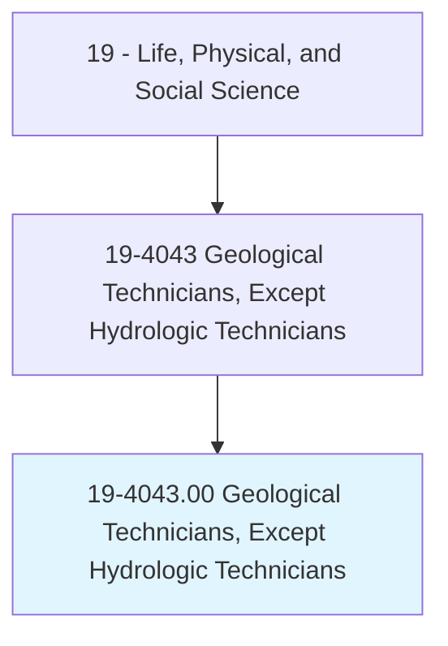
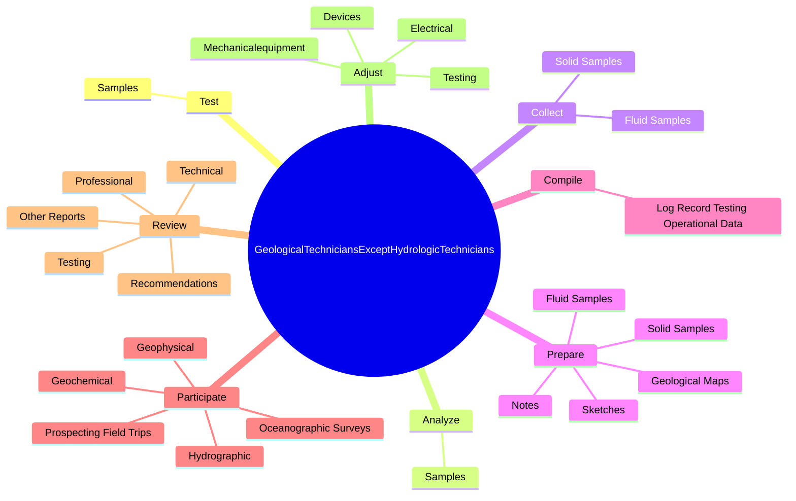
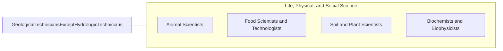

# Geological Technicians, Except Hydrologic Technicians

> Assist scientists or engineers in the use of electronic, sonic, or nuclear measuring instruments in laboratory, exploration, and production activities to obtain data indicating resources such as metallic ore, minerals, gas, coal, or petroleum. Analyze mud and drill cuttings. Chart pressure, temperature, and other characteristics of wells or bore holes.

## Overview

Geological Technicians, Except Hydrologic Technicians is an occupation within the Life, Physical, and Social Science category. Assist scientists or engineers in the use of electronic, sonic, or nuclear measuring instruments in laboratory, exploration, and production activities to obtain data indicating resources such as metallic ore, minerals, gas, coal, or petroleum. Analyze mud and drill cuttings.

## Classification Hierarchy

## Key Statistics

| Metric | Value |
|--------|-------|
| SOC Code | 19-4043.00 |
| Category | [Life, Physical, and Social Science](/occupations/Science/index) |
| Task Count | 106 |
| Source | O*NET |

## Core Tasks

### test.Samples

Geological Technicians, Except Hydrologic Technicians test samples as part of their core responsibilities.

**Actions:**
- `test.Samples.to.determine.Content`
- `test.Samples.to.Characteristics`
- `test.Samples.to.UsingLaboratoryApparatus`
- `test.Samples.to.TestingEquipment`

### analyze.Samples

Geological Technicians, Except Hydrologic Technicians analyze samples as part of their core responsibilities.

**Actions:**
- `analyze.Samples.to.determine.Content`
- `analyze.Samples.to.Characteristics`
- `analyze.Samples.to.UsingLaboratoryApparatus`
- `analyze.Samples.to.TestingEquipment`

### collect.SolidSamples

Geological Technicians, Except Hydrologic Technicians collect solid samples as part of their core responsibilities.

**Actions:**
- `collect.SolidSamples.for.Analysis`
- `collect.FluidSamples.for.Analysis`

## Skills & Competencies

### Technical Skills
- **Research Methods** - Advanced
- **Data Analysis** - Advanced
- **Laboratory Techniques** - Advanced

### Soft Skills
- **Communication** - Essential
- **Problem Solving** - Essential
- **Critical Thinking** - Important
- **Teamwork** - Important
- **Adaptability** - Important

## Related Occupations

## Industries

This occupation is found across multiple industries. See [Industries](/industries) for sector-specific employment data.

## Career Progression

---

*Source: O*NET 19-4043.00 - ONETOccupation*
