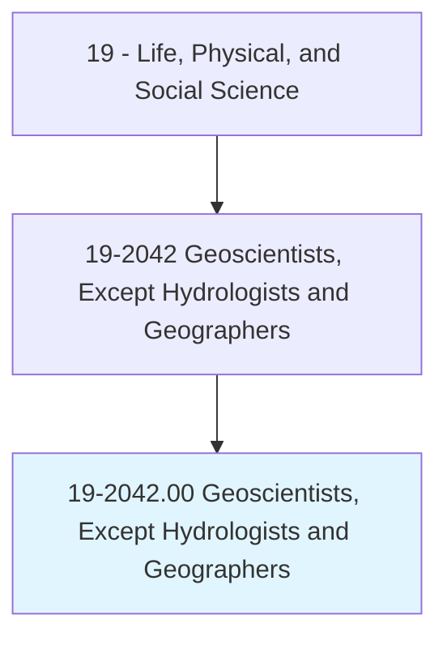
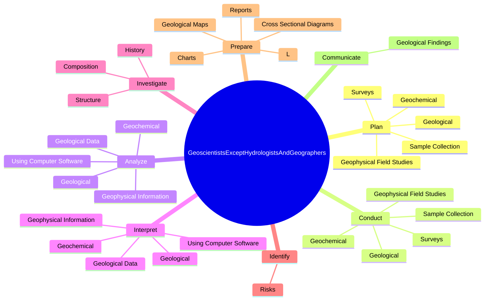
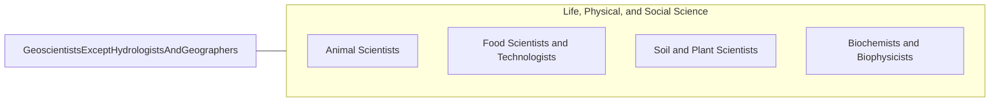

# Geoscientists, Except Hydrologists and Geographers

> Study the composition, structure, and other physical aspects of the Earth. May use geological, physics, and mathematics knowledge in exploration for oil, gas, minerals, or underground water; or in waste disposal, land reclamation, or other environmental problems. May study the Earth's internal composition, atmospheres, and oceans, and its magnetic, electrical, and gravitational forces. Includes mineralogists, paleontologists, stratigraphers, geodesists, and seismologists.

## Overview

Geoscientists, Except Hydrologists and Geographers is an occupation within the Life, Physical, and Social Science category. Study the composition, structure, and other physical aspects of the Earth. May use geological, physics, and mathematics knowledge in exploration for oil, gas, minerals, or underground water; or in waste disposal, land reclamation, or other environmental problems.

## Classification Hierarchy

## Key Statistics

| Metric | Value |
|--------|-------|
| SOC Code | 19-2042.00 |
| Category | [Life, Physical, and Social Science](/occupations/Science/index) |
| Task Count | 231 |
| Source | O*NET |

## Core Tasks

### plan.Geological

Geoscientists, Except Hydrologists and Geographers plan geological as part of their core responsibilities.

**Actions:**
- `plan.Geological.to.collect.DataForResearch`
- `plan.Geological.to.Application`
- `plan.Geochemical.to.collect.DataForResearch`
- `plan.Geochemical.to.Application`

### conduct.Geological

Geoscientists, Except Hydrologists and Geographers conduct geological as part of their core responsibilities.

**Actions:**
- `conduct.Geological.to.collect.DataForResearch`
- `conduct.Geological.to.Application`
- `conduct.Geochemical.to.collect.DataForResearch`
- `conduct.Geochemical.to.Application`

### analyze.GeologicalData

Geoscientists, Except Hydrologists and Geographers analyze geological data as part of their core responsibilities.

**Actions:**
- `analyze.GeologicalData`
- `analyze.UsingComputerSoftware`
- `analyze.Geological.from.Sources`
- `analyze.Geological.from.SurveyData`

## Skills & Competencies

### Technical Skills
- **Research Methods** - Advanced
- **Data Analysis** - Advanced
- **Laboratory Techniques** - Advanced

### Soft Skills
- **Communication** - Essential
- **Problem Solving** - Essential
- **Critical Thinking** - Important
- **Teamwork** - Important
- **Adaptability** - Important

## Related Occupations

## Industries

This occupation is found across multiple industries. See [Industries](/industries) for sector-specific employment data.

## Career Progression

---

*Source: O*NET 19-2042.00 - ONETOccupation*
