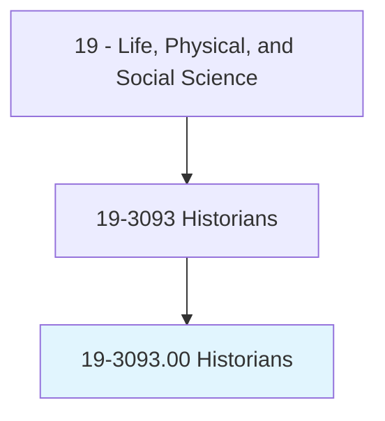
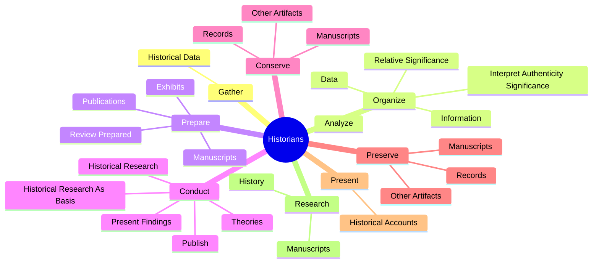
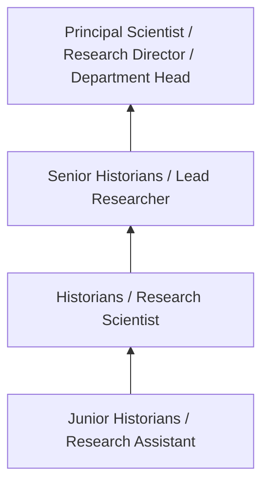
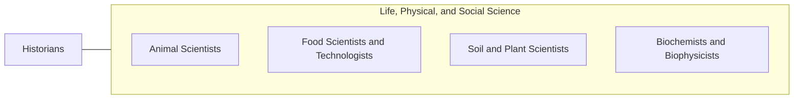

# Historians

> Research, analyze, record, and interpret the past as recorded in sources, such as government and institutional records, newspapers and other periodicals, photographs, interviews, films, electronic media, and unpublished manuscripts, such as personal diaries and letters.

## Overview

Historians professionals research, analyze, record, and interpret the past as recorded in sources, such as government and institutional records, newspapers and other periodicals, photographs, interviews, films, electronic media, and unpublished manuscripts, such as personal diaries and letters.. This occupation falls within the Life, Physical, and Social Science category and requires a combination of specialized knowledge, technical skills, and practical experience.

These professionals work across diverse settings and organizational contexts, applying their expertise to meet the demands of their field. They must stay current with industry standards, emerging practices, and regulatory requirements that affect their work. The role demands both independent judgment and collaborative skills, as practitioners regularly interact with colleagues, stakeholders, and the public.

As the field continues to evolve, Historians professionals increasingly leverage technology and data-driven approaches to enhance their effectiveness. Career opportunities span the public and private sectors, with demand influenced by economic conditions, demographic shifts, and technological advancement.

## Classification Hierarchy



## Key Statistics

| Metric | Value |
|--------|-------|
| SOC Code | 19-3093.00 |
| Job Zone | N/A |
| Category | [Life, Physical, and Social Science](/occupations/Science/index) |
| Core Tasks | 97+ |
| Salary Range | $50,000 - $130,000 |
| Median Salary | $78,000 |
| Growth Outlook | 7% (Faster than average) |
| Source | O*NET |

## Core Tasks



### conduct.HistoricalResearchAsBasis

Historians conduct historical research as basis as part of their core responsibilities.

**Actions:**
- `conduct.HistoricalResearchAsBasis.for.Identification` - Conduct historical research as a basis for the identification, conservation, ...
- `conduct.HistoricalResearchAsBasis.for.Conservation` - Conduct historical research as a basis for the identification, conservation, ...
- `conduct.HistoricalResearchAsBasis.for.Reconstruction.of.HistoricPlaces` - Conduct historical research as a basis for the identification, conservation, ...
- `conduct.HistoricalResearchAsBasis.for.Materials` - Conduct historical research as a basis for the identification, conservation, ...
- `conduct.HistoricalResearch` - Conduct historical research, and publish or present findings and theories.

### prepare.Publications

Historians prepare publications as part of their core responsibilities.

**Actions:**
- `prepare.Publications.by.Others` - Prepare publications and exhibits, or review those prepared by others, to ens...
- `prepare.Publications.by.ensure.HistoricalAccuracy` - Prepare publications and exhibits, or review those prepared by others, to ens...
- `prepare.Exhibits.by.Others` - Prepare publications and exhibits, or review those prepared by others, to ens...
- `prepare.Exhibits.by.ensure.HistoricalAccuracy` - Prepare publications and exhibits, or review those prepared by others, to ens...
- `prepare.ReviewPrepared.by.Others` - Prepare publications and exhibits, or review those prepared by others, to ens...

### gather.HistoricalData

Historians gather historical data as part of their core responsibilities.

**Actions:**
- `gather.HistoricalData.from.Sources` - Gather historical data from sources such as archives, court records, diaries,...
- `gather.HistoricalData.from.Archives` - Gather historical data from sources such as archives, court records, diaries,...
- `gather.HistoricalData.from.CourtRecords` - Gather historical data from sources such as archives, court records, diaries,...
- `gather.HistoricalData.from.Diaries` - Gather historical data from sources such as archives, court records, diaries,...
- `gather.HistoricalData.from.NewsFiles` - Gather historical data from sources such as archives, court records, diaries,...

### organize.Data

Historians organize data as part of their core responsibilities.

**Actions:**
- `organize.Data` - Organize data, and analyze and interpret its authenticity and relative signif...
- `organize.Analyze` - Organize data, and analyze and interpret its authenticity and relative signif...
- `organize.InterpretAuthenticitySignificance` - Organize data, and analyze and interpret its authenticity and relative signif...
- `organize.RelativeSignificance` - Organize data, and analyze and interpret its authenticity and relative signif...
- `organize.Information.for.PublicationOtherMeans.of.Dissemination` - Organize information for publication and for other means of dissemination, su...


## Skills & Competencies

### Technical Skills
- **Research Methodology** - Expert
- **Data Analysis** - Advanced
- **Laboratory Techniques** - Advanced
- **Scientific Writing** - Advanced
- **Statistical Software** - Advanced
- **Quality Control** - Proficient

### Soft Skills
- **Analytical Thinking** - Critical
- **Attention to Detail** - Critical
- **Problem Solving** - Essential
- **Collaboration** - Essential
- **Written Communication** - Essential

## Education & Certifications

| Requirement | Details |
|-------------|---------|
| Typical Education | Bachelor's or Master's degree in relevant scientific field |
| Work Experience | 1-3 years research or laboratory experience |
| On-the-Job Training | Moderate - specialized laboratory techniques |
| Certifications | Field-specific certifications may be required |

## Career Progression



## Industry Variations

### Academic Research
Focus on fundamental research and publication. Historians professionals in academia often combine research with teaching responsibilities and mentoring graduate students.

### Industry Research and Development
Applied research for product development and commercial applications. Emphasis on innovation timelines and market-driven objectives.

### Government and Regulatory
Mission-oriented research supporting public policy and regulatory decisions. Focus on public health, environmental protection, or national security.

### Consulting and Contract Research
Project-based work for diverse clients. Requires strong communication skills and ability to translate findings for non-technical audiences.

## Technology & Tools

- **Laboratory Information Management Systems (LIMS)**
- **Statistical software (R, SAS, SPSS)**
- **Spectroscopy and chromatography equipment**
- **Microscopy and imaging systems**
- **Data analysis and visualization tools**

## Related Occupations



## Industries

- [Research and Development](/industries/ResearchDevelopment) - High Employment
- [Pharmaceutical Manufacturing](/industries/Pharma) - High Employment
- [Government Agencies](/industries/Government) - Moderate Employment
- [Higher Education](/industries/Education) - Moderate Employment

## Departments

This occupation typically works in:
- [Research and Development](/departments/Research/index)
- [Quality Assurance](/departments/QualityAssurance)
- [Laboratory Operations](/departments/Laboratory)

## GraphDL Semantic Structure

```
Historians perform:
- gather.HistoricalData.from.Sources
- gather.HistoricalData.from.Archives
- gather.HistoricalData.from.CourtRecords
- gather.HistoricalData.from.Diaries
- gather.HistoricalData.from.NewsFiles
- gather.HistoricalData.from.Photographs
```

---

*Source: O*NET 19-3093.00 - ONETOccupation*
