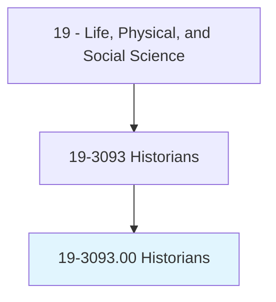
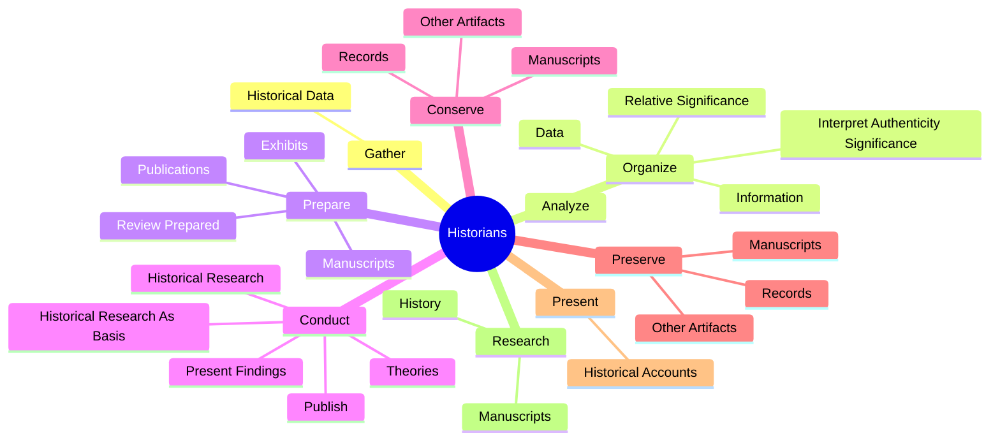
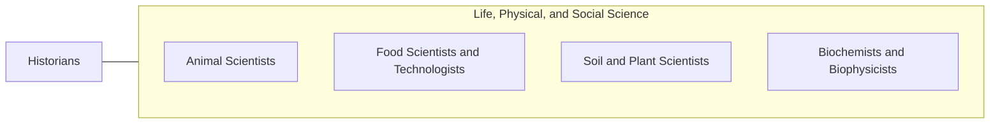

# Historians

> Research, analyze, record, and interpret the past as recorded in sources, such as government and institutional records, newspapers and other periodicals, photographs, interviews, films, electronic media, and unpublished manuscripts, such as personal diaries and letters.

## Overview

Historians is classified under Life, Physical, and Social Science (SOC 19). Research, analyze, record, and interpret the past as recorded in sources, such as government and institutional records, newspapers and other periodicals, photographs, interviews, films, electronic media, and unpublished manuscripts, such as personal diaries and letters.

## Classification Hierarchy

## Key Statistics

| Metric | Value |
|--------|-------|
| SOC Code | 19-3093.00 |
| Category | [Life, Physical, and Social Science](/occupations/Science/index) |
| Task Count | 97 |
| Source | O*NET |

## Core Tasks

### gather.HistoricalData

Historians gather historical data as part of their core responsibilities.

**Actions:**
- `gather.HistoricalData.from.Sources`
- `gather.HistoricalData.from.Archives`
- `gather.HistoricalData.from.CourtRecords`
- `gather.HistoricalData.from.Diaries`

### organize.Data

Historians organize data as part of their core responsibilities.

**Actions:**
- `organize.Data`
- `organize.Analyze`
- `organize.InterpretAuthenticitySignificance`
- `organize.RelativeSignificance`

### prepare.Publications

Historians prepare publications as part of their core responsibilities.

**Actions:**
- `prepare.Publications.by.Others`
- `prepare.Publications.by.ensure.HistoricalAccuracy`
- `prepare.Exhibits.by.Others`
- `prepare.Exhibits.by.ensure.HistoricalAccuracy`

## Skills & Competencies

### Technical Skills
- **Research Methods** - Advanced
- **Data Analysis** - Advanced
- **Laboratory Techniques** - Advanced

### Soft Skills
- **Communication** - Essential
- **Problem Solving** - Essential
- **Critical Thinking** - Important
- **Teamwork** - Important
- **Adaptability** - Important

## Related Occupations

## Industries

This occupation is found across multiple industries. See [Industries](/industries) for sector-specific employment data.

## Career Progression

---

*Source: O*NET 19-3093.00 - ONETOccupation*
