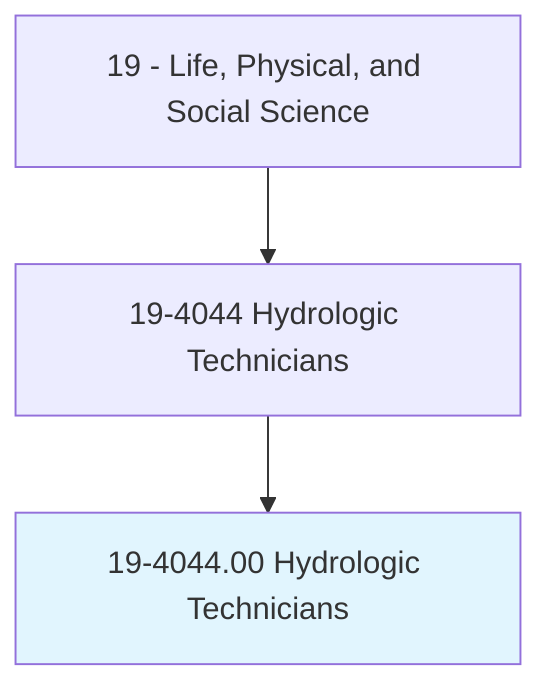
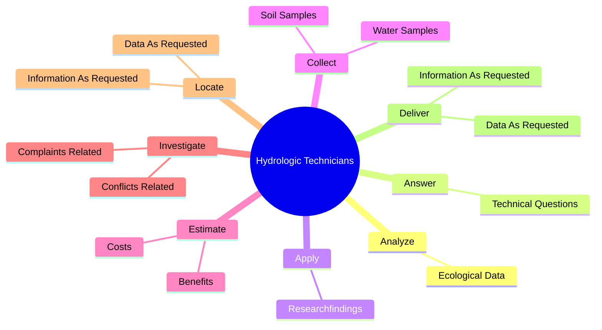

# Hydrologic Technicians

> Collect and organize data concerning the distribution and circulation of ground and surface water, and data on its physical, chemical, and biological properties. Measure and report on flow rates and ground water levels, maintain field equipment, collect water samples, install and collect sampling equipment, and process samples for shipment to testing laboratories. May collect data on behalf of hydrologists, engineers, developers, government agencies, or agriculture.

## Overview

Hydrologic Technicians is an occupation within the Life, Physical, and Social Science category. Collect and organize data concerning the distribution and circulation of ground and surface water, and data on its physical, chemical, and biological properties. Measure and report on flow rates and ground water levels, maintain field equipment, collect water samples, install and collect sampling equipment, and process samples for shipment to testing laboratories.

## Classification Hierarchy

## Key Statistics

| Metric | Value |
|--------|-------|
| SOC Code | 19-4044.00 |
| Category | [Life, Physical, and Social Science](/occupations/Science) |
| Task Count | 81 |
| Source | O*NET |

## Core Tasks

### analyze.EcologicalData

Hydrologic Technicians analyze ecological data as part of their core responsibilities.

**Actions:**
- `analyze.EcologicalData.about.Impact.of.Pollution`
- `analyze.EcologicalData.about.Impact.of.Erosion`
- `analyze.EcologicalData.about.Impact.of.Floods`
- `analyze.EcologicalData.about.Impact.of.OtherEnvironmentalProblemsOnBodiesOfWater`

### answer.TechnicalQuestions

Hydrologic Technicians answer technical questions as part of their core responsibilities.

**Actions:**
- `answer.TechnicalQuestions.from.Hydrologists`
- `answer.TechnicalQuestions.from.Policymakers`
- `answer.TechnicalQuestions.from.OtherCustomersDevelopingWaterConservationPlans`

### apply.Researchfindings

Hydrologic Technicians apply researchfindings as part of their core responsibilities.

**Actions:**
- `apply.Researchfindings.to.minimize.EnvironmentalImpactsOfPollution`

## Skills & Competencies

### Technical Skills
- **Research Methods** - Advanced
- **Data Analysis** - Advanced
- **Laboratory Techniques** - Advanced

### Soft Skills
- **Communication** - Essential
- **Problem Solving** - Essential
- **Critical Thinking** - Important
- **Teamwork** - Important
- **Adaptability** - Important

## Related Occupations

## Industries

This occupation is found across multiple industries. See [Industries](/industries) for sector-specific employment data.

## Career Progression

---

*Source: O*NET 19-4044.00 - ONETOccupation*
