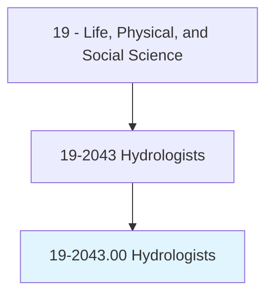
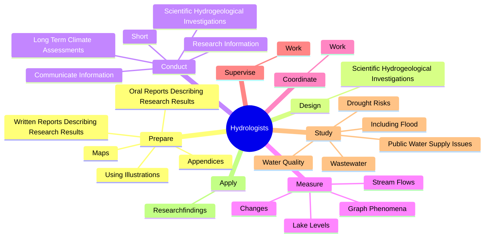
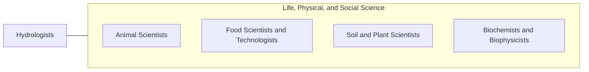

# Hydrologists

> Research the distribution, circulation, and physical properties of underground and surface waters; and study the form and intensity of precipitation and its rate of infiltration into the soil, movement through the earth, and return to the ocean and atmosphere.

## Overview

Hydrologists is classified under Life, Physical, and Social Science (SOC 19). Research the distribution, circulation, and physical properties of underground and surface waters; and study the form and intensity of precipitation and its rate of infiltration into the soil, movement through the earth, and return to the ocean and atmosphere.

## Classification Hierarchy

## Key Statistics

| Metric | Value |
|--------|-------|
| SOC Code | 19-2043.00 |
| Category | [Life, Physical, and Social Science](/occupations/Science/index) |
| Task Count | 153 |
| Source | O*NET |

## Core Tasks

### prepare.WrittenReportsDescribingResearchResults

Hydrologists prepare written reports describing research results as part of their core responsibilities.

**Actions:**
- `prepare.WrittenReportsDescribingResearchResults`
- `prepare.OralReportsDescribingResearchResults`
- `prepare.UsingIllustrations`
- `prepare.Maps`

### design.ScientificHydrogeologicalInvestigations

Hydrologists design scientific hydrogeological investigations as part of their core responsibilities.

**Actions:**
- `design.ScientificHydrogeologicalInvestigations.to.ensure.AccurateInformationIsAvailableForUseInWaterResourceManagementDecisions`
- `design.ScientificHydrogeologicalInvestigations.to.appropriate.InformationIsAvailableForUseInWaterResourceManagementDecisions`

### conduct.ScientificHydrogeologicalInvestigations

Hydrologists conduct scientific hydrogeological investigations as part of their core responsibilities.

**Actions:**
- `conduct.ScientificHydrogeologicalInvestigations.to.ensure.AccurateInformationIsAvailableForUseInWaterResourceManagementDecisions`
- `conduct.ScientificHydrogeologicalInvestigations.to.appropriate.InformationIsAvailableForUseInWaterResourceManagementDecisions`
- `conduct.ResearchInformation.to.promote.ConservationOfWaterResources`
- `conduct.ResearchInformation.to.PreservationOfWaterResources`

## Skills & Competencies

### Technical Skills
- **Research Methods** - Advanced
- **Data Analysis** - Advanced
- **Laboratory Techniques** - Advanced

### Soft Skills
- **Communication** - Essential
- **Problem Solving** - Essential
- **Critical Thinking** - Important
- **Teamwork** - Important
- **Adaptability** - Important

## Related Occupations

## Industries

This occupation is found across multiple industries. See [Industries](/industries) for sector-specific employment data.

## Career Progression

---

*Source: O*NET 19-2043.00 - ONETOccupation*
