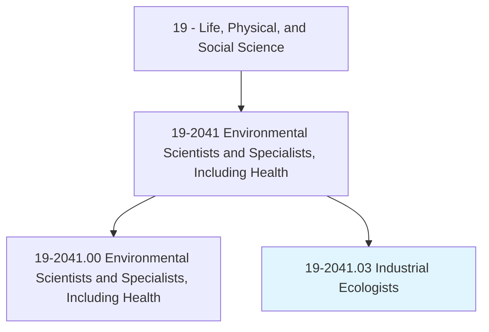
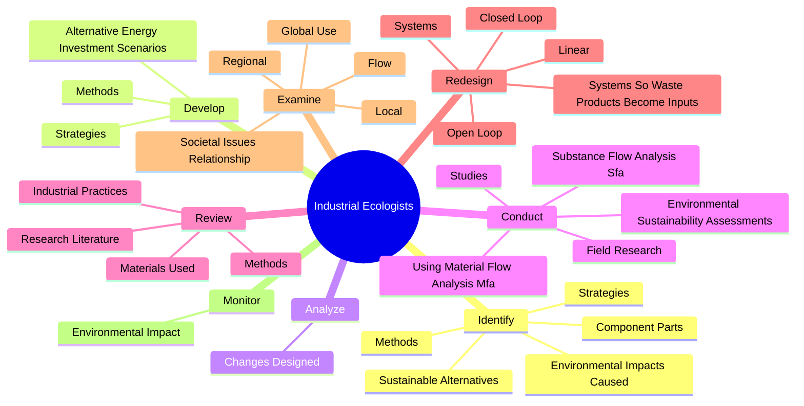
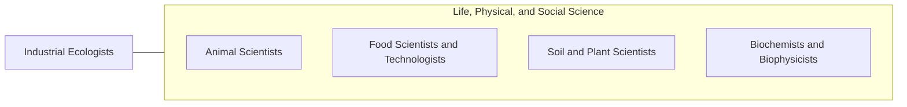

# Industrial Ecologists

> Apply principles and processes of natural ecosystems to develop models for efficient industrial systems. Use knowledge from the physical and social sciences to maximize effective use of natural resources in the production and use of goods and services. Examine societal issues and their relationship with both technical systems and the environment.

## Overview

Industrial Ecologists is a specialized variant within the Life, Physical, and Social Science category. Apply principles and processes of natural ecosystems to develop models for efficient industrial systems. Use knowledge from the physical and social sciences to maximize effective use of natural resources in the production and use of goods and services.

## Classification Hierarchy

## Key Statistics

| Metric | Value |
|--------|-------|
| SOC Code | 19-2041.03 |
| Category | [Life, Physical, and Social Science](/occupations/Science) |
| Task Count | 162 |
| Source | O*NET |

## Core Tasks

### identify.EnvironmentalImpactsCaused

Industrial Ecologists identify environmental impacts caused as part of their core responsibilities.

**Actions:**
- `identify.EnvironmentalImpactsCaused.by.Products`
- `identify.EnvironmentalImpactsCaused.by.Systems`
- `identify.EnvironmentalImpactsCaused.by.Projects`
- `identify.Strategies.to.minimize.EnvironmentalImpactOfIndustrialProductionProcesses`

### develop.Strategies

Industrial Ecologists develop strategies as part of their core responsibilities.

**Actions:**
- `develop.Strategies.to.minimize.EnvironmentalImpactOfIndustrialProductionProcesses`
- `develop.Methods.to.minimize.EnvironmentalImpactOfIndustrialProductionProcesses`
- `develop.AlternativeEnergyInvestmentScenarios.to.compare.EconomicCostsBenefits`
- `develop.AlternativeEnergyInvestmentScenarios.to.EnvironmentalCostsBenefits`

### analyze.ChangesDesigned

Industrial Ecologists analyze changes designed as part of their core responsibilities.

**Actions:**
- `analyze.ChangesDesigned.to.improve.EnvironmentalPerformanceOfComplexSystems`
- `analyze.ChangesDesigned.to.avoid.UnintendedNegativeConsequences`

## Skills & Competencies

### Technical Skills
- **Research Methods** - Advanced
- **Data Analysis** - Advanced
- **Laboratory Techniques** - Advanced

### Soft Skills
- **Communication** - Essential
- **Problem Solving** - Essential
- **Critical Thinking** - Important
- **Teamwork** - Important
- **Adaptability** - Important

## Related Occupations

## Industries

This occupation is found across multiple industries. See [Industries](/industries) for sector-specific employment data.

## Career Progression

---

*Source: O*NET 19-2041.03 - ONETOccupation*
