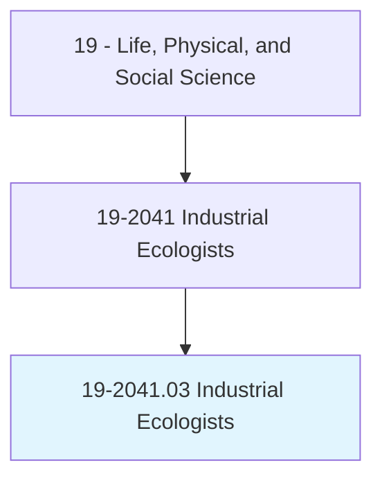
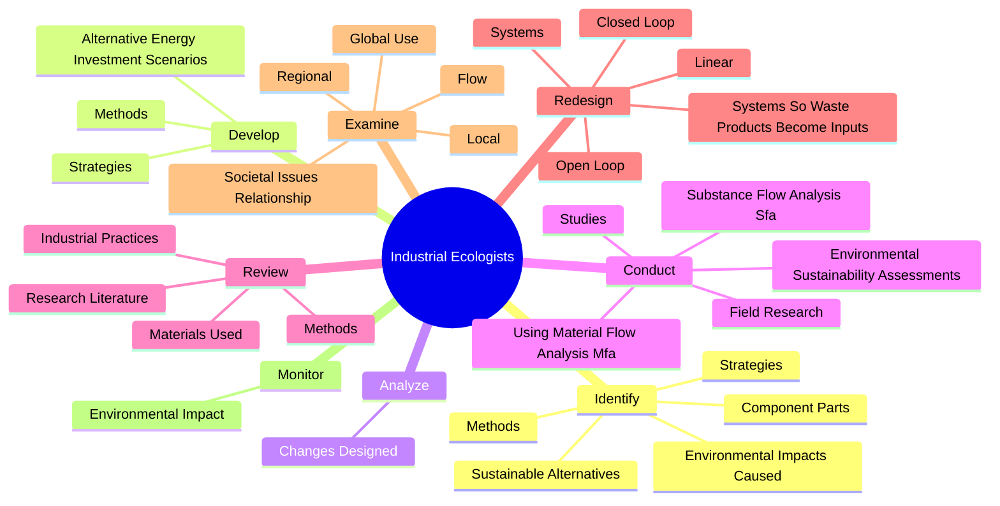
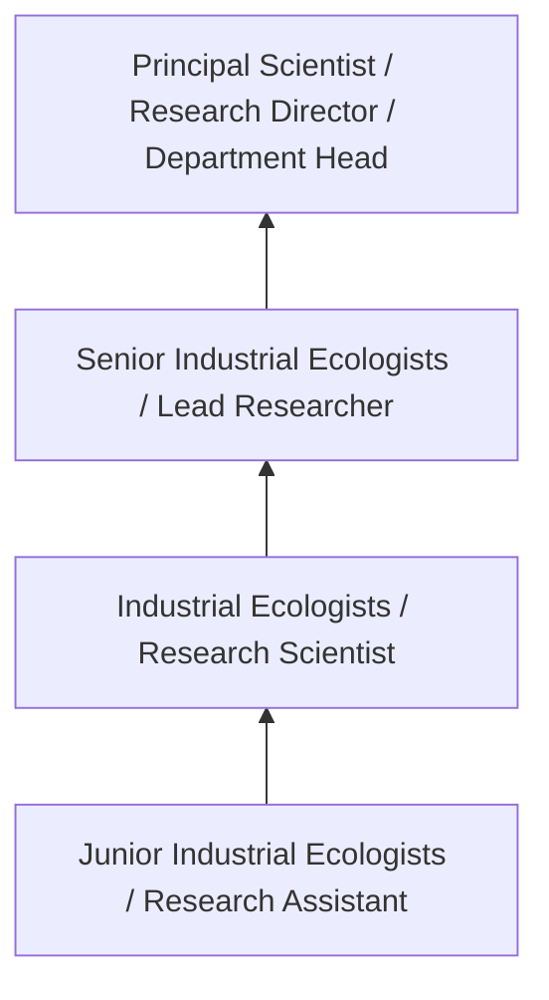

# Industrial Ecologists

> Apply principles and processes of natural ecosystems to develop models for efficient industrial systems. Use knowledge from the physical and social sciences to maximize effective use of natural resources in the production and use of goods and services. Examine societal issues and their relationship with both technical systems and the environment.

## Overview

Industrial Ecologists professionals apply principles and processes of natural ecosystems to develop models for efficient industrial systems. This occupation falls within the Life, Physical, and Social Science category and requires a combination of specialized knowledge, technical skills, and practical experience.

These professionals work across diverse settings and organizational contexts, applying their expertise to meet the demands of their field. They must stay current with industry standards, emerging practices, and regulatory requirements that affect their work. The role demands both independent judgment and collaborative skills, as practitioners regularly interact with colleagues, stakeholders, and the public.

As the field continues to evolve, Industrial Ecologists professionals increasingly leverage technology and data-driven approaches to enhance their effectiveness. Career opportunities span the public and private sectors, with demand influenced by economic conditions, demographic shifts, and technological advancement.

## Classification Hierarchy



## Key Statistics

| Metric | Value |
|--------|-------|
| SOC Code | 19-2041.03 |
| Job Zone | N/A |
| Category | [Life, Physical, and Social Science](/occupations/Science/index) |
| Core Tasks | 162+ |
| Salary Range | $50,000 - $130,000 |
| Median Salary | $78,000 |
| Growth Outlook | 7% (Faster than average) |
| Source | O*NET |

## Core Tasks



### conduct.EnvironmentalSustainabilityAssessments

Industrial Ecologists conduct environmental sustainability assessments as part of their core responsibilities.

**Actions:**
- `conduct.EnvironmentalSustainabilityAssessments` - Conduct environmental sustainability assessments, using material flow analysi...
- `conduct.UsingMaterialFlowAnalysisMfa` - Conduct environmental sustainability assessments, using material flow analysi...
- `conduct.SubstanceFlowAnalysisSfa` - Conduct environmental sustainability assessments, using material flow analysi...
- `conduct.FieldResearch.on.Topics` - Plan or conduct field research on topics such as industrial production, indus...
- `conduct.FieldResearch.on.IndustrialProduction` - Plan or conduct field research on topics such as industrial production, indus...

### review.ResearchLiterature

Industrial Ecologists review research literature as part of their core responsibilities.

**Actions:**
- `review.ResearchLiterature.to.maintain.KnowledgeOnTopicsRelatedToIndustrialEcology` - Review research literature to maintain knowledge on topics related to industr...
- `review.ResearchLiterature.to.PhysicalScience` - Review research literature to maintain knowledge on topics related to industr...
- `review.ResearchLiterature.to.Technology` - Review research literature to maintain knowledge on topics related to industr...
- `review.ResearchLiterature.to.Economy` - Review research literature to maintain knowledge on topics related to industr...
- `review.ResearchLiterature.to.PublicPolicy` - Review research literature to maintain knowledge on topics related to industr...

### identify.EnvironmentalImpactsCaused

Industrial Ecologists identify environmental impacts caused as part of their core responsibilities.

**Actions:**
- `identify.EnvironmentalImpactsCaused.by.Products` - Identify environmental impacts caused by products, systems, or projects.
- `identify.EnvironmentalImpactsCaused.by.Systems` - Identify environmental impacts caused by products, systems, or projects.
- `identify.EnvironmentalImpactsCaused.by.Projects` - Identify environmental impacts caused by products, systems, or projects.
- `identify.Strategies.to.minimize.EnvironmentalImpactOfIndustrialProductionProcesses` - Identify or develop strategies or methods to minimize the environmental impac...
- `identify.Methods.to.minimize.EnvironmentalImpactOfIndustrialProductionProcesses` - Identify or develop strategies or methods to minimize the environmental impac...

### examine.Local

Industrial Ecologists examine local as part of their core responsibilities.

**Actions:**
- `examine.Local.of.Materials.in.IndustrialProductionProcesses` - Examine local, regional, or global use and flow of materials or energy in ind...
- `examine.Local.of.Energy.in.IndustrialProductionProcesses` - Examine local, regional, or global use and flow of materials or energy in ind...
- `examine.Regional.of.Materials.in.IndustrialProductionProcesses` - Examine local, regional, or global use and flow of materials or energy in ind...
- `examine.Regional.of.Energy.in.IndustrialProductionProcesses` - Examine local, regional, or global use and flow of materials or energy in ind...
- `examine.GlobalUse.of.Materials.in.IndustrialProductionProcesses` - Examine local, regional, or global use and flow of materials or energy in ind...


## Skills & Competencies

### Technical Skills
- **Research Methodology** - Expert
- **Data Analysis** - Advanced
- **Laboratory Techniques** - Advanced
- **Scientific Writing** - Advanced
- **Statistical Software** - Advanced
- **Quality Control** - Proficient

### Soft Skills
- **Analytical Thinking** - Critical
- **Attention to Detail** - Critical
- **Problem Solving** - Essential
- **Collaboration** - Essential
- **Written Communication** - Essential

## Education & Certifications

| Requirement | Details |
|-------------|---------|
| Typical Education | Bachelor's or Master's degree in relevant scientific field |
| Work Experience | 1-3 years research or laboratory experience |
| On-the-Job Training | Moderate - specialized laboratory techniques |
| Certifications | Field-specific certifications may be required |

## Career Progression



## Industry Variations

### Academic Research
Focus on fundamental research and publication. Industrial Ecologists professionals in academia often combine research with teaching responsibilities and mentoring graduate students.

### Industry Research and Development
Applied research for product development and commercial applications. Emphasis on innovation timelines and market-driven objectives.

### Government and Regulatory
Mission-oriented research supporting public policy and regulatory decisions. Focus on public health, environmental protection, or national security.

### Consulting and Contract Research
Project-based work for diverse clients. Requires strong communication skills and ability to translate findings for non-technical audiences.

## Technology & Tools

- **Laboratory Information Management Systems (LIMS)**
- **Statistical software (R, SAS, SPSS)**
- **Spectroscopy and chromatography equipment**
- **Microscopy and imaging systems**
- **Data analysis and visualization tools**

## Related Occupations


## Industries

- Research and Development - High Employment
- Pharmaceutical Manufacturing - High Employment
- [Government Agencies](/industries/PublicAdministration) - Moderate Employment
- [Higher Education](/industries/Education) - Moderate Employment

## Departments

This occupation typically works in:
- [Research and Development](/departments/Research/index)
- Quality Assurance
- Laboratory Operations

## GraphDL Semantic Structure

```graphdl
Industrial Ecologists perform:
- identify.EnvironmentalImpactsCaused.by.Products
- identify.EnvironmentalImpactsCaused.by.Systems
- identify.EnvironmentalImpactsCaused.by.Projects
- identify.Strategies.to.minimize.EnvironmentalImpactOfIndustrialProductionProcesses
- identify.Methods.to.minimize.EnvironmentalImpactOfIndustrialProductionProcesses
- develop.Strategies.to.minimize.EnvironmentalImpactOfIndustrialProductionProcesses
```

---

*Source: O*NET 19-2041.03 - ONETOccupation*
