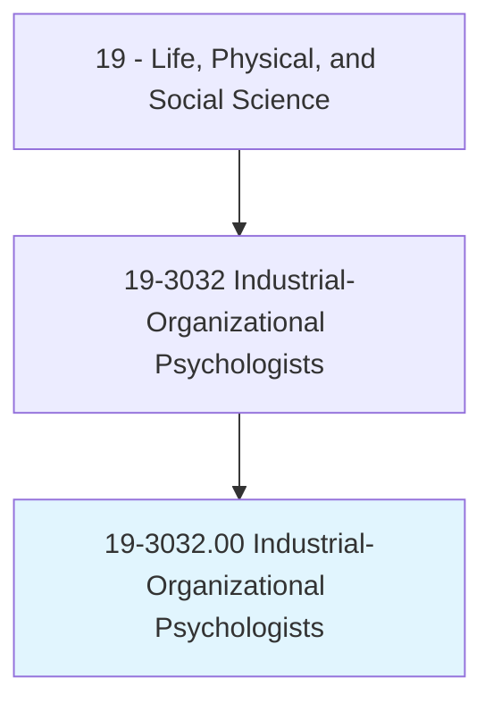
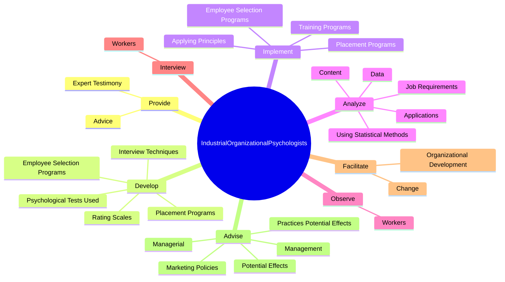

# Industrial-Organizational Psychologists

> Apply principles of psychology to human resources, administration, management, sales, and marketing problems. Activities may include policy planning; employee testing and selection, training, and development; and organizational development and analysis. May work with management to organize the work setting to improve worker productivity.

## Overview

Industrial-Organizational Psychologists is an occupation within the Life, Physical, and Social Science category. Apply principles of psychology to human resources, administration, management, sales, and marketing problems. Activities may include policy planning; employee testing and selection, training, and development; and organizational development and analysis.

## Classification Hierarchy

## Key Statistics

| Metric | Value |
|--------|-------|
| SOC Code | 19-3032.00 |
| Category | [Life, Physical, and Social Science](/occupations/Science) |
| Task Count | 122 |
| Source | O*NET |

## Core Tasks

### provide.Advice

Industrial-Organizational Psychologists provide advice as part of their core responsibilities.

**Actions:**
- `provide.Advice.on.BestPractices.for.Selection`
- `provide.Advice.on.Implementation.for.Selection`
- `provide.ExpertTestimony.in.EmploymentLawsuits`

### develop.EmployeeSelectionPrograms

Industrial-Organizational Psychologists develop employee selection programs as part of their core responsibilities.

**Actions:**
- `develop.EmployeeSelectionPrograms`
- `develop.PlacementPrograms`
- `develop.InterviewTechniques.to.assess.Skills`
- `develop.InterviewTechniques.to.Abilities`

### implement.EmployeeSelectionPrograms

Industrial-Organizational Psychologists implement employee selection programs as part of their core responsibilities.

**Actions:**
- `implement.EmployeeSelectionPrograms`
- `implement.PlacementPrograms`
- `implement.TrainingPrograms.of.LearningDifferences`
- `implement.TrainingPrograms.of.IndividualDifferences`

## Skills & Competencies

### Technical Skills
- **Research Methods** - Advanced
- **Data Analysis** - Advanced
- **Laboratory Techniques** - Advanced

### Soft Skills
- **Communication** - Essential
- **Problem Solving** - Essential
- **Critical Thinking** - Important
- **Teamwork** - Important
- **Adaptability** - Important

## Related Occupations

## Industries

This occupation is found across multiple industries. See [Industries](/industries) for sector-specific employment data.

## Career Progression

---

*Source: O*NET 19-3032.00 - ONETOccupation*
