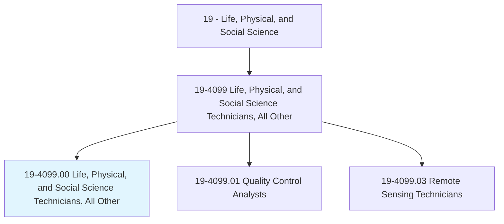
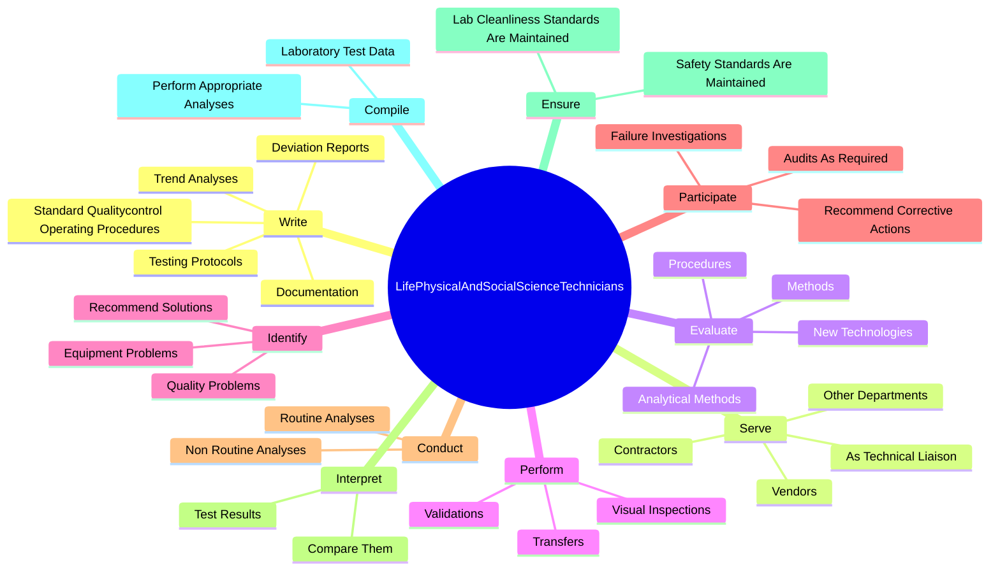
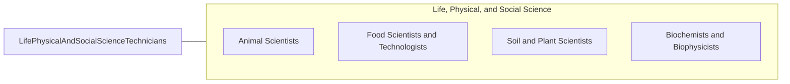

# Life, Physical, and Social Science Technicians, All Other

> All life, physical, and social science technicians not listed separately.

## Overview

Life, Physical, and Social Science Technicians, All Other is classified under Life, Physical, and Social Science (SOC 19). All life, physical, and social science technicians not listed separately.

## Classification Hierarchy

## Key Statistics

| Metric | Value |
|--------|-------|
| SOC Code | 19-4099.00 |
| Category | [Life, Physical, and Social Science](/occupations/Science/index) |
| Task Count | 72 |
| Source | O*NET |

## Core Tasks

### write.Documentation

Life, Physical, and Social Science Technicians, All Other write documentation as part of their core responsibilities.

**Actions:**
- `write.Documentation`
- `write.DeviationReports`
- `write.TestingProtocols`
- `write.TrendAnalyses`

### serve.AsTechnicalLiaison

Life, Physical, and Social Science Technicians, All Other serve as technical liaison as part of their core responsibilities.

**Actions:**
- `serve.AsTechnicalLiaison.between.QualitycontrolDepartments`
- `serve.OtherDepartments`
- `serve.Vendors`
- `serve.Contractors`

### evaluate.AnalyticalMethods

Life, Physical, and Social Science Technicians, All Other evaluate analytical methods as part of their core responsibilities.

**Actions:**
- `evaluate.AnalyticalMethods.to.DetermineHowTheyImproved`
- `evaluate.Procedures.to.DetermineHowTheyImproved`
- `evaluate.NewTechnologies.to.MakeRecommendationsRegardingUse`
- `evaluate.Methods.to.MakeRecommendationsRegardingUse`

## Skills & Competencies

### Technical Skills
- **Research Methods** - Advanced
- **Data Analysis** - Advanced
- **Laboratory Techniques** - Advanced

### Soft Skills
- **Communication** - Essential
- **Problem Solving** - Essential
- **Critical Thinking** - Important
- **Teamwork** - Important
- **Adaptability** - Important

## Related Occupations

## Industries

This occupation is found across multiple industries. See [Industries](/industries) for sector-specific employment data.

## Career Progression

---

*Source: O*NET 19-4099.00 - ONETOccupation*
