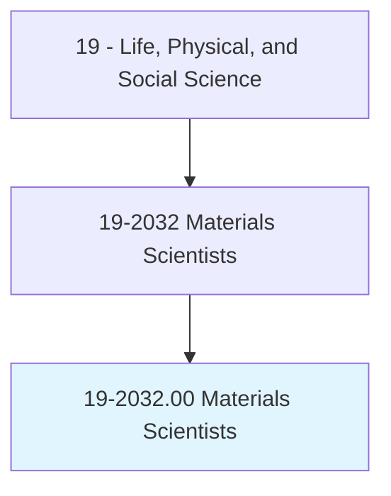
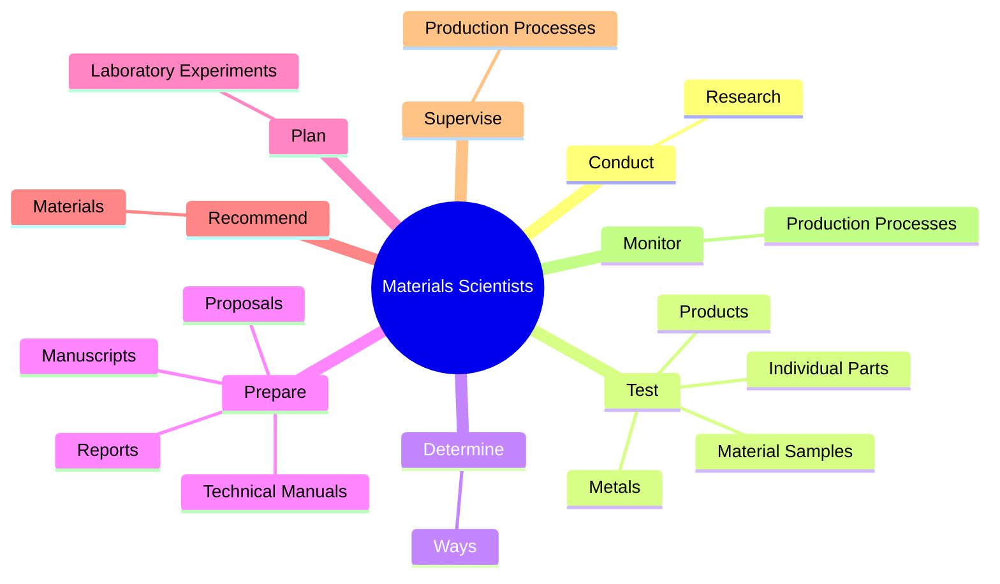

# Materials Scientists

> Research and study the structures and chemical properties of various natural and synthetic or composite materials, including metals, alloys, rubber, ceramics, semiconductors, polymers, and glass. Determine ways to strengthen or combine materials or develop new materials with new or specific properties for use in a variety of products and applications. Includes glass scientists, ceramic scientists, metallurgical scientists, and polymer scientists.

## Overview

Materials Scientists is an occupation within the Life, Physical, and Social Science category. Research and study the structures and chemical properties of various natural and synthetic or composite materials, including metals, alloys, rubber, ceramics, semiconductors, polymers, and glass. Determine ways to strengthen or combine materials or develop new materials with new or specific properties for use in a variety of products and applications.

## Classification Hierarchy

## Key Statistics

| Metric | Value |
|--------|-------|
| SOC Code | 19-2032.00 |
| Category | [Life, Physical, and Social Science](/occupations/Science) |
| Task Count | 71 |
| Source | O*NET |

## Core Tasks

### conduct.Research

Materials Scientists conduct research as part of their core responsibilities.

**Actions:**
- `conduct.Research.on.Structures.of.Materials`
- `conduct.Research.on.Properties.of.Materials`
- `conduct.Research.on.Metals`
- `conduct.Research.on.Alloys`

### test.Metals

Materials Scientists test metals as part of their core responsibilities.

**Actions:**
- `test.Metals.to.determine.ConformanceToSpecificationsOfMechanicalStrength`
- `test.Metals.to.StrengthWeightRatio`
- `test.Metals.to.Ductility`
- `test.Metals.to.Magnetic`

### determine.Ways

Materials Scientists determine ways as part of their core responsibilities.

**Actions:**
- `determine.Ways.to.strengthen.MaterialsDevelopNewMaterialsWithNewSpecificPropertiesForUseInVarietyOfProductsApplications`
- `determine.Ways.to.combine.MaterialsDevelopNewMaterialsWithNewSpecificPropertiesForUseInVarietyOfProductsApplications`

## Skills & Competencies

### Technical Skills
- **Research Methods** - Advanced
- **Data Analysis** - Advanced
- **Laboratory Techniques** - Advanced

### Soft Skills
- **Communication** - Essential
- **Problem Solving** - Essential
- **Critical Thinking** - Important
- **Teamwork** - Important
- **Adaptability** - Important

## Related Occupations

## Industries

This occupation is found across multiple industries. See [Industries](/industries) for sector-specific employment data.

## Career Progression

---

*Source: O*NET 19-2032.00 - ONETOccupation*
