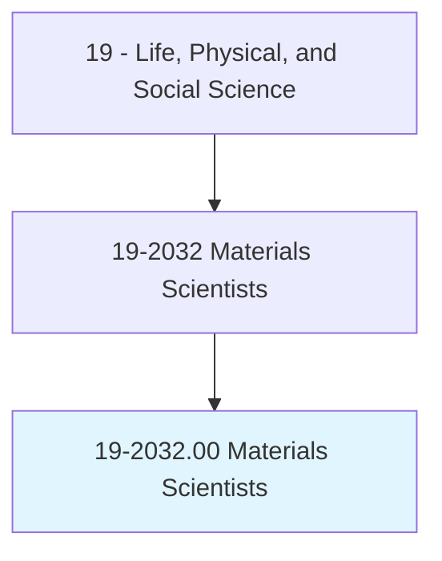
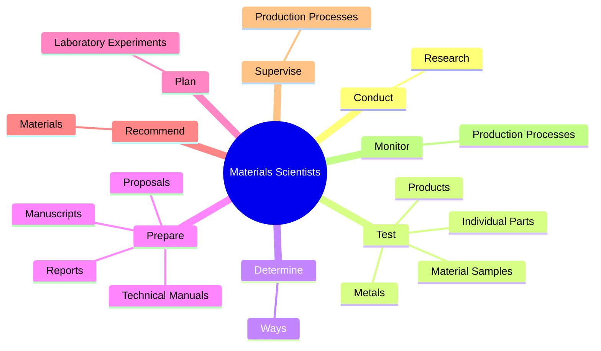
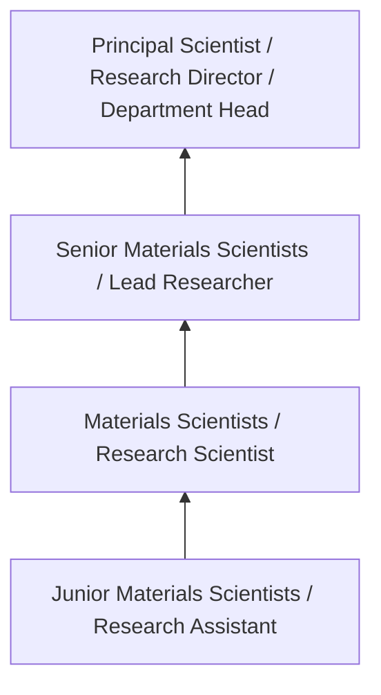

# Materials Scientists

> Research and study the structures and chemical properties of various natural and synthetic or composite materials, including metals, alloys, rubber, ceramics, semiconductors, polymers, and glass. Determine ways to strengthen or combine materials or develop new materials with new or specific properties for use in a variety of products and applications. Includes glass scientists, ceramic scientists, metallurgical scientists, and polymer scientists.

## Overview

Materials Scientists professionals research and study the structures and chemical properties of various natural and synthetic or composite materials, including metals, alloys, rubber, ceramics, semiconductors, polymers, and glass. This occupation falls within the Life, Physical, and Social Science category and requires a combination of specialized knowledge, technical skills, and practical experience.

These professionals work across diverse settings and organizational contexts, applying their expertise to meet the demands of their field. They must stay current with industry standards, emerging practices, and regulatory requirements that affect their work. The role demands both independent judgment and collaborative skills, as practitioners regularly interact with colleagues, stakeholders, and the public.

As the field continues to evolve, Materials Scientists professionals increasingly leverage technology and data-driven approaches to enhance their effectiveness. Career opportunities span the public and private sectors, with demand influenced by economic conditions, demographic shifts, and technological advancement.

## Classification Hierarchy



## Key Statistics

| Metric | Value |
|--------|-------|
| SOC Code | 19-2032.00 |
| Job Zone | N/A |
| Category | [Life, Physical, and Social Science](/occupations/Science/index) |
| Core Tasks | 71+ |
| Salary Range | $50,000 - $130,000 |
| Median Salary | $78,000 |
| Growth Outlook | 7% (Faster than average) |
| Source | O*NET |

## Core Tasks



### test.Metals

Materials Scientists test metals as part of their core responsibilities.

**Actions:**
- `test.Metals.to.determine.ConformanceToSpecificationsOfMechanicalStrength` - Test metals to determine conformance to specifications of mechanical strength...
- `test.Metals.to.StrengthWeightRatio` - Test metals to determine conformance to specifications of mechanical strength...
- `test.Metals.to.Ductility` - Test metals to determine conformance to specifications of mechanical strength...
- `test.Metals.to.Magnetic` - Test metals to determine conformance to specifications of mechanical strength...
- `test.Metals.to.ElectricalProperties` - Test metals to determine conformance to specifications of mechanical strength...

### prepare.Reports

Materials Scientists prepare reports as part of their core responsibilities.

**Actions:**
- `prepare.Reports.for.Use.by.OtherScientists` - Prepare reports, manuscripts, proposals, and technical manuals for use by oth...
- `prepare.Reports.for.Requestors` - Prepare reports, manuscripts, proposals, and technical manuals for use by oth...
- `prepare.Reports.for.Sponsors` - Prepare reports, manuscripts, proposals, and technical manuals for use by oth...
- `prepare.Reports.for.Customers` - Prepare reports, manuscripts, proposals, and technical manuals for use by oth...
- `prepare.Manuscripts.for.Use.by.OtherScientists` - Prepare reports, manuscripts, proposals, and technical manuals for use by oth...

### perform.Experiments

Materials Scientists perform experiments as part of their core responsibilities.

**Actions:**
- `perform.Experiments.to.study.Nature` - Perform experiments and computer modeling to study the nature, structure, and...
- `perform.Experiments.to.structure` - Perform experiments and computer modeling to study the nature, structure, and...
- `perform.Experiments.to.PhysicalPropertiesOfMetalsAlloys` - Perform experiments and computer modeling to study the nature, structure, and...
- `perform.Experiments.to.ChemicalPropertiesOfMetalsAlloys` - Perform experiments and computer modeling to study the nature, structure, and...
- `perform.Experiments.to.ResponsesToAppliedForces` - Perform experiments and computer modeling to study the nature, structure, and...

### conduct.Research

Materials Scientists conduct research as part of their core responsibilities.

**Actions:**
- `conduct.Research.on.Structures.of.Materials` - Conduct research on the structures and properties of materials, such as metal...
- `conduct.Research.on.Properties.of.Materials` - Conduct research on the structures and properties of materials, such as metal...
- `conduct.Research.on.Metals` - Conduct research on the structures and properties of materials, such as metal...
- `conduct.Research.on.Alloys` - Conduct research on the structures and properties of materials, such as metal...
- `conduct.Research.on.Polymers` - Conduct research on the structures and properties of materials, such as metal...


## Skills & Competencies

### Technical Skills
- **Research Methodology** - Expert
- **Data Analysis** - Advanced
- **Laboratory Techniques** - Advanced
- **Scientific Writing** - Advanced
- **Statistical Software** - Advanced
- **Quality Control** - Proficient

### Soft Skills
- **Analytical Thinking** - Critical
- **Attention to Detail** - Critical
- **Problem Solving** - Essential
- **Collaboration** - Essential
- **Written Communication** - Essential

## Education & Certifications

| Requirement | Details |
|-------------|---------|
| Typical Education | Bachelor's or Master's degree in relevant scientific field |
| Work Experience | 1-3 years research or laboratory experience |
| On-the-Job Training | Moderate - specialized laboratory techniques |
| Certifications | Field-specific certifications may be required |

## Career Progression



## Industry Variations

### Academic Research
Focus on fundamental research and publication. Materials Scientists professionals in academia often combine research with teaching responsibilities and mentoring graduate students.

### Industry Research and Development
Applied research for product development and commercial applications. Emphasis on innovation timelines and market-driven objectives.

### Government and Regulatory
Mission-oriented research supporting public policy and regulatory decisions. Focus on public health, environmental protection, or national security.

### Consulting and Contract Research
Project-based work for diverse clients. Requires strong communication skills and ability to translate findings for non-technical audiences.

## Technology & Tools

- **Laboratory Information Management Systems (LIMS)**
- **Statistical software (R, SAS, SPSS)**
- **Spectroscopy and chromatography equipment**
- **Microscopy and imaging systems**
- **Data analysis and visualization tools**

## Related Occupations


## Industries

- [Research and Development](/industries/ResearchDevelopment) - High Employment
- [Pharmaceutical Manufacturing](/industries/Pharma) - High Employment
- [Government Agencies](/industries/Government) - Moderate Employment
- [Higher Education](/industries/Education) - Moderate Employment

## Departments

This occupation typically works in:
- [Research and Development](/departments/Research/index)
- [Quality Assurance](/departments/QualityAssurance)
- [Laboratory Operations](/departments/Laboratory)

## GraphDL Semantic Structure

```
Materials Scientists perform:
- conduct.Research.on.Structures.of.Materials
- conduct.Research.on.Properties.of.Materials
- conduct.Research.on.Metals
- conduct.Research.on.Alloys
- conduct.Research.on.Polymers
- conduct.Research.on.Ceramics
```

---

*Source: O*NET 19-2032.00 - ONETOccupation*
