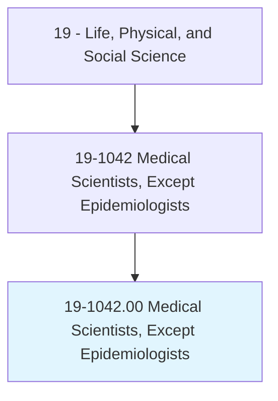
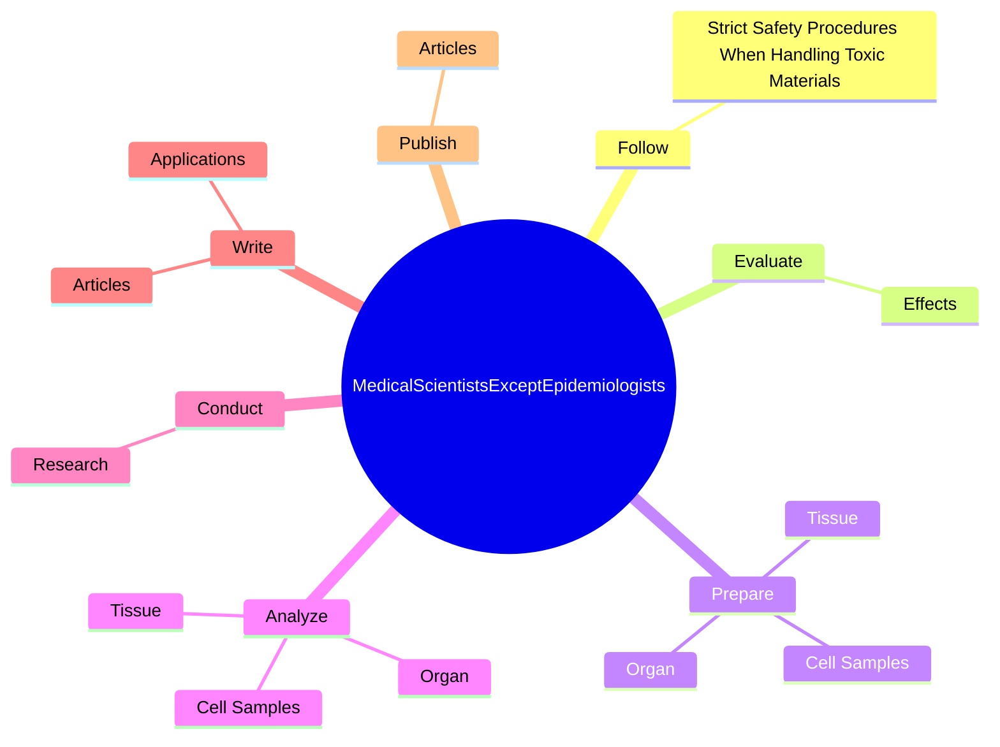

# Medical Scientists, Except Epidemiologists

> Conduct research dealing with the understanding of human diseases and the improvement of human health. Engage in clinical investigation, research and development, or other related activities.

## Overview

Medical Scientists, Except Epidemiologists is an occupation within the Life, Physical, and Social Science category. Conduct research dealing with the understanding of human diseases and the improvement of human health. 

## Classification Hierarchy

## Key Statistics

| Metric | Value |
|--------|-------|
| SOC Code | 19-1042.00 |
| Category | [Life, Physical, and Social Science](/occupations/Science/index) |
| Task Count | 65 |
| Source | O*NET |

## Core Tasks

### follow.StrictSafetyProceduresWhenHandlingToxicMaterials

Medical Scientists, Except Epidemiologists follow strict safety procedures when handling toxic materials as part of their core responsibilities.

**Actions:**
- `follow.StrictSafetyProceduresWhenHandlingToxicMaterials.to.avoid.Contamination`

### evaluate.Effects

Medical Scientists, Except Epidemiologists evaluate effects as part of their core responsibilities.

**Actions:**
- `evaluate.Effects.of.Drugs`
- `evaluate.Effects.of.Gases`
- `evaluate.Effects.of.Pesticides`
- `evaluate.Effects.of.Parasites`

### prepare.Organ

Medical Scientists, Except Epidemiologists prepare organ as part of their core responsibilities.

**Actions:**
- `prepare.Organ.to.identify.Toxicity`
- `prepare.Organ.to.Bacteria`
- `prepare.Organ.to.MicroorganismsStudyCellStructure`
- `prepare.Organ.to.ToStudyCellStructure`

## Skills & Competencies

### Technical Skills
- **Research Methods** - Advanced
- **Data Analysis** - Advanced
- **Laboratory Techniques** - Advanced

### Soft Skills
- **Communication** - Essential
- **Problem Solving** - Essential
- **Critical Thinking** - Important
- **Teamwork** - Important
- **Adaptability** - Important

## Related Occupations

## Industries

This occupation is found across multiple industries. See [Industries](/industries) for sector-specific employment data.

## Career Progression

---

*Source: O*NET 19-1042.00 - ONETOccupation*
