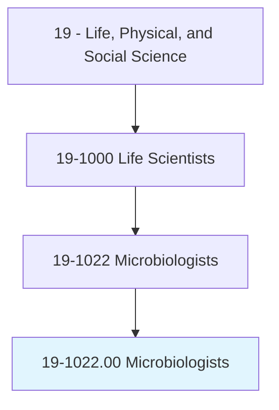
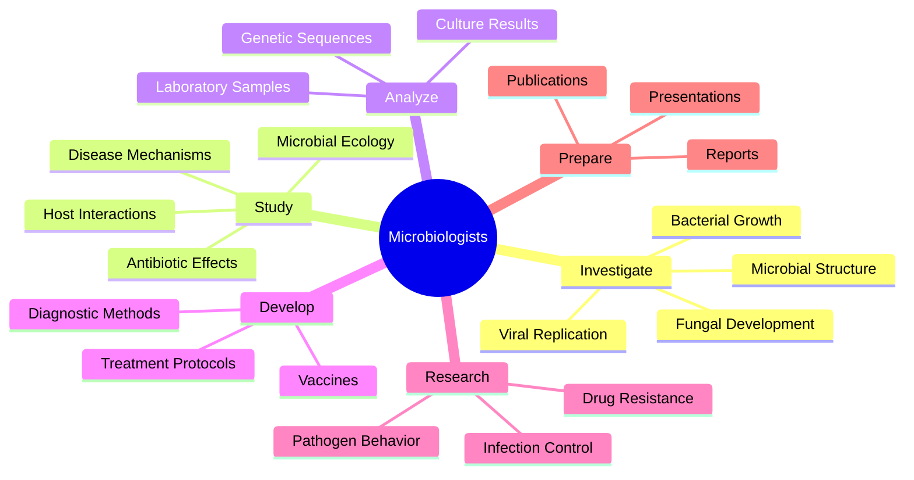
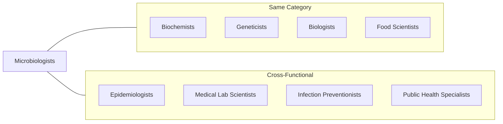
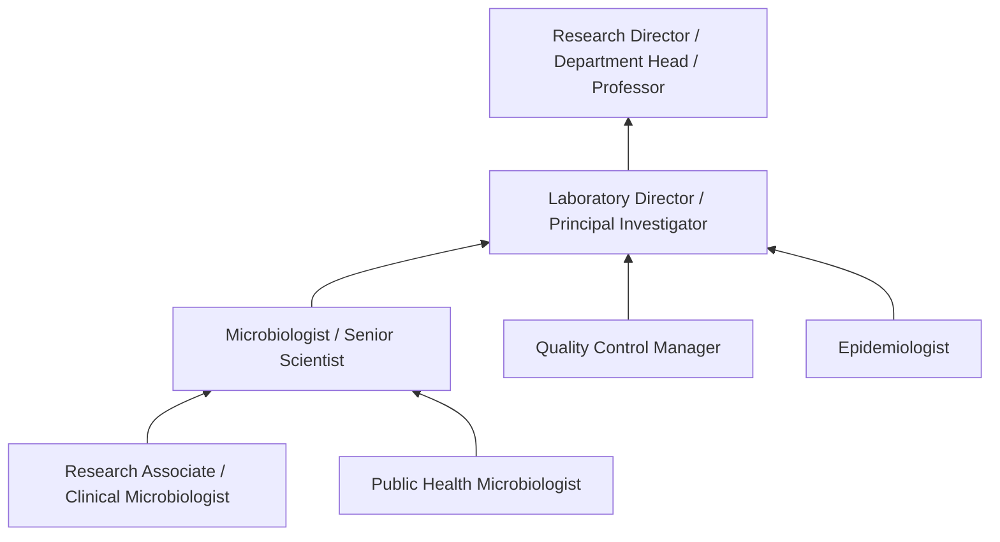

# Microbiologists

> Investigate the growth, structure, development, and other characteristics of microscopic organisms, such as bacteria, algae, or fungi. Includes medical microbiologists who study the relationship between organisms and disease or the effects of antibiotics on microorganisms.

## Overview

Microbiologists are scientists who study microscopic life forms including bacteria, viruses, fungi, algae, and parasites. They investigate how these organisms grow, reproduce, and interact with their environments, with applications ranging from medicine and public health to food safety and environmental science. Medical microbiologists focus on understanding infectious diseases and developing treatments, while environmental microbiologists study microbial ecology and biotechnology applications. They work in clinical laboratories, research institutions, pharmaceutical companies, food manufacturers, and government agencies.

## Classification Hierarchy



## Key Statistics

| Metric | Value |
|--------|-------|
| SOC Code | 19-1022.00 |
| Job Zone | 5 (Extensive Preparation) |
| Category | [Life, Physical, and Social Science](/occupations/Science) |
| Core Tasks | 15+ |
| Source | O*NET |

## Core Tasks



### investigate.MicrobialCharacteristics

Microbiologists study the fundamental properties of microscopic organisms.

**Actions:**
- `investigate.Growth.of.MicroscopicOrganisms` - Study reproduction and population dynamics
- `analyze.Structure.of.Bacteria` - Examine cellular and molecular architecture
- `study.Development.of.Fungi` - Research life cycles and morphogenesis
- `characterize.Algae.for.BiologicalProperties` - Investigate photosynthetic microorganisms
- `examine.VirulenceFactors.to.understand.Pathogenicity` - Identify disease-causing mechanisms

### study.OrganismDiseaseRelationship

Medical microbiologists investigate how microorganisms cause disease.

**Actions:**
- `study.Relationship.between.Organisms.and.Disease` - Research infection mechanisms
- `investigate.HostPathogen.Interactions` - Analyze how organisms invade hosts
- `research.TransmissionRoutes.of.InfectiousDiseases` - Track disease spread patterns
- `analyze.ImmunResponse.to.MicrobialInfection` - Study host defense mechanisms
- `identify.Pathogens.causing.SpecificDiseases` - Diagnose infectious agents

### evaluate.AntibioticEffects

Microbiologists study how antimicrobial agents affect microorganisms.

**Actions:**
- `evaluate.Effects.of.Antibiotics.on.Microorganisms` - Test antimicrobial efficacy
- `study.DrugResistance.Mechanisms` - Research how organisms evade treatment
- `develop.NewAntimicrobial.Compounds` - Create novel therapeutic agents
- `monitor.Resistance.Patterns.in.Populations` - Track emerging resistance
- `optimize.Treatment.Protocols.for.Efficacy` - Improve therapeutic outcomes

### conduct.LaboratoryAnalysis

Microbiologists perform specialized testing and identification procedures.

**Actions:**
- `conduct.LaboratoryAnalysis.of.Samples` - Process clinical and environmental specimens
- `culture.Microorganisms.for.Identification` - Grow and isolate organisms
- `perform.BiochemicalTests.to.characterize.Organisms` - Apply identification methods
- `analyze.GeneticSequences.for.Identification` - Use molecular diagnostics
- `conduct.SensitivityTesting.to.determine.DrugSusceptibility` - Guide treatment selection

### develop.DiagnosticMethods

Microbiologists create new approaches for detecting microorganisms.

**Actions:**
- `develop.DiagnosticMethods.to.detect.Pathogens` - Create new testing procedures
- `validate.NewTests.for.AccuracyReliability` - Ensure diagnostic quality
- `implement.RapidDetection.Techniques` - Deploy faster identification methods
- `design.ScreeningProtocols.for.InfectionControl` - Develop surveillance systems
- `improve.SensitivitySpecificity.of.DiagnosticAssays` - Enhance test performance

### research.InfectionControl

Microbiologists study methods to prevent disease transmission.

**Actions:**
- `research.InfectionControl.Methods.to.prevent.Spread` - Develop containment strategies
- `evaluate.Disinfection.Procedures` - Test sanitization effectiveness
- `develop.Sterilization.Protocols` - Create decontamination methods
- `advise.HealthcareSettings.on.PreventionMeasures` - Guide infection prevention
- `investigate.Outbreaks.to.identify.Sources` - Conduct epidemiological investigations

### prepare.ScientificCommunications

Microbiologists document and share research findings.

**Actions:**
- `prepare.Reports.on.ResearchFindings` - Document experimental results
- `publish.Papers.in.ScientificJournals` - Share discoveries with scientific community
- `present.Research.at.Conferences` - Communicate findings to peers
- `write.GrantProposals.to.secure.Funding` - Obtain research support
- `contribute.to.PublicHealthGuidelines` - Inform policy and practice

## Skills & Competencies

### Technical Skills
- **Microbial Cultivation** - Expert
- **Molecular Biology** - Advanced
- **Diagnostic Techniques** - Expert
- **Antimicrobial Testing** - Advanced
- **Biosafety Practices** - Expert
- **Microscopy** - Advanced
- **Genomic Analysis** - Advanced
- **Statistical Analysis** - Advanced
- **Quality Control** - Advanced

### Soft Skills
- **Analytical Thinking** - Critical
- **Attention to Detail** - Critical
- **Scientific Writing** - Essential
- **Problem Solving** - Essential
- **Collaboration** - Essential

## Related Occupations



## Industries

- [Healthcare and Clinical Laboratories](/industries/Healthcare) - High Employment
- [Pharmaceutical and Medicine Manufacturing](/industries/Pharma) - High Employment
- [Research and Development](/industries/ResearchDevelopment) - High Employment
- [Food Manufacturing](/industries/FoodManufacturing) - Moderate Employment
- [Government Public Health Agencies](/industries/Government) - Moderate Employment
- [Environmental Services](/industries/Environmental) - Growing Employment
- [Biotechnology](/industries/Biotechnology) - Growing Employment

## Career Progression



## Industry Variations

### Clinical Microbiology
Focus on diagnostic testing and patient care support. Emphasis on rapid identification and antimicrobial susceptibility testing. Regulatory compliance and quality assurance.

### Pharmaceutical Research
Drug discovery and development for infectious diseases. Focus on antibiotic development, vaccine research, and therapeutic targets.

### Public Health
Surveillance of infectious diseases and outbreak investigation. Emphasis on population health and disease prevention. Policy development and public communication.

### Food Industry
Quality control and food safety testing. Pathogen detection and prevention. Regulatory compliance and HACCP implementation.

### Environmental Microbiology
Study of microbial ecology and bioremediation. Water quality testing and environmental monitoring. Research on microbial communities.

### Academic Research
Fundamental research on microbial biology. Teaching responsibilities and graduate student mentorship. Publication-focused discovery science.

## Education & Training

| Requirement | Details |
|-------------|---------|
| Typical Education | Doctoral degree in Microbiology, Bacteriology, or related field (research); Master's for some industry positions |
| Work Experience | 2-4 years postdoctoral or clinical experience |
| On-the-Job Training | Moderate - specialized techniques and laboratory protocols |
| Common Certifications | ASCP (Clinical), ABMM (Medical Microbiology), SM(ASCP) (Technologist) |

## Departments

This occupation typically works in:
- [Research and Development](/departments/ResearchDevelopment)
- [Clinical Laboratory](/departments/ClinicalLab)
- [Quality Control](/departments/QualityControl)
- [Infectious Disease](/departments/InfectiousDisease)
- [Microbiology Department](/departments/Microbiology)
- [Public Health](/departments/PublicHealth)

## GraphDL Semantic Structure

```
Microbiologists perform:
- investigate.Growth.of.MicroscopicOrganisms
- study.Relationship.between.Organisms.and.Disease
- evaluate.Effects.of.Antibiotics.on.Microorganisms
- conduct.LaboratoryAnalysis.of.Samples
- develop.DiagnosticMethods.to.detect.Pathogens
- research.InfectionControl.to.prevent.Spread
```

---

*Source: O*NET 19-1022.00 - ONETOccupation*
