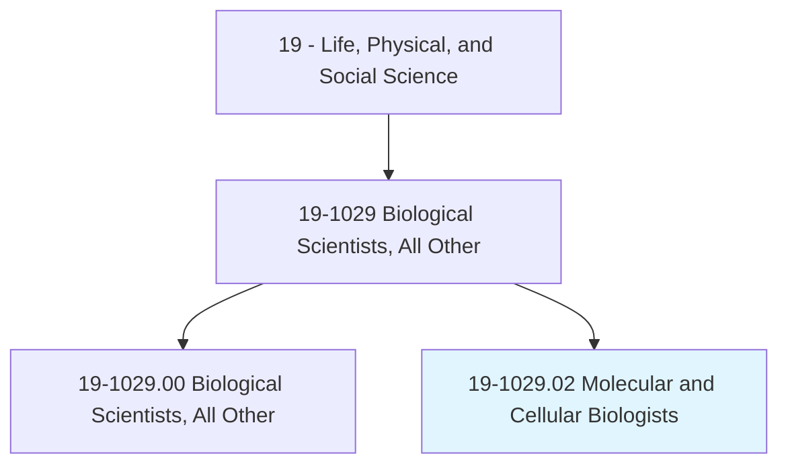
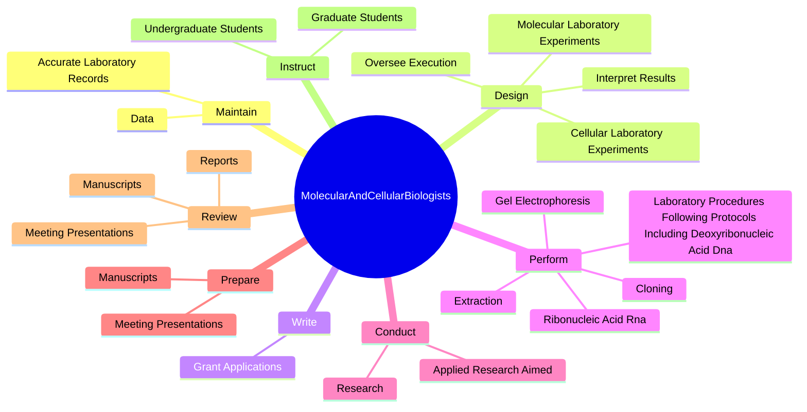

# Molecular and Cellular Biologists

> Research and study cellular molecules and organelles to understand cell function and organization.

## Overview

Molecular and Cellular Biologists is classified under Life, Physical, and Social Science (SOC 19). Research and study cellular molecules and organelles to understand cell function and organization.

## Classification Hierarchy

## Key Statistics

| Metric | Value |
|--------|-------|
| SOC Code | 19-1029.02 |
| Category | [Life, Physical, and Social Science](/occupations/Science) |
| Task Count | 80 |
| Source | O*NET |

## Core Tasks

### maintain.AccurateLaboratoryRecords

Molecular and Cellular Biologists maintain accurate laboratory records as part of their core responsibilities.

**Actions:**
- `maintain.AccurateLaboratoryRecords`
- `maintain.Data`

### design.MolecularLaboratoryExperiments

Molecular and Cellular Biologists design molecular laboratory experiments as part of their core responsibilities.

**Actions:**
- `design.MolecularLaboratoryExperiments`
- `design.CellularLaboratoryExperiments`
- `design.OverseeExecution`
- `design.InterpretResults`

### write.GrantApplications

Molecular and Cellular Biologists write grant applications as part of their core responsibilities.

**Actions:**
- `write.GrantApplications.to.obtain.Funding`

## Skills & Competencies

### Technical Skills
- **Research Methods** - Advanced
- **Data Analysis** - Advanced
- **Laboratory Techniques** - Advanced

### Soft Skills
- **Communication** - Essential
- **Problem Solving** - Essential
- **Critical Thinking** - Important
- **Teamwork** - Important
- **Adaptability** - Important

## Related Occupations

## Industries

This occupation is found across multiple industries. See [Industries](/industries) for sector-specific employment data.

## Career Progression

---

*Source: O*NET 19-1029.02 - ONETOccupation*
