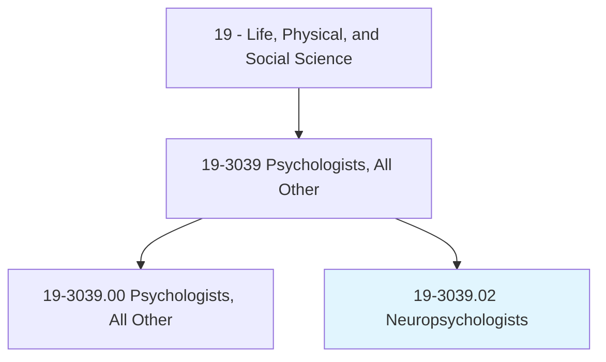
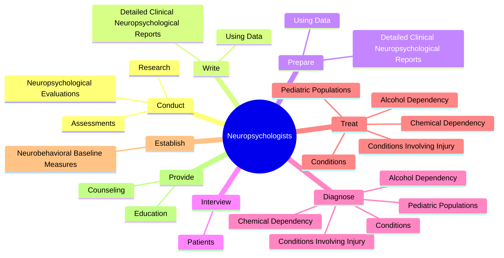

# Neuropsychologists

> Apply theories and principles of neuropsychology to evaluate and diagnose disorders of higher cerebral functioning, often in research and medical settings. Study the human brain and the effect of physiological states on human cognition and behavior. May formulate and administer programs of treatment.

## Overview

Neuropsychologists is a specialized variant within the Life, Physical, and Social Science category. Apply theories and principles of neuropsychology to evaluate and diagnose disorders of higher cerebral functioning, often in research and medical settings. Study the human brain and the effect of physiological states on human cognition and behavior.

## Classification Hierarchy

## Key Statistics

| Metric | Value |
|--------|-------|
| SOC Code | 19-3039.02 |
| Category | [Life, Physical, and Social Science](/occupations/Science/index) |
| Task Count | 96 |
| Source | O*NET |

## Core Tasks

### conduct.NeuropsychologicalEvaluations

Neuropsychologists conduct neuropsychological evaluations as part of their core responsibilities.

**Actions:**
- `conduct.NeuropsychologicalEvaluations.of.Intelligence`
- `conduct.NeuropsychologicalEvaluations.of.AcademicAbility`
- `conduct.NeuropsychologicalEvaluations.of.Attention`
- `conduct.NeuropsychologicalEvaluations.of.Concentration`

### write.DetailedClinicalNeuropsychologicalReports

Neuropsychologists write detailed clinical neuropsychological reports as part of their core responsibilities.

**Actions:**
- `write.DetailedClinicalNeuropsychologicalReports.from.PsychologicalTests`
- `write.DetailedClinicalNeuropsychologicalReports.from.NeuropsychologicalTests`
- `write.DetailedClinicalNeuropsychologicalReports.from.SelfReportMeasures`
- `write.DetailedClinicalNeuropsychologicalReports.from.RatingScales`

### prepare.DetailedClinicalNeuropsychologicalReports

Neuropsychologists prepare detailed clinical neuropsychological reports as part of their core responsibilities.

**Actions:**
- `prepare.DetailedClinicalNeuropsychologicalReports.from.PsychologicalTests`
- `prepare.DetailedClinicalNeuropsychologicalReports.from.NeuropsychologicalTests`
- `prepare.DetailedClinicalNeuropsychologicalReports.from.SelfReportMeasures`
- `prepare.DetailedClinicalNeuropsychologicalReports.from.RatingScales`

## Skills & Competencies

### Technical Skills
- **Research Methods** - Advanced
- **Data Analysis** - Advanced
- **Laboratory Techniques** - Advanced

### Soft Skills
- **Communication** - Essential
- **Problem Solving** - Essential
- **Critical Thinking** - Important
- **Teamwork** - Important
- **Adaptability** - Important

## Related Occupations

## Industries

This occupation is found across multiple industries. See [Industries](/industries) for sector-specific employment data.

## Career Progression

---

*Source: O*NET 19-3039.02 - ONETOccupation*
