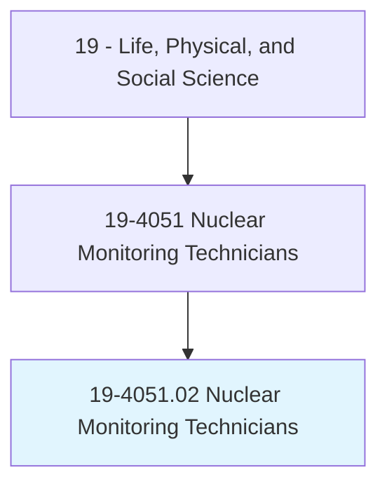
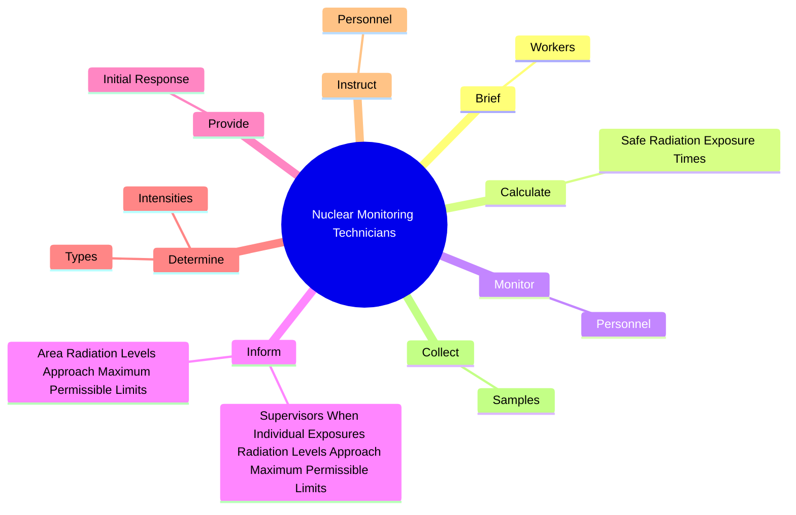
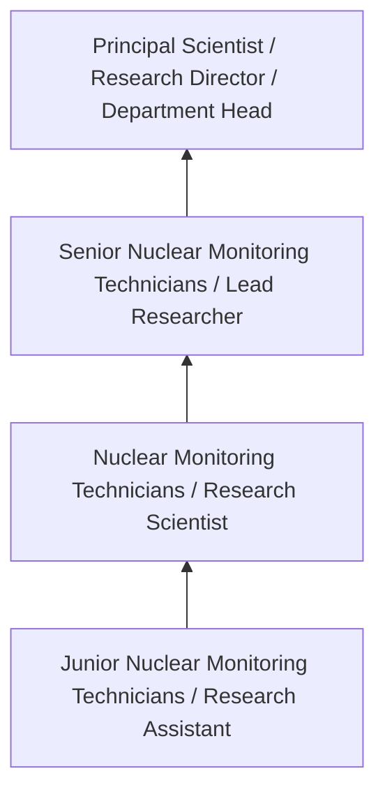
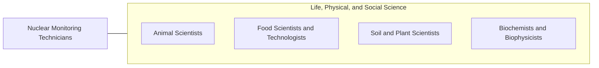

# Nuclear Monitoring Technicians

> Collect and test samples to monitor results of nuclear experiments and contamination of humans, facilities, and environment.

## Overview

Nuclear Monitoring Technicians professionals collect and test samples to monitor results of nuclear experiments and contamination of humans, facilities, and environment.. This occupation falls within the Life, Physical, and Social Science category and requires a combination of specialized knowledge, technical skills, and practical experience.

These professionals work across diverse settings and organizational contexts, applying their expertise to meet the demands of their field. They must stay current with industry standards, emerging practices, and regulatory requirements that affect their work. The role demands both independent judgment and collaborative skills, as practitioners regularly interact with colleagues, stakeholders, and the public.

As the field continues to evolve, Nuclear Monitoring Technicians professionals increasingly leverage technology and data-driven approaches to enhance their effectiveness. Career opportunities span the public and private sectors, with demand influenced by economic conditions, demographic shifts, and technological advancement.

## Classification Hierarchy



## Key Statistics

| Metric | Value |
|--------|-------|
| SOC Code | 19-4051.02 |
| Job Zone | N/A |
| Category | [Life, Physical, and Social Science](/occupations/Science/index) |
| Core Tasks | 53+ |
| Salary Range | $50,000 - $130,000 |
| Median Salary | $78,000 |
| Growth Outlook | 7% (Faster than average) |
| Source | O*NET |

## Core Tasks



### determine.Intensities

Nuclear Monitoring Technicians determine intensities as part of their core responsibilities.

**Actions:**
- `determine.Intensities.of.Radiation.in.WorkAreas` - Determine intensities and types of radiation in work areas, equipment, or mat...
- `determine.Intensities.of.Equipment` - Determine intensities and types of radiation in work areas, equipment, or mat...
- `determine.Intensities.of.Materials` - Determine intensities and types of radiation in work areas, equipment, or mat...
- `determine.Intensities.of.UsingRadiationDetectors` - Determine intensities and types of radiation in work areas, equipment, or mat...
- `determine.Intensities.of.OtherInstruments` - Determine intensities and types of radiation in work areas, equipment, or mat...

### analyze.Samples

Nuclear Monitoring Technicians analyze samples as part of their core responsibilities.

**Actions:**
- `analyze.Samples.for.ContaminantsElements` - Analyze samples, such as air or water samples, for contaminants or other elem...
- `analyze.Samples.for.OtherElements` - Analyze samples, such as air or water samples, for contaminants or other elem...
- `analyze.Air.for.ContaminantsElements` - Analyze samples, such as air or water samples, for contaminants or other elem...
- `analyze.Air.for.OtherElements` - Analyze samples, such as air or water samples, for contaminants or other elem...
- `analyze.WaterSamples.for.ContaminantsElements` - Analyze samples, such as air or water samples, for contaminants or other elem...

### place.RadioactiveWaste

Nuclear Monitoring Technicians place radioactive waste as part of their core responsibilities.

**Actions:**
- `place.RadioactiveWaste.for.Shipping` - Place radioactive waste, such as sweepings or broken sample bottles, into con...
- `place.RadioactiveWaste.for.Disposal` - Place radioactive waste, such as sweepings or broken sample bottles, into con...
- `place.Sweepings.for.Shipping` - Place radioactive waste, such as sweepings or broken sample bottles, into con...
- `place.Sweepings.for.Disposal` - Place radioactive waste, such as sweepings or broken sample bottles, into con...
- `place.BrokenSampleBottles.for.Shipping` - Place radioactive waste, such as sweepings or broken sample bottles, into con...

### prepare.ReportsDescribingContaminationTests

Nuclear Monitoring Technicians prepare reports describing contamination tests as part of their core responsibilities.

**Actions:**
- `prepare.ReportsDescribingContaminationTests.in.DecontaminationProcesses` - Prepare reports describing contamination tests, material or equipment deconta...
- `prepare.Material.in.DecontaminationProcesses` - Prepare reports describing contamination tests, material or equipment deconta...
- `prepare.EquipmentDecontaminated.in.DecontaminationProcesses` - Prepare reports describing contamination tests, material or equipment deconta...
- `prepare.MethodsUsed.in.DecontaminationProcesses` - Prepare reports describing contamination tests, material or equipment deconta...


## Skills & Competencies

### Technical Skills
- **Research Methodology** - Expert
- **Data Analysis** - Advanced
- **Laboratory Techniques** - Advanced
- **Scientific Writing** - Advanced
- **Statistical Software** - Advanced
- **Quality Control** - Proficient

### Soft Skills
- **Analytical Thinking** - Critical
- **Attention to Detail** - Critical
- **Problem Solving** - Essential
- **Collaboration** - Essential
- **Written Communication** - Essential

## Education & Certifications

| Requirement | Details |
|-------------|---------|
| Typical Education | Bachelor's or Master's degree in relevant scientific field |
| Work Experience | 1-3 years research or laboratory experience |
| On-the-Job Training | Moderate - specialized laboratory techniques |
| Certifications | Field-specific certifications may be required |

## Career Progression



## Industry Variations

### Academic Research
Focus on fundamental research and publication. Nuclear Monitoring Technicians professionals in academia often combine research with teaching responsibilities and mentoring graduate students.

### Industry Research and Development
Applied research for product development and commercial applications. Emphasis on innovation timelines and market-driven objectives.

### Government and Regulatory
Mission-oriented research supporting public policy and regulatory decisions. Focus on public health, environmental protection, or national security.

### Consulting and Contract Research
Project-based work for diverse clients. Requires strong communication skills and ability to translate findings for non-technical audiences.

## Technology & Tools

- **Laboratory Information Management Systems (LIMS)**
- **Statistical software (R, SAS, SPSS)**
- **Spectroscopy and chromatography equipment**
- **Microscopy and imaging systems**
- **Data analysis and visualization tools**

## Related Occupations



## Industries

- [Research and Development](/industries/ResearchDevelopment) - High Employment
- [Pharmaceutical Manufacturing](/industries/Pharma) - High Employment
- [Government Agencies](/industries/Government) - Moderate Employment
- [Higher Education](/industries/Education) - Moderate Employment

## Departments

This occupation typically works in:
- [Research and Development](/departments/Research/index)
- [Quality Assurance](/departments/QualityAssurance)
- [Laboratory Operations](/departments/Laboratory)

## GraphDL Semantic Structure

```
Nuclear Monitoring Technicians perform:
- brief.Workers.on.RadiationLevels.in.WorkAreas
- calculate.SafeRadiationExposureTimes.for.PersonnelUsingPlantContaminationReadings
- calculate.SafeRadiationExposureTimes.for.PrescribedSafeLevels.of.Radiation
- monitor.Personnel.to.determine.AmountsOfRadiationExposure
- monitor.Personnel.to.IntensitiesOfRadiationExposure
- inform.SupervisorsWhenIndividualExposuresRadiationLevelsApproachMaximumPermissibleLimits
```

---

*Source: O*NET 19-4051.02 - ONETOccupation*
