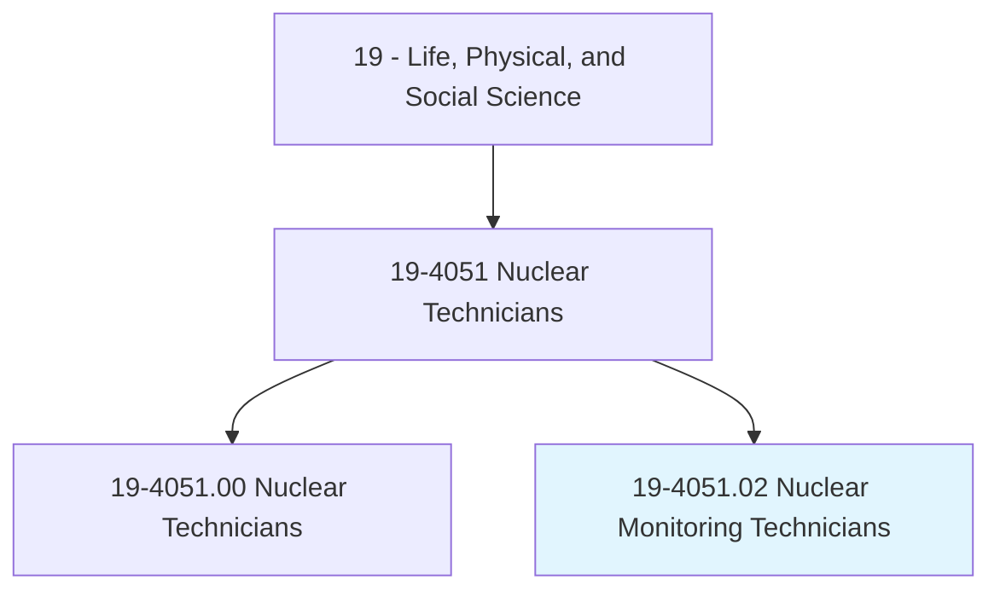
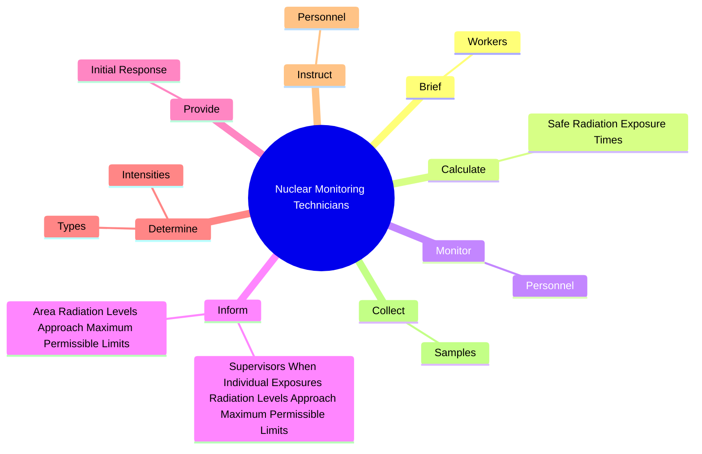
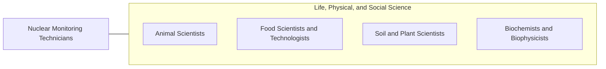

# Nuclear Monitoring Technicians

> Collect and test samples to monitor results of nuclear experiments and contamination of humans, facilities, and environment.

## Overview

Nuclear Monitoring Technicians is classified under Life, Physical, and Social Science (SOC 19). Collect and test samples to monitor results of nuclear experiments and contamination of humans, facilities, and environment.

## Classification Hierarchy

## Key Statistics

| Metric | Value |
|--------|-------|
| SOC Code | 19-4051.02 |
| Category | [Life, Physical, and Social Science](/occupations/Science) |
| Task Count | 53 |
| Source | O*NET |

## Core Tasks

### brief.Workers

Nuclear Monitoring Technicians brief workers as part of their core responsibilities.

**Actions:**
- `brief.Workers.on.RadiationLevels.in.WorkAreas`

### calculate.SafeRadiationExposureTimes

Nuclear Monitoring Technicians calculate safe radiation exposure times as part of their core responsibilities.

**Actions:**
- `calculate.SafeRadiationExposureTimes.for.PersonnelUsingPlantContaminationReadings`
- `calculate.SafeRadiationExposureTimes.for.PrescribedSafeLevels.of.Radiation`

### monitor.Personnel

Nuclear Monitoring Technicians monitor personnel as part of their core responsibilities.

**Actions:**
- `monitor.Personnel.to.determine.AmountsOfRadiationExposure`
- `monitor.Personnel.to.IntensitiesOfRadiationExposure`

## Skills & Competencies

### Technical Skills
- **Research Methods** - Advanced
- **Data Analysis** - Advanced
- **Laboratory Techniques** - Advanced

### Soft Skills
- **Communication** - Essential
- **Problem Solving** - Essential
- **Critical Thinking** - Important
- **Teamwork** - Important
- **Adaptability** - Important

## Related Occupations

## Industries

This occupation is found across multiple industries. See [Industries](/industries) for sector-specific employment data.

## Career Progression

---

*Source: O*NET 19-4051.02 - ONETOccupation*
