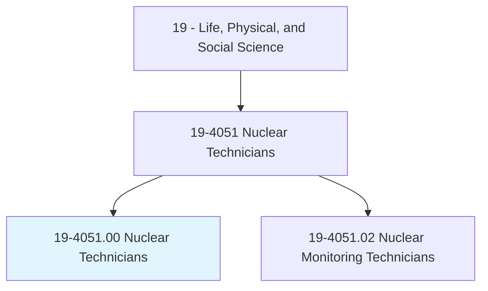
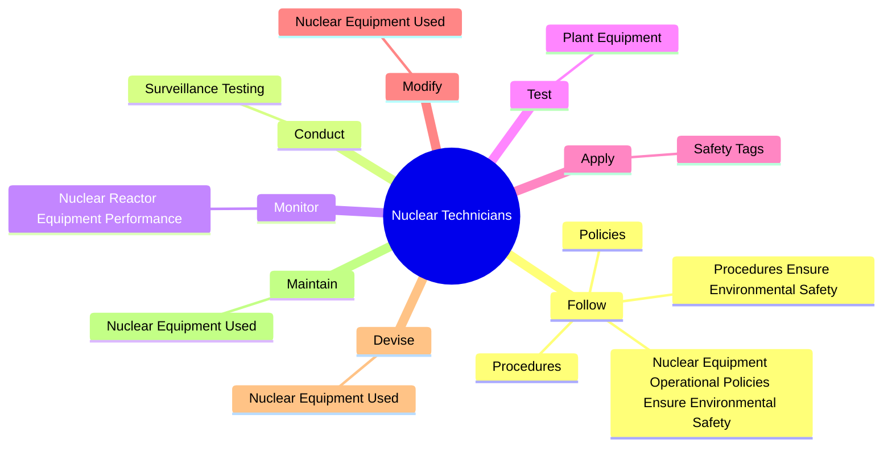

# Nuclear Technicians

> Assist nuclear physicists, nuclear engineers, or other scientists in laboratory, power generation, or electricity production activities. May operate, maintain, or provide quality control for nuclear testing and research equipment. May monitor radiation.

## Overview

Nuclear Technicians is an occupation within the Life, Physical, and Social Science category. Assist nuclear physicists, nuclear engineers, or other scientists in laboratory, power generation, or electricity production activities. May operate, maintain, or provide quality control for nuclear testing and research equipment.

## Classification Hierarchy

## Key Statistics

| Metric | Value |
|--------|-------|
| SOC Code | 19-4051.00 |
| Category | [Life, Physical, and Social Science](/occupations/Science) |
| Task Count | 78 |
| Source | O*NET |

## Core Tasks

### follow.NuclearEquipmentOperationalPoliciesEnsureEnvironmentalSafety

Nuclear Technicians follow nuclear equipment operational policies ensure environmental safety as part of their core responsibilities.

**Actions:**
- `follow.NuclearEquipmentOperationalPoliciesEnsureEnvironmentalSafety`
- `follow.ProceduresEnsureEnvironmentalSafety`
- `follow.Policies.for.RadiationWorkers.to.ensure.PersonnelSafety`
- `follow.Procedures.for.RadiationWorkers.to.ensure.PersonnelSafety`

### conduct.SurveillanceTesting

Nuclear Technicians conduct surveillance testing as part of their core responsibilities.

**Actions:**
- `conduct.SurveillanceTesting.to.determine.SafetyOfNuclearEquipment`

### monitor.NuclearReactorEquipmentPerformance

Nuclear Technicians monitor nuclear reactor equipment performance as part of their core responsibilities.

**Actions:**
- `monitor.NuclearReactorEquipmentPerformance.to.identify.OperationalInefficiencies`
- `monitor.NuclearReactorEquipmentPerformance.to.Hazards`
- `monitor.NuclearReactorEquipmentPerformance.to.NeedsForMaintenance`
- `monitor.NuclearReactorEquipmentPerformance.to.repair`

## Skills & Competencies

### Technical Skills
- **Research Methods** - Advanced
- **Data Analysis** - Advanced
- **Laboratory Techniques** - Advanced

### Soft Skills
- **Communication** - Essential
- **Problem Solving** - Essential
- **Critical Thinking** - Important
- **Teamwork** - Important
- **Adaptability** - Important

## Related Occupations

## Industries

This occupation is found across multiple industries. See [Industries](/industries) for sector-specific employment data.

## Career Progression

---

*Source: O*NET 19-4051.00 - ONETOccupation*
