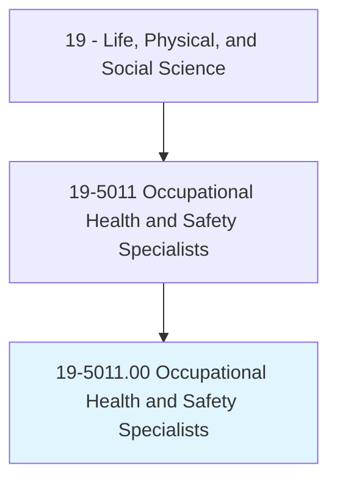
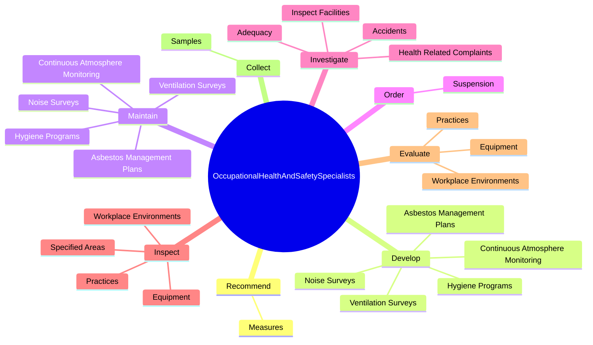

# Occupational Health and Safety Specialists

> Review, evaluate, and analyze work environments and design programs and procedures to control, eliminate, and prevent disease or injury caused by chemical, physical, and biological agents or ergonomic factors. May conduct inspections and enforce adherence to laws and regulations governing the health and safety of individuals. May be employed in the public or private sector.

## Overview

Occupational Health and Safety Specialists is an occupation within the Life, Physical, and Social Science category. Review, evaluate, and analyze work environments and design programs and procedures to control, eliminate, and prevent disease or injury caused by chemical, physical, and biological agents or ergonomic factors. May conduct inspections and enforce adherence to laws and regulations governing the health and safety of individuals.

## Classification Hierarchy

## Key Statistics

| Metric | Value |
|--------|-------|
| SOC Code | 19-5011.00 |
| Category | [Life, Physical, and Social Science](/occupations/Science/index) |
| Task Count | 87 |
| Source | O*NET |

## Core Tasks

### recommend.Measures

Occupational Health and Safety Specialists recommend measures as part of their core responsibilities.

**Actions:**
- `recommend.Measures.to.help.ProtectWorkersFromPotentiallyHazardousWorkMethods`
- `recommend.Measures.to.processes`
- `recommend.Measures.to.Materials`

### develop.HygienePrograms

Occupational Health and Safety Specialists develop hygiene programs as part of their core responsibilities.

**Actions:**
- `develop.HygienePrograms`
- `develop.NoiseSurveys`
- `develop.ContinuousAtmosphereMonitoring`
- `develop.VentilationSurveys`

### maintain.HygienePrograms

Occupational Health and Safety Specialists maintain hygiene programs as part of their core responsibilities.

**Actions:**
- `maintain.HygienePrograms`
- `maintain.NoiseSurveys`
- `maintain.ContinuousAtmosphereMonitoring`
- `maintain.VentilationSurveys`

## Skills & Competencies

### Technical Skills
- **Research Methods** - Advanced
- **Data Analysis** - Advanced
- **Laboratory Techniques** - Advanced

### Soft Skills
- **Communication** - Essential
- **Problem Solving** - Essential
- **Critical Thinking** - Important
- **Teamwork** - Important
- **Adaptability** - Important

## Related Occupations

## Industries

This occupation is found across multiple industries. See [Industries](/industries) for sector-specific employment data.

## Career Progression

---

*Source: O*NET 19-5011.00 - ONETOccupation*
