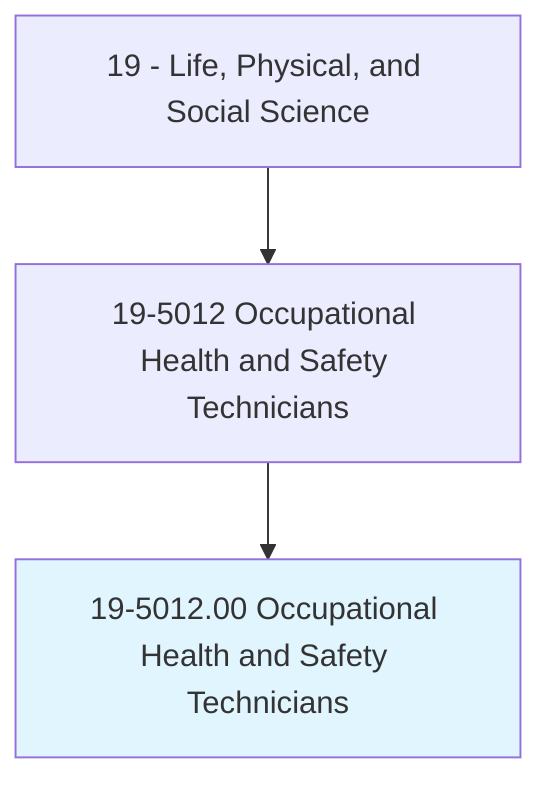
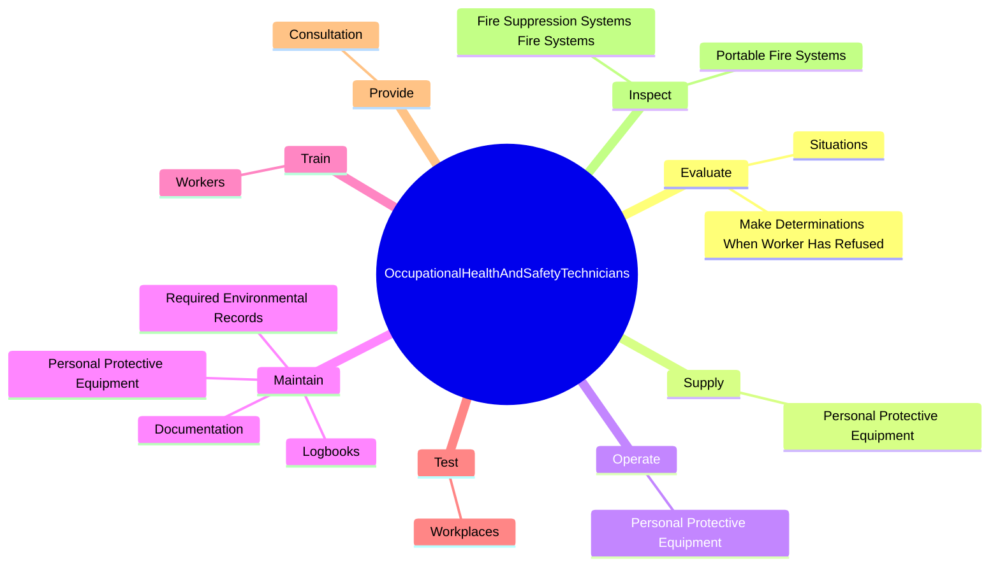

# Occupational Health and Safety Technicians

> Collect data on work environments for analysis by occupational health and safety specialists. Implement and conduct evaluation of programs designed to limit chemical, physical, biological, and ergonomic risks to workers.

## Overview

Occupational Health and Safety Technicians is an occupation within the Life, Physical, and Social Science category. Collect data on work environments for analysis by occupational health and safety specialists. 

## Classification Hierarchy

## Key Statistics

| Metric | Value |
|--------|-------|
| SOC Code | 19-5012.00 |
| Category | [Life, Physical, and Social Science](/occupations/Science) |
| Task Count | 101 |
| Source | O*NET |

## Core Tasks

### evaluate.Situations

Occupational Health and Safety Technicians evaluate situations as part of their core responsibilities.

**Actions:**
- `evaluate.Situations.to.work.OnGroundsDangerHarmExists`
- `evaluate.Situations.to.PotentialHarmExists`
- `evaluate.MakeDeterminationsWhenWorkerHasRefused.to.work.OnGroundsDangerHarmExists`
- `evaluate.MakeDeterminationsWhenWorkerHasRefused.to.PotentialHarmExists`

### supply.PersonalProtectiveEquipment

Occupational Health and Safety Technicians supply personal protective equipment as part of their core responsibilities.

**Actions:**
- `supply.PersonalProtectiveEquipment`

### operate.PersonalProtectiveEquipment

Occupational Health and Safety Technicians operate personal protective equipment as part of their core responsibilities.

**Actions:**
- `operate.PersonalProtectiveEquipment`

## Skills & Competencies

### Technical Skills
- **Research Methods** - Advanced
- **Data Analysis** - Advanced
- **Laboratory Techniques** - Advanced

### Soft Skills
- **Communication** - Essential
- **Problem Solving** - Essential
- **Critical Thinking** - Important
- **Teamwork** - Important
- **Adaptability** - Important

## Related Occupations

## Industries

This occupation is found across multiple industries. See [Industries](/industries) for sector-specific employment data.

## Career Progression

---

*Source: O*NET 19-5012.00 - ONETOccupation*
